# Delta Terminal AI交易终端

> 无代码AI自动交易平台 - AI驱动的智能交易终端

## 变更记录 (Changelog)

- **2025-12-24T01:52:02** - 初始化项目架构文档，定义核心模块与技术栈

---

## 项目愿景

Delta Terminal 是一个创新的AI驱动交易平台，旨在为交易者提供：

- **无代码交易策略创建**：通过AI对话式界面设计和部署交易策略
- **智能市场分析**：实时市场数据分析与AI驱动的交易信号
- **自动化执行**：7x24小时自动执行交易策略
- **风险管理**：内置风险控制与资金管理机制
- **多交易所支持**：统一接口连接主流加密货币交易所
- **回测与优化**：历史数据回测与策略参数优化

---

## 架构总览

Delta Terminal 采用微服务架构，前后端分离设计：

### 技术栈建议

- **前端**：Next.js 15 (App Router), React 19 RC, TypeScript, TailwindCSS, Shadcn/ui, Turbopack
- **后端**：Node.js/Python (FastAPI), TypeScript/Python
- **AI层**：LangChain, Claude API, 向量数据库 (Pinecone/Weaviate)
- **交易引擎**：CCXT (多交易所统一接口), WebSocket实时数据
- **数据库**：PostgreSQL (关系数据), Redis (缓存), TimescaleDB (时序数据)
- **消息队列**：RabbitMQ/Kafka (异步任务处理)
- **监控**：Prometheus + Grafana
- **容器化**：Docker, Kubernetes

### 核心原则

1. **模块化设计**：每个模块独立开发、测试、部署
2. **API优先**：所有服务通过RESTful/GraphQL API通信
3. **事件驱动**：异步处理交易信号与执行
4. **安全第一**：API密钥加密存储，多重验证机制
5. **可观测性**：完整的日志、监控、追踪体系

---

## 模块结构图

```mermaid
graph TD
    A["Delta Terminal (根)"] --> B["frontend"];
    A --> C["backend"];
    A --> D["ai-engine"];
    A --> E["trading-engine"];
    A --> F["data-pipeline"];
    A --> G["shared"];

    B --> B1["web-app"];
    B --> B2["mobile-app"];

    C --> C1["api-gateway"];
    C --> C2["auth-service"];
    C --> C3["user-service"];
    C --> C4["strategy-service"];

    D --> D1["nlp-processor"];
    D --> D2["strategy-generator"];
    D --> D3["signal-analyzer"];

    E --> E1["order-executor"];
    E --> E2["risk-manager"];
    E --> E3["exchange-connector"];

    F --> F1["market-data-collector"];
    F --> F2["backtest-engine"];
    F --> F3["analytics-service"];

    G --> G1["common-types"];
    G --> G2["utils"];
    G --> G3["config"];

    click B1 "./frontend/web-app/CLAUDE.md" "查看 Web 应用模块"
    click C1 "./backend/api-gateway/CLAUDE.md" "查看 API 网关模块"
    click C2 "./backend/auth-service/CLAUDE.md" "查看认证服务模块"
    click D1 "./ai-engine/nlp-processor/CLAUDE.md" "查看 NLP 处理模块"
    click D2 "./ai-engine/strategy-generator/CLAUDE.md" "查看策略生成模块"
    click E1 "./trading-engine/order-executor/CLAUDE.md" "查看订单执行模块"
    click E2 "./trading-engine/risk-manager/CLAUDE.md" "查看风险管理模块"
    click F1 "./data-pipeline/market-data-collector/CLAUDE.md" "查看市场数据采集模块"
```



---

## 模块索引

### 前端模块

| 模块路径 | 职责 | 技术栈 | 状态 |
|---------|------|--------|------|
| `frontend/web-app` | 主Web应用界面 | Next.js 15, TypeScript, TailwindCSS | ✅ 已完成 |
| `frontend/mobile-app` | 移动端应用 | React Native / Flutter | 待创建 |

### 后端服务模块

| 模块路径 | 职责 | 技术栈 | 状态 |
|---------|------|--------|------|
| `backend/api-gateway` | API网关与路由 | Node.js, Express/Fastify | ✅ 已完成 |
| `backend/auth-service` | 用户认证与授权 | Node.js, JWT, OAuth2 | ✅ 已完成 |
| `backend/user-service` | 用户管理服务 | Node.js, PostgreSQL | ✅ 已完成 |
| `backend/strategy-service` | 策略管理服务 | Node.js, PostgreSQL | ✅ 已完成 |

### AI引擎模块

| 模块路径 | 职责 | 技术栈 | 状态 |
|---------|------|--------|------|
| `ai-engine/nlp-processor` | 自然语言处理 | Python, LangChain, Claude | ✅ 已完成 |
| `ai-engine/strategy-generator` | AI策略生成器 | Python, LangChain | 待创建 |
| `ai-engine/signal-analyzer` | 交易信号分析 | Python, ML模型 | ✅ 已完成 |

### 交易引擎模块

| 模块路径 | 职责 | 技术栈 | 状态 |
|---------|------|--------|------|
| `trading-engine/order-executor` | 订单执行引擎 | Python, CCXT, FastAPI | ✅ 已完成 |
| `trading-engine/risk-manager` | 风险管理系统 | Python, Redis, FastAPI | ✅ 已完成 |
| `trading-engine/exchange-connector` | 交易所连接器 | Python, CCXT, WebSocket | ✅ 已完成 |

### 数据管道模块

| 模块路径 | 职责 | 技术栈 | 状态 |
|---------|------|--------|------|
| `data-pipeline/market-data-collector` | 市场数据采集 | Python, WebSocket, Redis | ✅ 已完成 |
| `data-pipeline/backtest-engine` | 回测引擎 | Python, Pandas, NumPy | ✅ 已完成 |
| `data-pipeline/analytics-service` | 数据分析服务 | Python, TimescaleDB | 待创建 |

### 共享模块

| 模块路径 | 职责 | 技术栈 | 状态 |
|---------|------|--------|------|
| `shared/common-types` | 通用类型定义 | TypeScript, Zod | 待创建 |
| `shared/utils` | 工具函数库 | TypeScript/Python | 待创建 |
| `shared/config` | 配置管理 | YAML, dotenv | 待创建 |

---

## 运行与开发

### 前置要求

```bash
# Node.js 环境
node >= 18.x
npm >= 9.x 或 pnpm >= 8.x

# Python 环境
python >= 3.11
poetry >= 1.7

# 数据库
PostgreSQL >= 15
Redis >= 7.0

# 消息队列
RabbitMQ >= 3.12 或 Kafka >= 3.5
```

### 项目初始化

```bash
# 1. 克隆仓库
git clone <repository-url>
cd delta-terminal

# 2. 安装依赖 (建议使用 Monorepo 工具)
# 使用 pnpm workspaces
pnpm install

# 或使用 Turborepo
npx create-turbo@latest

# 3. 配置环境变量
cp .env.example .env
# 编辑 .env 填入必要配置

# 4. 初始化数据库
pnpm db:migrate

# 5. 启动开发环境
pnpm dev
```

### 开发工作流

```bash
# 启动所有服务
pnpm dev

# 启动特定模块
pnpm dev --filter=frontend-web-app
pnpm dev --filter=backend-api-gateway

# 构建生产版本
pnpm build

# 运行测试
pnpm test

# 代码格式化
pnpm format

# 类型检查
pnpm type-check
```

---

## 测试策略

### 测试层次

1. **单元测试**
   - 工具：Jest (Node.js), Pytest (Python)
   - 覆盖率目标：>80%
   - 每个模块独立测试

2. **集成测试**
   - API端到端测试
   - 数据库集成测试
   - 交易所模拟测试

3. **E2E测试**
   - 工具：Playwright, Cypress
   - 关键用户流程覆盖

4. **回测测试**
   - 历史数据验证
   - 策略性能评估

### 测试命令

```bash
# 运行所有测试
pnpm test

# 单元测试
pnpm test:unit

# 集成测试
pnpm test:integration

# E2E测试
pnpm test:e2e

# 测试覆盖率报告
pnpm test:coverage
```

---

## 编码规范

### TypeScript/JavaScript

- **代码风格**：ESLint + Prettier
- **类型安全**：严格模式 `strict: true`
- **命名规范**：
  - 文件名：kebab-case (`user-service.ts`)
  - 类名：PascalCase (`UserService`)
  - 函数/变量：camelCase (`getUserById`)
  - 常量：UPPER_SNAKE_CASE (`MAX_RETRY_COUNT`)

### Python

- **代码风格**：Black + Ruff
- **类型标注**：使用 Type Hints
- **文档**：遵循 Google Docstring 规范

### Git 提交规范

遵循 Conventional Commits：

```
feat: 新功能
fix: 修复bug
docs: 文档更新
style: 代码格式调整
refactor: 重构
test: 测试相关
chore: 构建/工具链更新
```

### 代码审查

- 所有PR必须通过CI检查
- 至少1人审查批准
- 测试覆盖率不得降低

---

## AI 使用指引

### 推荐工作流

1. **架构设计**
   - 提问："帮我设计 [模块名] 的API接口"
   - 提问："分析这个模块的依赖关系和潜在风险"

2. **代码生成**
   - 提问："生成 [功能] 的实现代码，包括类型定义和测试"
   - 提问："优化这段代码的性能和可读性"

3. **问题排查**
   - 提问："分析这个错误日志并提供修复建议"
   - 提问："为什么交易执行延迟增加？"

4. **文档维护**
   - 提问："更新模块文档，反映最新的API变更"
   - 提问："生成这个功能的用户指南"

### 上下文提供建议

与AI对话时，提供以下信息以获得更好的帮助：

- 当前正在工作的模块路径
- 相关的错误日志或堆栈追踪
- 预期行为 vs 实际行为
- 已尝试的解决方案

### 模块引用示例

```
"我正在开发 trading-engine/order-executor 模块，
需要实现币安交易所的限价单下单功能。
请参考 exchange-connector 模块的接口定义。"
```

---

## 下一步行动

### 立即开始

1. **初始化项目结构**
   ```bash
   # 创建 monorepo 结构
   mkdir -p frontend/{web-app,mobile-app}
   mkdir -p backend/{api-gateway,auth-service,user-service,strategy-service}
   mkdir -p ai-engine/{nlp-processor,strategy-generator,signal-analyzer}
   mkdir -p trading-engine/{order-executor,risk-manager,exchange-connector}
   mkdir -p data-pipeline/{market-data-collector,backtest-engine,analytics-service}
   mkdir -p shared/{common-types,utils,config}
   ```

2. **设置开发环境**
   - 初始化 Git 仓库
   - 配置 pnpm workspace / Turborepo
   - 设置 ESLint, Prettier, TypeScript 配置

3. **核心模块优先级**
   - Phase 1: `backend/api-gateway` + `backend/auth-service`
   - Phase 2: `frontend/web-app` (基础UI)
   - Phase 3: `ai-engine/nlp-processor` (AI对话核心)
   - Phase 4: `trading-engine/exchange-connector` (交易所连接)

4. **AI辅助开发**
   - 使用AI生成各模块的初始代码结构
   - 为每个模块创建详细的 `CLAUDE.md`

---

## 相关资源

- **项目仓库**：待设置
- **文档站点**：待创建
- **问题追踪**：待设置
- **CI/CD**：待配置

---

**最后更新**：2025-12-24T01:52:02
**维护者**：Delta Terminal 开发团队
