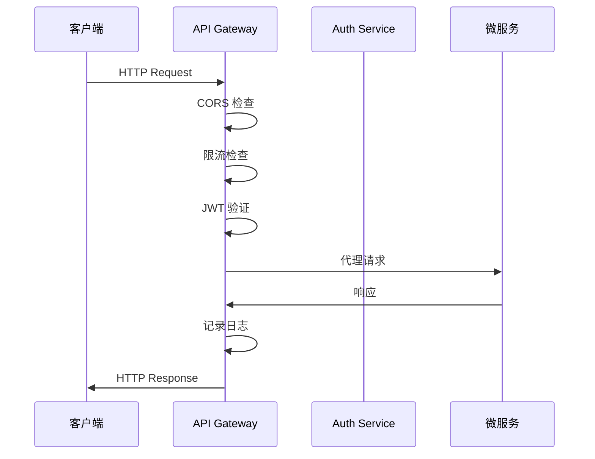
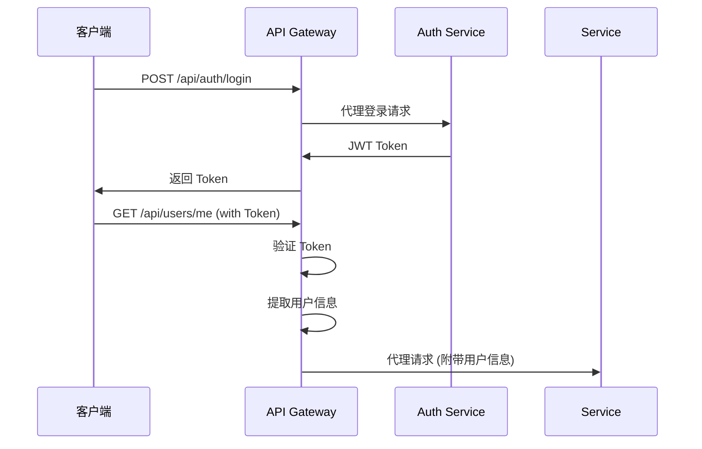

# API Gateway 模块

> Delta Terminal 的 API 网关服务 - 统一入口、路由、认证与限流

## 模块职责

API Gateway 是整个 Delta Terminal 系统的统一入口,负责:

- **请求路由**: 将客户端请求路由到对应的微服务
- **认证授权**: JWT token 验证与用户身份识别
- **限流保护**: 防止 API 滥用,保护后端服务
- **CORS 处理**: 处理跨域请求
- **日志记录**: 统一的请求日志记录
- **健康监控**: 监控所有微服务的健康状态
- **API 文档**: 提供统一的 API 文档服务

## 技术架构

### 核心框架

- **Fastify**: 高性能 Node.js Web 框架
- **TypeScript**: 类型安全的开发语言
- **http-proxy**: HTTP 代理实现

### 关键插件

- `@fastify/jwt`: JWT 认证
- `@fastify/cors`: CORS 处理
- `@fastify/helmet`: 安全头
- `@fastify/rate-limit`: 请求限流
- `@fastify/swagger`: API 文档生成
- `@fastify/compress`: 响应压缩

### 配置管理

- **Zod**: 环境变量验证
- **dotenv**: 环境变量加载

## 模块结构

```
backend/api-gateway/
├── src/
│   ├── config/           # 配置管理
│   │   └── index.ts      # 环境变量解析与验证
│   ├── middleware/       # 中间件层
│   │   ├── auth.ts       # JWT 认证中间件
│   │   ├── cors.ts       # CORS 配置
│   │   ├── logger.ts     # 请求日志中间件
│   │   └── rateLimit.ts  # 限流中间件
│   ├── plugins/          # Fastify 插件
│   │   └── swagger.ts    # Swagger 文档配置
│   ├── routes/           # 路由定义
│   │   ├── health.ts     # 健康检查路由
│   │   ├── proxy.ts      # 微服务代理路由
│   │   └── index.ts      # 路由注册入口
│   ├── types/            # TypeScript 类型定义
│   │   └── index.ts      # 共享类型定义
│   ├── app.ts            # Fastify 应用配置
│   └── index.ts          # 服务启动入口
├── .env.example          # 环境变量示例
├── package.json          # 依赖配置
├── tsconfig.json         # TypeScript 配置
└── README.md             # 模块文档
```

## 核心流程

### 请求处理流程



### 认证流程



## 关键配置

### 环境变量

必需配置:

```env
# 服务配置
PORT=3000
HOST=0.0.0.0

# JWT 配置
JWT_SECRET=至少32字符的密钥
JWT_EXPIRES_IN=24h

# 限流配置
RATE_LIMIT_MAX=100
RATE_LIMIT_TIME_WINDOW=60000

# 微服务地址
AUTH_SERVICE_URL=http://localhost:3001
USER_SERVICE_URL=http://localhost:3002
STRATEGY_SERVICE_URL=http://localhost:3003
TRADING_ENGINE_URL=http://localhost:3004
DATA_PIPELINE_URL=http://localhost:3005

# CORS 配置
CORS_ORIGIN=http://localhost:3100
CORS_CREDENTIALS=true

# 日志配置
LOG_LEVEL=info
LOG_PRETTY=true
```

### 路由映射

| 客户端路径 | 微服务目标 | 认证要求 |
|-----------|-----------|---------|
| `/api/auth/*` | Auth Service | 否 |
| `/api/users/*` | User Service | 是 |
| `/api/strategies/*` | Strategy Service | 是 |
| `/api/trading/*` | Trading Engine | 是 |
| `/api/data/*` | Data Pipeline | 是 |

## API 接口

### 健康检查

```typescript
GET /health
Response: {
  status: "healthy",
  timestamp: "2025-12-24T00:00:00.000Z"
}

GET /health/detailed
Response: {
  status: "healthy" | "unhealthy",
  timestamp: "2025-12-24T00:00:00.000Z",
  uptime: 123.456,
  services: {
    auth: { status: "up", responseTime: 12 },
    user: { status: "up", responseTime: 15 },
    // ...
  }
}
```

### 认证相关

```typescript
// 登录 (代理到 Auth Service)
POST /api/auth/login
Request: {
  email: string,
  password: string
}
Response: {
  token: string,
  expiresIn: string
}

// 注册 (代理到 Auth Service)
POST /api/auth/register
Request: {
  email: string,
  password: string,
  name: string
}
```

### 受保护的路由

所有 `/api/users/*`, `/api/strategies/*`, `/api/trading/*`, `/api/data/*` 路由均需要:

```
Authorization: Bearer <JWT_TOKEN>
```

## 中间件说明

### 认证中间件 (auth.ts)

- **authenticateJWT**: 必需认证,验证失败返回 401
- **optionalAuthenticateJWT**: 可选认证,token 存在时验证
- **requireRole**: 角色权限检查

### 限流中间件 (rateLimit.ts)

- 默认: 100 次/分钟/IP
- 可为特定路由自定义限流规则
- 响应头包含限流信息

### 日志中间件 (logger.ts)

- 记录请求开始/结束时间
- 记录响应时间
- 记录错误详情

## 错误处理

### 统一错误格式

```typescript
{
  statusCode: number,
  error: string,
  message: string,
  timestamp: string,
  details?: any  // 验证错误时包含详情
}
```

### 常见错误码

- **400**: 请求参数验证失败
- **401**: 未认证或 token 无效
- **403**: 权限不足
- **404**: 路由不存在
- **429**: 请求过于频繁
- **500**: 服务器内部错误
- **502**: 上游服务不可用

## 性能优化

### 已实现

- ✅ 响应压缩 (gzip/deflate)
- ✅ 请求日志异步写入
- ✅ 连接池复用
- ✅ 限流缓存 (内存)

### 生产环境建议

- 使用 Redis 存储限流数据
- 启用 Fastify 集群模式
- 配置 Nginx/HAProxy 负载均衡
- 使用 CDN 缓存静态资源

## 监控与日志

### 日志级别

- `fatal`: 致命错误
- `error`: 错误
- `warn`: 警告
- `info`: 信息 (默认)
- `debug`: 调试
- `trace`: 追踪

### 监控指标

建议监控:

- 请求数量/QPS
- 响应时间 (P50, P95, P99)
- 错误率
- 限流触发次数
- 微服务健康状态

## 开发指南

### 本地开发

```bash
# 安装依赖
pnpm install

# 配置环境变量
cp .env.example .env

# 启动开发服务器
pnpm dev
```

### 添加新的微服务代理

1. 在 `src/config/index.ts` 添加服务配置
2. 在 `src/routes/proxy.ts` 添加代理路由
3. 在 `src/plugins/swagger.ts` 添加文档标签

### 自定义中间件

```typescript
// src/middleware/custom.ts
import { FastifyRequest, FastifyReply } from 'fastify';

export async function customMiddleware(
  request: FastifyRequest,
  reply: FastifyReply
): Promise<void> {
  // 自定义逻辑
}
```

### 测试

```bash
# 单元测试
pnpm test

# 类型检查
pnpm type-check

# 代码检查
pnpm lint
```

## 部署

### Docker

```bash
# 构建
docker build -t delta-terminal/api-gateway:latest .

# 运行
docker run -p 3000:3000 --env-file .env delta-terminal/api-gateway:latest
```

### Kubernetes

使用 `readinessProbe` 和 `livenessProbe`:

```yaml
readinessProbe:
  httpGet:
    path: /ready
    port: 3000
livenessProbe:
  httpGet:
    path: /live
    port: 3000
```

## 安全建议

### 必须实施

- ✅ 使用强 JWT 密钥 (至少 32 字符)
- ✅ 启用 HTTPS (生产环境)
- ✅ 配置严格的 CORS 策略
- ✅ 定期轮换 JWT 密钥
- ✅ 启用请求大小限制

### 可选增强

- 添加 IP 白名单/黑名单
- 实现 API Key 认证
- 添加请求签名验证
- 实现速率限制分级策略

## 故障排查

### 问题: JWT 验证失败

**症状**: 401 Unauthorized

**可能原因**:
1. JWT_SECRET 不一致
2. Token 已过期
3. Token 格式错误

**解决方案**:
```bash
# 检查密钥配置
echo $JWT_SECRET

# 检查 token 有效期
JWT_EXPIRES_IN=24h

# 查看详细日志
LOG_LEVEL=debug pnpm dev
```

### 问题: 代理超时

**症状**: 502 Bad Gateway

**可能原因**:
1. 微服务未启动
2. 网络连接问题
3. 服务响应慢

**解决方案**:
```bash
# 检查微服务健康状态
curl http://localhost:3000/health/detailed

# 检查微服务是否运行
curl http://localhost:3001/health  # Auth Service
curl http://localhost:3002/health  # User Service
```

### 问题: 限流触发

**症状**: 429 Too Many Requests

**解决方案**:
```env
# 调整限流配置
RATE_LIMIT_MAX=200
RATE_LIMIT_TIME_WINDOW=60000
```

## 依赖服务

### 必需

- **Auth Service**: 认证服务 (用于 /api/auth/* 代理)

### 可选

- **Redis**: 分布式限流存储
- **Prometheus**: 监控指标收集
- **ELK/Loki**: 日志聚合

## 未来改进

### 计划中

- [ ] 添加 GraphQL 支持
- [ ] 实现 WebSocket 代理
- [ ] 添加请求缓存层
- [ ] 实现服务熔断机制
- [ ] 支持 gRPC 代理

### 性能优化

- [ ] 使用 Redis 存储限流数据
- [ ] 实现响应缓存
- [ ] 添加 Prometheus 指标
- [ ] 优化代理性能

## 相关资源

- [Fastify 官方文档](https://fastify.dev/)
- [JWT 最佳实践](https://tools.ietf.org/html/rfc8725)
- [API Gateway 模式](https://microservices.io/patterns/apigateway.html)

## 变更日志

- **2025-12-24**: 初始版本实现
  - 基础路由与代理功能
  - JWT 认证
  - 请求限流
  - 健康检查
  - Swagger 文档

---

**维护者**: Delta Terminal 后端团队
**最后更新**: 2025-12-24
