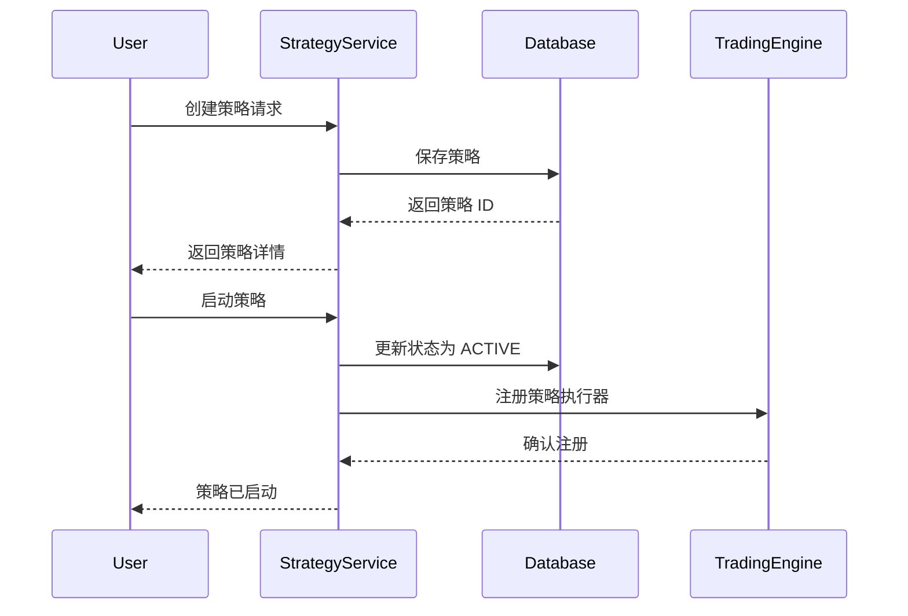
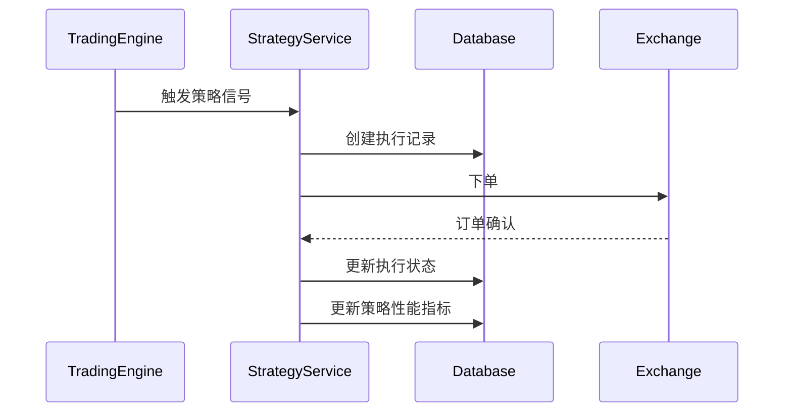

# Strategy Service - 策略管理服务模块

## 模块概述

策略服务是 Delta Terminal 的核心业务模块，负责交易策略的完整生命周期管理，包括创建、配置、执行、监控和优化。

**路径**: `backend/strategy-service`  
**状态**: ✅ 已实现  
**最后更新**: 2025-12-24

## 核心职责

1. **策略管理**
   - 策略的 CRUD 操作
   - 策略版本控制
   - 策略状态管理（草稿、运行、暂停、停止）
   - 策略分享与复制

2. **策略模板**
   - 预定义策略模板
   - 自定义模板创建
   - 模板评分与推荐

3. **策略执行**
   - 执行记录管理
   - 执行状态追踪
   - 执行结果统计

4. **性能监控**
   - 实时性能指标计算
   - 历史数据分析
   - 风险评估

## 技术栈

- **框架**: Fastify 5.x
- **语言**: TypeScript 5.x
- **ORM**: Prisma 6.x
- **数据库**: PostgreSQL 15+
- **验证**: Zod
- **认证**: JWT

## 数据模型

### 核心实体

#### Strategy (策略)
```typescript
{
  id: string;              // UUID
  userId: string;          // 所属用户
  name: string;            // 策略名称
  type: StrategyType;      // SPOT/FUTURES/GRID/DCA/ARBITRAGE/CUSTOM
  status: StrategyStatus;  // DRAFT/ACTIVE/PAUSED/STOPPED/ARCHIVED/ERROR
  riskLevel: RiskLevel;    // LOW/MEDIUM/HIGH/EXTREME
  config: Json;            // 策略配置
  indicators: Json;        // 指标配置
  conditions: Json;        // 触发条件
  actions: Json;           // 执行动作
  exchange: string;        // 交易所
  symbol: string;          // 交易对
  initialCapital: Decimal; // 初始资金
  currentCapital: Decimal; // 当前资金
  totalProfit: Decimal;    // 总盈亏
  profitRate: Decimal;     // 收益率
  totalTrades: number;     // 总交易次数
  winRate: Decimal;        // 胜率
}
```

#### StrategyTemplate (策略模板)
```typescript
{
  id: string;
  name: string;
  category: string;        // 分类
  type: StrategyType;
  config: Json;            // 默认配置
  isOfficial: boolean;     // 官方模板
  usageCount: number;      // 使用次数
  rating: Decimal;         // 评分
}
```

#### StrategyExecution (策略执行)
```typescript
{
  id: string;
  strategyId: string;
  status: ExecutionStatus; // PENDING/RUNNING/SUCCESS/FAILED/CANCELLED
  executionType: string;   // BUY/SELL/CLOSE
  side: string;            // BUY/SELL
  type: string;            // MARKET/LIMIT
  amount: Decimal;
  price: Decimal;
  profit: Decimal;
}
```

## API 接口

### 策略管理 API

```
POST   /api/v1/strategies              创建策略
GET    /api/v1/strategies              获取策略列表
GET    /api/v1/strategies/:id          获取策略详情
PUT    /api/v1/strategies/:id          更新策略
DELETE /api/v1/strategies/:id          删除策略
POST   /api/v1/strategies/:id/start    启动策略
POST   /api/v1/strategies/:id/pause    暂停策略
POST   /api/v1/strategies/:id/stop     停止策略
POST   /api/v1/strategies/:id/share    分享策略
```

### 模板管理 API

```
POST   /api/v1/templates               创建模板
GET    /api/v1/templates               获取模板列表
GET    /api/v1/templates/:id           获取模板详情
DELETE /api/v1/templates/:id           删除模板
```

### 执行记录 API

```
POST   /api/v1/executions              创建执行记录
GET    /api/v1/executions              获取执行列表
GET    /api/v1/executions/:id          获取执行详情
```

## 文件结构

```
strategy-service/
├── prisma/
│   └── schema.prisma              # Prisma 数据模型
├── src/
│   ├── config/
│   │   └── index.ts               # 配置管理
│   ├── repositories/
│   │   └── strategy.repository.ts # 数据访问层
│   ├── services/
│   │   ├── strategy.service.ts    # 策略业务逻辑
│   │   ├── template.service.ts    # 模板业务逻辑
│   │   └── execution.service.ts   # 执行业务逻辑
│   ├── routes/
│   │   ├── strategies.ts          # 策略路由
│   │   ├── templates.ts           # 模板路由
│   │   └── executions.ts          # 执行路由
│   ├── types/
│   │   └── strategy.ts            # 类型定义
│   ├── app.ts                     # Fastify 应用配置
│   └── index.ts                   # 服务入口
├── .env.example                   # 环境变量示例
├── package.json
├── tsconfig.json
├── README.md
└── CLAUDE.md                      # 本文档
```

## 依赖关系

### 上游依赖
- `auth-service`: 用户认证和授权
- `data-pipeline/market-data-collector`: 市场数据

### 下游依赖
- `trading-engine/order-executor`: 订单执行
- `trading-engine/risk-manager`: 风险管理

## 运行与开发

### 本地开发

```bash
# 安装依赖
pnpm install

# 配置环境变量
cp .env.example .env

# 初始化数据库
pnpm prisma:generate
pnpm db:push

# 启动开发服务器
pnpm dev
```

### 环境变量

```env
PORT=3002
DATABASE_URL=postgresql://...
JWT_SECRET=your-secret
MAX_STRATEGIES_PER_USER=50
MAX_ACTIVE_STRATEGIES=10
```

### 数据库迁移

```bash
# 创建迁移
pnpm prisma:migrate

# 查看数据库
pnpm prisma:studio
```

## 业务流程

### 策略创建流程



### 策略执行流程



## 扩展点

### 1. 自定义策略类型

在 `src/types/strategy.ts` 中扩展 `StrategyType`:

```typescript
export enum StrategyType {
  SPOT = 'SPOT',
  FUTURES = 'FUTURES',
  GRID = 'GRID',
  DCA = 'DCA',
  ARBITRAGE = 'ARBITRAGE',
  CUSTOM = 'CUSTOM',
  // 添加新类型
  OPTION = 'OPTION',
}
```

### 2. 自定义指标

在策略配置中添加新指标：

```typescript
indicators: [
  {
    name: 'custom_indicator',
    type: 'technical',
    params: { period: 20, source: 'close' }
  }
]
```

### 3. 新增执行类型

在 `StrategyExecution` 模型中扩展 `executionType`。

## 测试

```bash
# 运行测试
pnpm test

# 测试覆盖率
pnpm test:coverage
```

## 监控指标

- 活跃策略数量
- 平均策略收益率
- 策略执行成功率
- API 响应时间
- 数据库查询性能

## 安全考虑

1. **认证**: 所有 API 都需要 JWT 认证
2. **授权**: 用户只能访问自己的策略
3. **限流**: 防止 API 滥用
4. **数据验证**: 使用 Zod 验证输入
5. **SQL 注入**: Prisma ORM 自动防护

## 待优化项

- [ ] 添加策略性能实时计算
- [ ] 实现策略回测功能
- [ ] 添加策略告警通知
- [ ] 优化大量策略查询性能
- [ ] 实现策略推荐算法

## 相关文档

- [Prisma 文档](https://www.prisma.io/docs)
- [Fastify 文档](https://www.fastify.io/docs)
- [Zod 验证](https://zod.dev/)

---

**维护者**: Delta Terminal 开发团队  
**联系方式**: [待添加]  
**最后更新**: 2025-12-24
