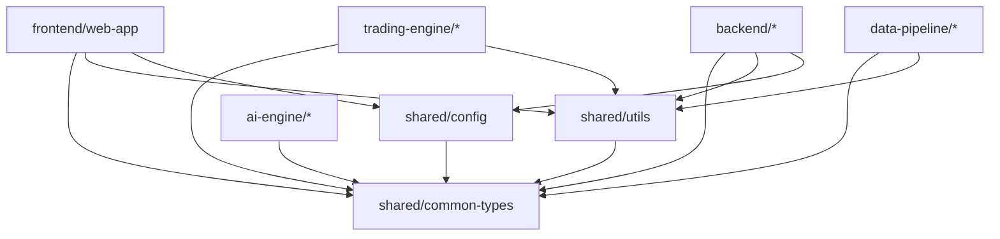

# Delta Terminal 项目结构说明

本文档详细说明了 Delta Terminal monorepo 的组织结构和各模块职责。

## 目录结构

```
delta-terminal/
├── .github/              # GitHub 配置 (CI/CD, Issue 模板等)
├── docs/                 # 项目文档
│   ├── QUICKSTART.md    # 快速开始指南
│   ├── ARCHITECTURE.md  # 架构设计文档
│   └── API.md           # API 接口文档
├── frontend/            # 前端应用模块
│   ├── web-app/         # Next.js 15 Web 应用
│   └── mobile-app/      # React Native 移动应用 (未来)
├── backend/             # 后端服务模块
│   ├── api-gateway/     # API 网关与路由
│   ├── auth-service/    # 认证与授权服务
│   ├── user-service/    # 用户管理服务
│   └── strategy-service/ # 策略管理服务
├── ai-engine/           # AI 引擎模块
│   ├── nlp-processor/   # 自然语言处理
│   ├── strategy-generator/ # AI 策略生成器
│   └── signal-analyzer/ # 交易信号分析
├── trading-engine/      # 交易引擎模块
│   ├── order-executor/  # 订单执行引擎
│   ├── risk-manager/    # 风险管理系统
│   └── exchange-connector/ # 交易所连接器
├── data-pipeline/       # 数据管道模块
│   ├── market-data-collector/ # 市场数据采集
│   ├── backtest-engine/ # 回测引擎
│   └── analytics-service/ # 数据分析服务
├── shared/              # 共享模块
│   ├── common-types/    # TypeScript 类型定义 + Zod Schemas
│   ├── utils/           # 通用工具函数
│   └── config/          # 配置管理
├── CLAUDE.md            # 项目 AI 辅助开发指南
├── README.md            # 项目说明
├── package.json         # 根 package.json (monorepo 配置)
├── pnpm-workspace.yaml  # pnpm workspace 配置
├── turbo.json           # Turbo 构建配置
├── tsconfig.json        # TypeScript 基础配置
├── .eslintrc.json       # ESLint 配置
├── .prettierrc          # Prettier 配置
├── .gitignore           # Git 忽略规则
└── .env.example         # 环境变量示例
```

## 模块详解

### 1. Frontend 模块

#### frontend/web-app

**技术栈**: Next.js 15 (App Router), React 19, TypeScript, TailwindCSS

**职责**:
- 用户界面展示
- AI 对话式策略创建界面
- 实时交易数据可视化
- 策略回测结果展示
- 用户账户管理

**关键文件**:
```
web-app/
├── src/
│   ├── app/              # Next.js App Router 页面
│   │   ├── layout.tsx    # 根布局
│   │   ├── page.tsx      # 首页
│   │   ├── dashboard/    # 仪表盘
│   │   ├── strategies/   # 策略管理
│   │   └── settings/     # 设置页面
│   ├── components/       # React 组件
│   │   ├── ui/          # 基础 UI 组件 (按钮, 表单等)
│   │   ├── charts/      # 图表组件
│   │   └── layouts/     # 布局组件
│   ├── lib/             # 工具函数
│   ├── hooks/           # React Hooks
│   ├── styles/          # 全局样式
│   └── types/           # 前端特定类型
├── public/              # 静态资源
├── next.config.ts       # Next.js 配置
├── tailwind.config.ts   # TailwindCSS 配置
└── package.json
```

### 2. Backend 模块

#### backend/api-gateway

**技术栈**: Fastify, TypeScript

**职责**:
- 统一 API 入口
- 请求路由与转发
- 请求限流与防护
- API 文档生成

#### backend/auth-service

**技术栈**: Fastify, JWT, bcrypt, PostgreSQL

**职责**:
- 用户注册与登录
- JWT Token 生成与验证
- 密码加密与验证
- OAuth2 集成 (未来)

#### backend/user-service

**技术栈**: Fastify, Kysely (SQL Builder), PostgreSQL

**职责**:
- 用户信息管理
- 用户配置存储
- API Key 管理

#### backend/strategy-service

**技术栈**: Fastify, PostgreSQL

**职责**:
- 策略 CRUD 操作
- 策略版本控制
- 策略执行日志

### 3. AI Engine 模块

#### ai-engine/nlp-processor

**技术栈**: Python, LangChain, Claude API

**职责**:
- 用户自然语言意图识别
- 策略参数提取
- 对话上下文管理

#### ai-engine/strategy-generator

**技术栈**: Python, LangChain

**职责**:
- 基于用户描述生成策略代码
- 策略参数优化建议
- 策略风险评估

#### ai-engine/signal-analyzer

**技术栈**: Python, NumPy, Pandas

**职责**:
- 技术指标计算
- 交易信号生成
- 市场趋势分析

### 4. Trading Engine 模块

#### trading-engine/order-executor

**技术栈**: Node.js/Python, CCXT

**职责**:
- 订单创建与提交
- 订单状态跟踪
- 订单执行确认

#### trading-engine/risk-manager

**技术栈**: Python, Redis

**职责**:
- 仓位风险控制
- 止损/止盈管理
- 资金分配管理

#### trading-engine/exchange-connector

**技术栈**: Node.js, WebSocket, CCXT

**职责**:
- 多交易所适配
- WebSocket 实时数据
- REST API 封装

### 5. Data Pipeline 模块

#### data-pipeline/market-data-collector

**技术栈**: Python, WebSocket, Redis, TimescaleDB

**职责**:
- 实时行情数据采集
- K线数据存储
- 订单簿数据缓存

#### data-pipeline/backtest-engine

**技术栈**: Python, Pandas, NumPy

**职责**:
- 历史数据回测
- 策略性能评估
- 回测报告生成

#### data-pipeline/analytics-service

**技术栈**: Python, TimescaleDB

**职责**:
- 交易数据分析
- 性能指标计算
- 统计报表生成

### 6. Shared 模块

#### shared/common-types

**导出内容**:
- TypeScript 接口定义
- Zod 验证 Schema
- 枚举类型

**关键类型**:
- `User`, `Strategy`, `Order`, `TradingSignal`
- `ApiResponse`, `PaginatedResponse`
- `Candlestick`, `OrderBook`, `Ticker`

#### shared/utils

**导出内容**:
- 日志工具 (`Logger`)
- 格式化函数 (`formatPrice`, `formatPercentage`)
- 日期时间工具 (`formatDateTime`, `formatRelativeTime`)
- 验证工具 (`validateSchema`)

#### shared/config

**导出内容**:
- 环境变量解析
- 数据库配置
- Redis 配置
- JWT 配置
- 应用配置

## 依赖关系



## Workspace 配置

### pnpm-workspace.yaml

```yaml
packages:
  - 'frontend/*'
  - 'backend/*'
  - 'ai-engine/*'
  - 'trading-engine/*'
  - 'data-pipeline/*'
  - 'shared/*'
```

### 引用共享模块

在任何工作区的 `package.json` 中:

```json
{
  "dependencies": {
    "@delta/common-types": "workspace:*",
    "@delta/utils": "workspace:*",
    "@delta/config": "workspace:*"
  }
}
```

## 开发工作流

### 添加新模块

```bash
# 1. 创建模块目录
mkdir -p backend/new-service/src

# 2. 创建 package.json
cd backend/new-service
pnpm init

# 3. 添加依赖
pnpm add @delta/common-types@workspace:*

# 4. 更新 pnpm-workspace.yaml (如果需要)
```

### 构建顺序

Turbo 自动处理依赖顺序,共享模块会先构建:

1. `shared/common-types` (无依赖)
2. `shared/utils` (依赖 common-types)
3. `shared/config` (依赖 common-types)
4. 其他模块 (依赖共享模块)

### 测试策略

- **单元测试**: 每个模块独立测试
- **集成测试**: 跨模块 API 测试
- **E2E 测试**: 完整用户流程测试

## 最佳实践

1. **模块独立性**: 每个模块应尽可能独立,减少耦合
2. **类型安全**: 所有跨模块接口使用 `@delta/common-types`
3. **配置集中**: 环境配置统一使用 `@delta/config`
4. **日志规范**: 统一使用 `@delta/utils` 的 Logger
5. **代码复用**: 通用逻辑放入 `shared/utils`

## 扩展建议

### 未来可添加的模块

- `frontend/admin-dashboard` - 管理后台
- `backend/notification-service` - 通知服务
- `trading-engine/portfolio-manager` - 投资组合管理
- `ai-engine/sentiment-analyzer` - 市场情绪分析
- `shared/monitoring` - 监控告警库

---

**最后更新**: 2025-12-24
