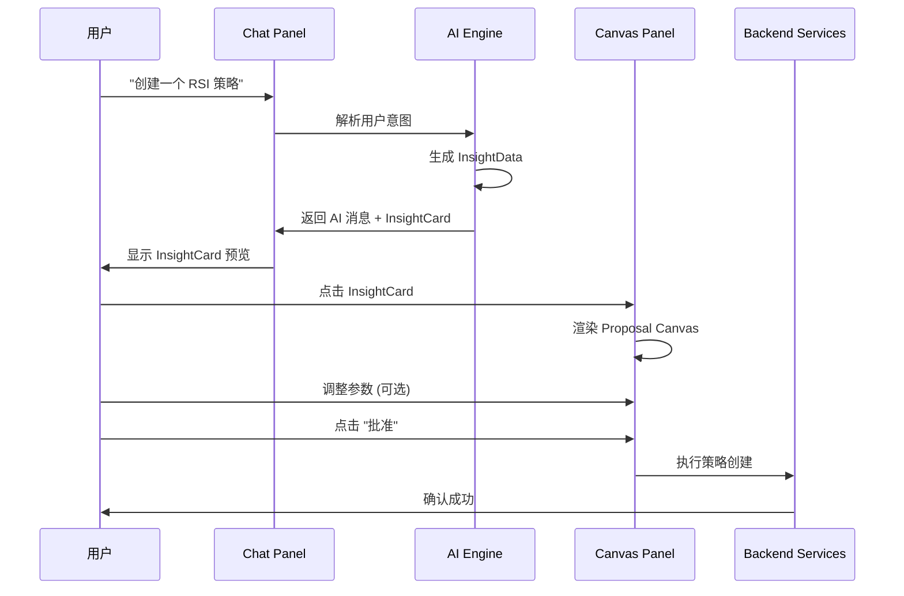

# A2UI 系统架构设计

> **版本**: 2.0.0
> **更新日期**: 2025-12-25
> **维护团队**: Delta Terminal 架构组

---

## 1. 概述

### 1.1 什么是 A2UI

**A2UI (Agent-to-UI)** 是 Delta Terminal 2.0 的核心创新架构，重新定义了 AI 与用户的交互方式：

| 维度 | 传统 AI 聊天 | A2UI 模式 |
|-----|------------|----------|
| **AI 输出** | 纯文本建议 | 结构化 InsightData |
| **用户操作** | 手动配置参数 | 审批/调整交互控件 |
| **核心范式** | 用户执行 AI 建议 | **AI 提议，人类批准** |
| **交互形态** | 聊天窗口 | Chat + Canvas 双面板 |

### 1.2 核心理念

```
"AI Proposer, Human Approver"
 AI 是策略的提议者，人类是最终的决策者。
```

**设计原则**：
- 用户不需要理解每个参数的含义
- 只需审查 AI 的提案、查看证据、决定是否批准
- 从"手动配置"变成"审批决策"

---

## 2. 系统架构

### 2.1 整体架构图

```
┌─────────────────────────────────────────────────────────────────────┐
│                         Delta Terminal 2.0                          │
├─────────────────────────────────────────────────────────────────────┤
│                                                                      │
│  ┌─────────────────┐    ┌──────────────────────────────────────┐   │
│  │   Chat Panel    │    │           Canvas Panel               │   │
│  │                 │    │                                      │   │
│  │  ┌───────────┐  │    │  ┌────────────────────────────────┐ │   │
│  │  │ UserMsg   │  │    │  │  Proposal / Backtest /         │ │   │
│  │  ├───────────┤  │◀───│  │  Explorer / Monitor /          │ │   │
│  │  │ AI + Card │──┼────▶│  │  Config / Detail Canvas        │ │   │
│  │  └───────────┘  │    │  └────────────────────────────────┘ │   │
│  │                 │    │                                      │   │
│  │  ┌───────────┐  │    │  ┌────────────────────────────────┐ │   │
│  │  │ Input Box │  │    │  │ Action Buttons: Approve/Reject │ │   │
│  │  └───────────┘  │    │  └────────────────────────────────┘ │   │
│  └─────────────────┘    └──────────────────────────────────────┘   │
│                                                                      │
├─────────────────────────────────────────────────────────────────────┤
│                         A2UI Engine Layer                            │
│  ┌────────────┐  ┌────────────┐  ┌────────────┐  ┌────────────┐    │
│  │  NLP       │  │  Strategy  │  │  Insight   │  │  Canvas    │    │
│  │  Processor │→ │  Generator │→ │  Builder   │→ │  Renderer  │    │
│  └────────────┘  └────────────┘  └────────────┘  └────────────┘    │
│                                                                      │
├─────────────────────────────────────────────────────────────────────┤
│                         Backend Services                             │
│  ┌────────────┐  ┌────────────┐  ┌────────────┐  ┌────────────┐    │
│  │  Strategy  │  │  Backtest  │  │  Risk      │  │  Order     │    │
│  │  Service   │  │  Engine    │  │  Manager   │  │  Executor  │    │
│  └────────────┘  └────────────┘  └────────────┘  └────────────┘    │
└─────────────────────────────────────────────────────────────────────┘
```

### 2.2 数据流



---

## 3. 核心数据结构

### 3.1 InsightData

AI 返回的结构化策略资产，是 A2UI 的核心数据模型：

```typescript
interface InsightData {
  id: string;
  type: InsightType;

  // 目标策略 (修改/批量时)
  target?: {
    strategyId: string;
    name: string;
    symbol: string;
  };

  // 参数列表 (核心!)
  params: InsightParam[];

  // 视觉证据
  evidence?: {
    chart?: ChartData;        // K 线图 + 标注
    comparison?: Comparison;  // 新旧对比曲线
  };

  // 影响预估
  impact?: {
    metrics: ImpactMetric[];  // 收益、胜率、回撤等
    confidence: number;       // 置信度 0-1
    sampleSize: number;       // 样本量
  };

  // AI 解释
  explanation: string;
}

type InsightType =
  | "strategy_create"    // 创建策略
  | "strategy_modify"    // 修改策略
  | "batch_adjust"       // 批量调整
  | "risk_alert";        // 风险预警
```

### 3.2 InsightParam

多态参数控件，可渲染为各种 UI 控件：

```typescript
interface InsightParam {
  key: string;
  label: string;
  type: ParamType;
  value: any;
  oldValue?: any;          // 修改时显示 diff
  level: 1 | 2;            // L1 直接展示, L2 折叠
  constraints?: Constraint[];  // 约束规则
  config: ParamConfig;
}

type ParamType =
  | "slider"        // 滑块
  | "number"        // 数字输入
  | "select"        // 下拉选择
  | "toggle"        // 开关
  | "button_group"  // 按钮组
  | "logic_builder" // 逻辑构建器
  | "heatmap_slider"; // 热力图滑块

interface ParamConfig {
  min?: number;
  max?: number;
  step?: number;
  options?: Option[];
  unit?: string;
  heatmapZones?: HeatmapZone[];
}
```

### 3.3 约束系统

参数间的依赖和约束关系：

```typescript
interface Constraint {
  type: ConstraintType;
  relatedParam?: string;
  rule: string;
  message: string;
}

type ConstraintType =
  | "min_max"       // 最小最大值
  | "dependency"    // 依赖另一参数
  | "mutual_exclusive"  // 互斥
  | "conditional";  // 条件约束

// 示例：止损必须小于止盈
{
  type: "dependency",
  relatedParam: "takeProfit",
  rule: "value < relatedValue",
  message: "止损必须小于止盈"
}
```

---

## 4. Canvas 模式

### 4.1 六大 Canvas 类型

| Canvas | 用途 | 触发场景 |
|--------|------|---------|
| **Proposal** | 策略创建/修改提案 | AI 生成策略时 |
| **Backtest** | 回测报告展示 | 回测完成时 |
| **Explorer** | 参数敏感度探索 | 用户想优化参数时 |
| **Monitor** | 实时策略监控 | 查看运行中策略 |
| **Config** | 完整配置编辑 | 深度配置策略时 |
| **Detail** | 明细查看 | 查看交易/订单详情 |

### 4.2 Proposal Canvas 结构

```
┌─────────────────────────────────────┐
│ Header: 策略名称 + 类型 Badge       │
├─────────────────────────────────────┤
│ Section: 核心参数 (L1)              │
│   ├─ RSI 周期: 14                   │
│   ├─ 超卖阈值: < 30                 │
│   ├─ 止损: -2%                      │
│   └─ 止盈: +5%                      │
├─────────────────────────────────────┤
│ Section: 证据 (Evidence)            │
│   └─ [K线图 + 回测曲线]            │
├─────────────────────────────────────┤
│ Section: 影响预估 (Impact)          │
│   ├─ 预估收益: +24.5%               │
│   ├─ 胜率: 68%                      │
│   └─ 最大回撤: -8.2%                │
├─────────────────────────────────────┤
│ Section: AI 解释                    │
│   └─ "基于过去90天数据..."          │
├─────────────────────────────────────┤
│ Footer: [拒绝] [修改] [批准]        │
└─────────────────────────────────────┘
```

---

## 5. 状态机设计

### 5.1 策略状态机

```
       ┌──────────────────────────────────────┐
       │                                      │
       ▼                                      │
   ┌───────┐  approve   ┌───────────┐        │
   │ Draft │──────────▶│ Backtesting│        │
   └───────┘            └─────┬─────┘        │
       ▲                      │ complete     │
       │ reject               ▼              │
       │               ┌───────────┐         │
       └───────────────│ Validated │         │
                       └─────┬─────┘         │
                             │ deploy        │
                             ▼               │
                       ┌───────────┐         │
            ┌─────────▶│   Paper   │         │
            │ pause    └─────┬─────┘         │
            │                │ go live       │
       ┌────┴────┐           ▼               │
       │ Paused  │◀────┌───────────┐         │
       └────┬────┘     │   Live    │         │
            │ resume   └─────┬─────┘         │
            └────────────────┤               │
                             │ stop          │
                             ▼               │
                       ┌───────────┐         │
                       │  Stopped  │─────────┘
                       └───────────┘  edit
```

### 5.2 订单状态机

```
Pending → Submitted → Partial → Filled
                ↓         ↓
            Cancelled  Cancelled
                ↓
            Rejected
```

### 5.3 持仓状态机

```
Opening → Open → Closing → Closed
           ↓
       Liquidated
```

---

## 6. 风控安全

### 6.1 主动哨兵系统

AI 持续监控市场和策略状态，主动发出预警：

```typescript
interface RiskAlert extends InsightData {
  type: "risk_alert";
  severity: "info" | "warning" | "critical";
  alertType: AlertType;
  suggestedAction: InsightParam[];  // AI 建议的操作
  timeoutAction?: "auto_execute" | "pause" | "notify";
  timeoutSeconds?: number;
}

type AlertType =
  | "high_volatility"     // 高波动
  | "margin_warning"      // 保证金预警
  | "liquidation_risk"    // 强平风险
  | "drawdown_limit"      // 回撤触及限制
  | "market_crash";       // 市场闪崩
```

### 6.2 熔断机制

```typescript
interface CircuitBreaker {
  level: 1 | 2 | 3;
  trigger: string;
  action: "pause_strategy" | "reduce_position" | "close_all";
  cooldownMinutes: number;
}

// 三级熔断
const circuitBreakers: CircuitBreaker[] = [
  { level: 1, trigger: "日亏损 > 3%", action: "pause_strategy", cooldownMinutes: 30 },
  { level: 2, trigger: "日亏损 > 5%", action: "reduce_position", cooldownMinutes: 60 },
  { level: 3, trigger: "日亏损 > 8%", action: "close_all", cooldownMinutes: 240 },
];
```

### 6.3 Kill Switch

紧急全局停止按钮，一键关闭所有交易活动：

```typescript
interface KillSwitchAction {
  cancelAllOrders: boolean;
  closeAllPositions: boolean;
  pauseAllStrategies: boolean;
  notifyAdmin: boolean;
  reason: string;
}
```

---

## 7. InsightCard 设计

### 7.1 卡片类型

| 类型 | Badge | 图标背景 | 用途 |
|------|-------|---------|------|
| 新建策略 | 蓝色 "新建" | cyan-dim | 创建新策略 |
| 修改策略 | 黄色 "修改" | yellow-dim | 优化现有策略 |
| 批量调整 | 紫色 "批量" | purple-dim | 调整多个策略 |
| 风险预警 | 红色 "紧急" | red-dim | 紧急风险通知 |

### 7.2 卡片结构

```
┌─────────────────────────────────────┐
│ Header                              │
│  [Icon] Title                [Badge]│
│         Subtitle                    │
├─────────────────────────────────────┤
│ Body: Preview Stats                 │
│  预估收益: +24.5%  胜率: 68%        │
├─────────────────────────────────────┤
│ Footer                              │
│  基于 90 天回测    点击查看详情 →   │
└─────────────────────────────────────┘
```

---

## 8. 参数控件规范

### 8.1 L1/L2 参数层级

| 层级 | 显示方式 | 包含参数 |
|------|---------|---------|
| L1 (核心) | 直接展示 | 指标周期、阈值、止损止盈 |
| L2 (高级) | 折叠展示 | 时间过滤、滑点容忍、高级风控 |

### 8.2 控件映射

| 参数类型 | 推荐控件 | 示例 |
|---------|---------|------|
| 数值范围 | Slider | RSI 周期 (7-21) |
| 百分比 | Slider + 输入框 | 止损 (0.5%-5%) |
| 枚举选择 | Button Group | 方向 (做多/做空) |
| 开关 | Toggle | 启用追踪止损 |
| 复杂逻辑 | Logic Builder | 多条件组合 |
| 风险偏好 | Heatmap Slider | 风险等级 (保守/激进) |

### 8.3 热力图滑块

用于风险相关参数，直观展示风险区域：

```
┌────────────────────────────────────────┐
│  [保守]     [中性]     [激进]         │
│  ████████  ░░░░░░░░  ████████         │
│  绿色       灰色       红色            │
│       ▲ (当前值)                       │
└────────────────────────────────────────┘
```

---

## 9. 场景覆盖

### 9.1 12 大 Part，68 个场景

| Part | 主题 | 场景数 |
|------|------|--------|
| 1 | 核心概念 | 5 |
| 2 | 策略生命周期 | 7 |
| 3 | A2UI 控件 | 6 |
| 4 | 运营场景 | 7 |
| 5 | 风控安全 | 6 |
| 6 | 分析报告 | 4 |
| 7 | 系统功能 | 5 |
| 8 | 状态处理 | 5 |
| 9 | 补充场景 | 4 |
| 10 | P0 补充 | 8 |
| 11 | 小白友好化 | 5 |
| 12 | Spirit 集成 | 6 |

### 9.2 关键新增场景

- **策略人格化**: 给策略取昵称，如"小稳"、"闪电侠"
- **叙事化逻辑**: "当市场恐惧时买入" 替代 "RSI < 30"
- **压力测试**: 模拟 2020 年 312 暴跌场景
- **安睡模式**: 夜间降低风险敞口
- **影子模式**: 跟踪他人策略但不实际执行

---

## 10. 技术实现

### 10.1 前端组件

```
src/components/a2ui/
├── InsightCard/           # Chat 内预览卡片
│   ├── index.tsx
│   ├── StrategyCard.tsx
│   ├── ModifyCard.tsx
│   ├── BatchCard.tsx
│   └── AlertCard.tsx
├── Canvas/                # Canvas 面板
│   ├── ProposalCanvas.tsx
│   ├── BacktestCanvas.tsx
│   ├── ExplorerCanvas.tsx
│   ├── MonitorCanvas.tsx
│   ├── ConfigCanvas.tsx
│   └── DetailCanvas.tsx
├── Controls/              # 参数控件
│   ├── ParamSlider.tsx
│   ├── ParamToggle.tsx
│   ├── ParamButtonGroup.tsx
│   ├── ParamLogicBuilder.tsx
│   └── ParamHeatmapSlider.tsx
└── Evidence/              # 证据组件
    ├── ChartEvidence.tsx
    └── ComparisonEvidence.tsx
```

### 10.2 状态管理

```typescript
// src/store/insight.ts
interface InsightStore {
  // 当前活跃的 Insight
  activeInsight: InsightData | null;

  // Canvas 状态
  canvasMode: CanvasMode;
  canvasOpen: boolean;

  // 参数编辑状态
  editedParams: Map<string, any>;

  // Actions
  openCanvas: (insight: InsightData, mode: CanvasMode) => void;
  closeCanvas: () => void;
  updateParam: (key: string, value: any) => void;
  approveInsight: () => Promise<void>;
  rejectInsight: (reason?: string) => void;
}
```

### 10.3 后端接口

```typescript
// AI Engine - InsightData 生成
POST /api/v1/ai/generate-insight
Request: { userMessage: string, conversationId: string, context?: any }
Response: { message: string, insight?: InsightData }

// 策略服务 - 批准 Insight
POST /api/v1/strategies/from-insight
Request: { insightId: string, params: Map<string, any> }
Response: { strategyId: string, status: string }

// 回测服务 - 实时回测
POST /api/v1/backtest/quick
Request: { insightId: string, params: Map<string, any> }
Response: { metrics: ImpactMetric[], chartData: ChartData }
```

---

## 11. 迁移路径

### 11.1 从 v1 到 v2

| 组件 | v1 (当前) | v2 (A2UI) | 迁移策略 |
|------|----------|----------|---------|
| AI 对话 | 纯文本响应 | InsightData 响应 | 渐进式替换 |
| 策略创建 | 表单配置 | Proposal Canvas | 并行支持 |
| 参数调整 | 静态表单 | 动态控件 + 约束 | 组件重构 |
| 监控 | 基础仪表盘 | Monitor Canvas | 扩展增强 |

### 11.2 实施阶段

**Phase 1**: 核心组件
- InsightData 类型定义
- InsightCard 组件
- Proposal Canvas

**Phase 2**: 控件系统
- 参数控件库
- 约束系统
- L1/L2 层级

**Phase 3**: Canvas 扩展
- Backtest Canvas
- Monitor Canvas
- Explorer Canvas

**Phase 4**: 高级功能
- 风险预警系统
- 批量调整
- 移动端适配

---

## 12. 设计系统

### 12.1 RiverBit 配色

```css
/* 品牌色 */
--rb-cyan: #0EECBC;
--rb-cyan-dim: rgba(14, 236, 188, 0.15);

/* 语义色 */
--rb-green: #61DD3C;   /* 成功/盈利 */
--rb-red: #DD3C41;     /* 错误/亏损 */
--rb-yellow: #E8BD30;  /* 警告 */
--rb-purple: #A855F7;  /* 批量操作 */

/* 深色主题灰阶 */
--rb-d950: #070E12;    /* 主背景 */
--rb-d930: #0D1417;    /* 次背景 */
--rb-d900: #151B1E;    /* 三级背景 */
--rb-d800: #1F292E;    /* 卡片背景 */
```

### 12.2 字体

```css
--font-sans: 'Inter', -apple-system, sans-serif;
--font-mono: 'JetBrains Mono', 'SF Mono', monospace;
```

---

## 13. 参考资源

- [A2UI 完整设计文档](/Users/victor/Desktop/A2UI/delta-terminal-v2-complete.html)
- [RiverBit Design System - Figma](#)
- [NLP Processor CLAUDE.md](../../ai-engine/nlp-processor/CLAUDE.md)
- [Strategy Generator CLAUDE.md](../../ai-engine/strategy-generator/CLAUDE.md)

---

**文档版本历史**

| 版本 | 日期 | 变更说明 |
|-----|------|---------|
| 2.0.0 | 2025-12-25 | A2UI 架构设计初版 |

---

**维护者**: Delta Terminal 架构团队
**最后更新**: 2025-12-25
