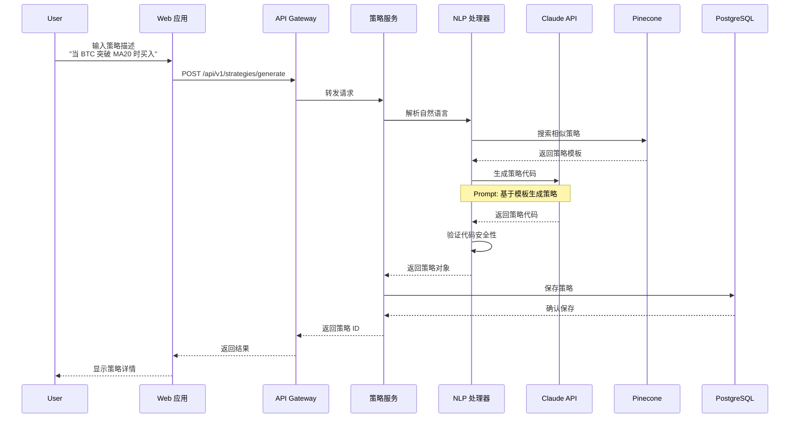
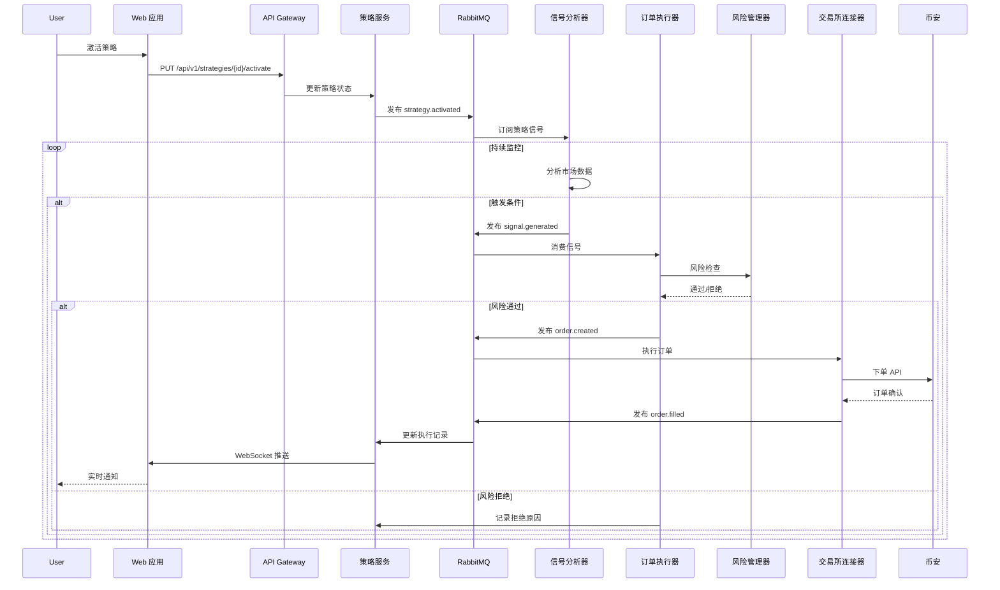
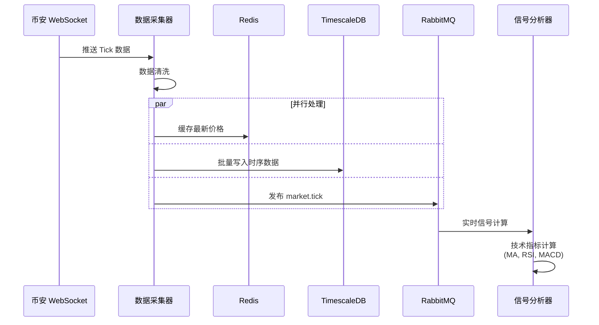
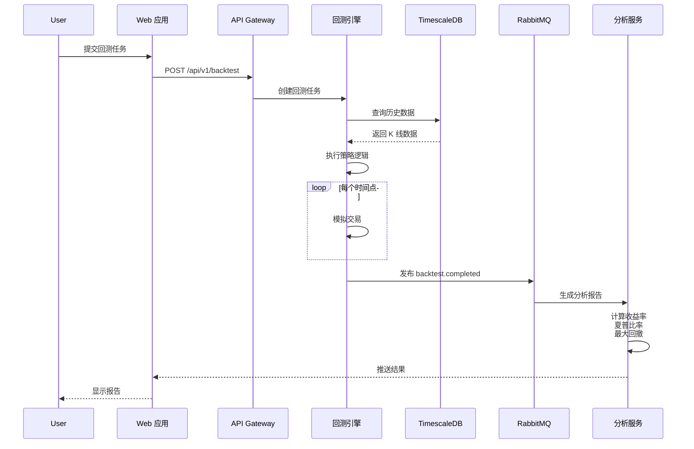
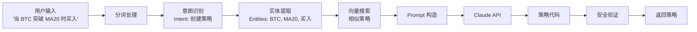
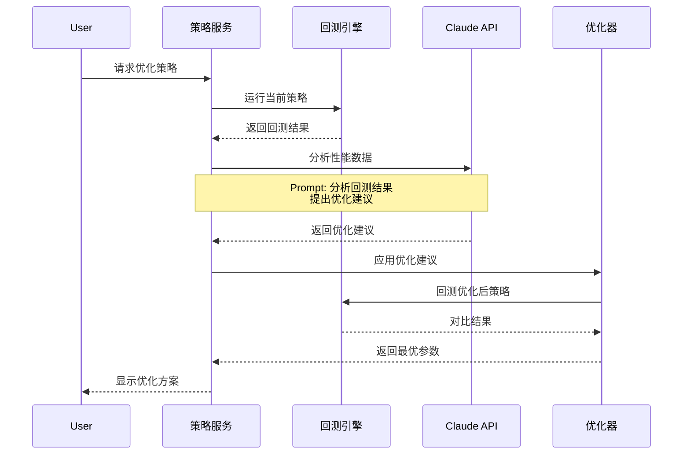
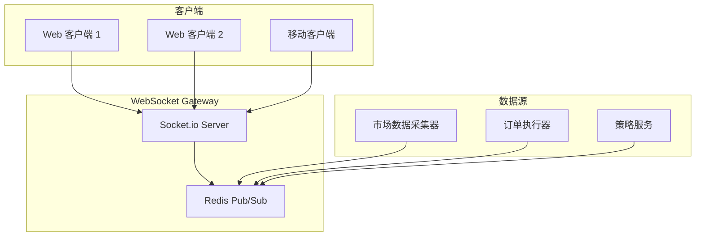
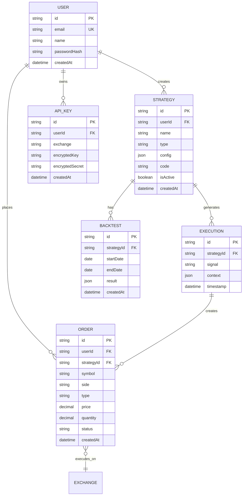

# Delta Terminal 数据流设计

> **版本**: 1.0.0
> **更新日期**: 2025-12-24

---

## 目录

1. [数据流概述](#数据流概述)
2. [核心数据流](#核心数据流)
3. [AI 处理流程](#ai-处理流程)
4. [实时数据推送](#实时数据推送)
5. [数据模型](#数据模型)
6. [数据存储策略](#数据存储策略)

---

## 数据流概述

Delta Terminal 采用**多层数据流架构**：

```
用户输入 → API 网关 → 业务服务 → AI 引擎 → 交易引擎 → 交易所
   ↑                                                           ↓
   └─────────────── WebSocket 推送 ←─── 数据管道 ←──────────────┘
```

### 数据流分类

1. **命令流** (Command Flow): 用户操作 → 系统执行
2. **查询流** (Query Flow): 用户请求 → 数据返回
3. **事件流** (Event Flow): 系统事件 → 异步处理
4. **数据流** (Data Flow): 市场数据 → 分析处理

---

## 核心数据流

### 1. 策略创建流程

用户通过自然语言描述策略，AI 生成可执行策略代码。



**数据结构**:

```typescript
// 请求
interface GenerateStrategyRequest {
  userId: string;
  prompt: string;        // "当 BTC 突破 MA20 时买入"
  language?: 'zh' | 'en';
}

// 响应
interface GenerateStrategyResponse {
  id: string;
  name: string;
  code: string;          // 可执行策略代码
  explanation: string;   // AI 生成的策略说明
  riskLevel: 'low' | 'medium' | 'high';
  estimatedProfit: number;
}
```

---

### 2. 策略激活与订单执行流程

策略激活后，系统持续监控市场数据并执行交易。



**数据结构**:

```typescript
// 策略激活事件
interface StrategyActivatedEvent {
  eventId: string;
  eventType: 'strategy.activated';
  timestamp: string;
  payload: {
    strategyId: string;
    userId: string;
    config: {
      symbols: string[];
      maxPosition: number;
      stopLoss: number;
    };
  };
}

// 交易信号事件
interface SignalGeneratedEvent {
  eventId: string;
  eventType: 'signal.generated';
  timestamp: string;
  payload: {
    strategyId: string;
    symbol: string;
    action: 'buy' | 'sell';
    price: number;
    quantity: number;
    confidence: number;  // 0-1
  };
}

// 订单创建事件
interface OrderCreatedEvent {
  eventId: string;
  eventType: 'order.created';
  timestamp: string;
  payload: {
    orderId: string;
    strategyId: string;
    symbol: string;
    side: 'buy' | 'sell';
    type: 'limit' | 'market';
    price: number;
    quantity: number;
  };
}
```

---

### 3. 市场数据采集流程

实时采集交易所行情数据，存储到时序数据库。



**数据结构**:

```typescript
// 市场 Tick 数据
interface MarketTick {
  symbol: string;
  timestamp: number;
  price: number;
  volume: number;
  bid: number;
  ask: number;
  high24h: number;
  low24h: number;
}

// TimescaleDB 存储
CREATE TABLE market_ticks (
  time        TIMESTAMPTZ NOT NULL,
  symbol      TEXT NOT NULL,
  price       NUMERIC(20, 8) NOT NULL,
  volume      NUMERIC(20, 8) NOT NULL,
  bid         NUMERIC(20, 8),
  ask         NUMERIC(20, 8),
  high_24h    NUMERIC(20, 8),
  low_24h     NUMERIC(20, 8)
);

SELECT create_hypertable('market_ticks', 'time');
CREATE INDEX idx_symbol_time ON market_ticks (symbol, time DESC);
```

---

### 4. 回测数据流程

用户上传策略代码，系统使用历史数据回测。



**回测结果数据**:

```typescript
interface BacktestResult {
  strategyId: string;
  period: {
    start: string;
    end: string;
  };
  metrics: {
    totalReturn: number;       // 总收益率
    annualizedReturn: number;  // 年化收益率
    sharpeRatio: number;       // 夏普比率
    maxDrawdown: number;       // 最大回撤
    winRate: number;           // 胜率
    profitFactor: number;      // 盈亏比
  };
  trades: Trade[];
  equity: { time: string; value: number }[];
}
```

---

## AI 处理流程

### 1. 自然语言理解

用户输入 → 意图识别 → 实体提取 → 策略生成



**Prompt 模板**:

```typescript
const STRATEGY_GENERATION_PROMPT = `
你是一位专业的量化交易策略专家。请根据用户描述生成 Python 交易策略代码。

用户描述:
{user_prompt}

相似策略参考:
{similar_strategies}

要求:
1. 使用 CCXT 库
2. 包含入场和出场逻辑
3. 添加风险管理
4. 代码必须可执行

请返回 JSON 格式:
{
  "name": "策略名称",
  "code": "完整策略代码",
  "explanation": "策略说明",
  "risk_level": "low/medium/high"
}
`;
```

### 2. 策略优化流程

AI 分析策略性能，提出优化建议。



---

## 实时数据推送

### WebSocket 架构



### 推送事件类型

```typescript
// 1. 市场数据推送
interface MarketTickEvent {
  channel: 'market.tick';
  data: {
    symbol: string;
    price: number;
    volume: number;
    timestamp: number;
  };
}

// 2. 订单状态推送
interface OrderUpdateEvent {
  channel: 'order.update';
  data: {
    orderId: string;
    status: 'pending' | 'filled' | 'cancelled';
    filledQuantity: number;
    timestamp: number;
  };
}

// 3. 策略执行推送
interface StrategyExecutionEvent {
  channel: 'strategy.execution';
  data: {
    strategyId: string;
    action: 'buy' | 'sell';
    symbol: string;
    quantity: number;
    price: number;
    timestamp: number;
  };
}

// 4. 账户更新推送
interface AccountUpdateEvent {
  channel: 'account.update';
  data: {
    balance: number;
    equity: number;
    availableMargin: number;
    timestamp: number;
  };
}
```

### 客户端订阅示例

```typescript
// hooks/useRealtimeData.ts
import { useEffect, useState } from 'react';
import { io, Socket } from 'socket.io-client';

export function useMarketData(symbols: string[]) {
  const [ticks, setTicks] = useState<MarketTick[]>([]);
  const [socket, setSocket] = useState<Socket | null>(null);

  useEffect(() => {
    const newSocket = io('ws://localhost:3000', {
      auth: { token: getAuthToken() }
    });

    newSocket.on('connect', () => {
      console.log('WebSocket connected');
      newSocket.emit('subscribe', {
        channel: 'market.tick',
        symbols: symbols
      });
    });

    newSocket.on('market.tick', (tick: MarketTick) => {
      setTicks(prev => [...prev.slice(-99), tick]); // 保留最新 100 条
    });

    newSocket.on('disconnect', () => {
      console.log('WebSocket disconnected');
    });

    setSocket(newSocket);

    return () => {
      newSocket.close();
    };
  }, [symbols]);

  return { ticks, socket };
}
```

### 服务端推送示例

```typescript
// websocket-gateway/server.ts
import { Server } from 'socket.io';
import { createClient } from 'redis';

const io = new Server(3000, {
  cors: { origin: '*' }
});

const redis = createClient();
const subscriber = redis.duplicate();

await subscriber.connect();

// 订阅 Redis 频道
await subscriber.subscribe('market:tick', (message) => {
  const tick = JSON.parse(message);

  // 广播给订阅该交易对的客户端
  io.to(`market:${tick.symbol}`).emit('market.tick', tick);
});

// 处理客户端订阅
io.on('connection', (socket) => {
  socket.on('subscribe', ({ channel, symbols }) => {
    if (channel === 'market.tick') {
      symbols.forEach((symbol: string) => {
        socket.join(`market:${symbol}`);
      });
    }
  });

  socket.on('disconnect', () => {
    console.log('Client disconnected');
  });
});
```

---

## 数据模型

### 核心实体关系图



### 数据库 Schema

```sql
-- 用户表
CREATE TABLE users (
  id UUID PRIMARY KEY DEFAULT gen_random_uuid(),
  email VARCHAR(255) UNIQUE NOT NULL,
  name VARCHAR(100) NOT NULL,
  password_hash VARCHAR(255) NOT NULL,
  created_at TIMESTAMPTZ DEFAULT NOW(),
  updated_at TIMESTAMPTZ DEFAULT NOW()
);

-- 策略表
CREATE TABLE strategies (
  id UUID PRIMARY KEY DEFAULT gen_random_uuid(),
  user_id UUID NOT NULL REFERENCES users(id) ON DELETE CASCADE,
  name VARCHAR(200) NOT NULL,
  type VARCHAR(50) NOT NULL,
  config JSONB NOT NULL,
  code TEXT,
  is_active BOOLEAN DEFAULT FALSE,
  created_at TIMESTAMPTZ DEFAULT NOW(),
  updated_at TIMESTAMPTZ DEFAULT NOW()
);

CREATE INDEX idx_strategies_user_id ON strategies(user_id);
CREATE INDEX idx_strategies_is_active ON strategies(is_active) WHERE is_active = TRUE;

-- API 密钥表
CREATE TABLE api_keys (
  id UUID PRIMARY KEY DEFAULT gen_random_uuid(),
  user_id UUID NOT NULL REFERENCES users(id) ON DELETE CASCADE,
  exchange VARCHAR(50) NOT NULL,
  encrypted_key TEXT NOT NULL,
  encrypted_secret TEXT NOT NULL,
  created_at TIMESTAMPTZ DEFAULT NOW()
);

CREATE INDEX idx_api_keys_user_id ON api_keys(user_id);

-- 订单表
CREATE TABLE orders (
  id UUID PRIMARY KEY DEFAULT gen_random_uuid(),
  user_id UUID NOT NULL REFERENCES users(id),
  strategy_id UUID REFERENCES strategies(id),
  exchange_order_id VARCHAR(100),
  symbol VARCHAR(20) NOT NULL,
  side VARCHAR(10) NOT NULL,
  type VARCHAR(10) NOT NULL,
  price NUMERIC(20, 8),
  quantity NUMERIC(20, 8) NOT NULL,
  status VARCHAR(20) NOT NULL,
  filled_quantity NUMERIC(20, 8) DEFAULT 0,
  created_at TIMESTAMPTZ DEFAULT NOW(),
  updated_at TIMESTAMPTZ DEFAULT NOW()
);

CREATE INDEX idx_orders_user_id ON orders(user_id);
CREATE INDEX idx_orders_strategy_id ON orders(strategy_id);
CREATE INDEX idx_orders_status ON orders(status);
CREATE INDEX idx_orders_created_at ON orders(created_at DESC);

-- 市场数据表 (TimescaleDB)
CREATE TABLE market_ticks (
  time TIMESTAMPTZ NOT NULL,
  symbol TEXT NOT NULL,
  price NUMERIC(20, 8) NOT NULL,
  volume NUMERIC(20, 8) NOT NULL,
  bid NUMERIC(20, 8),
  ask NUMERIC(20, 8)
);

SELECT create_hypertable('market_ticks', 'time');
CREATE INDEX idx_market_ticks_symbol ON market_ticks (symbol, time DESC);
```

---

## 数据存储策略

### 1. 数据分层

```
热数据 (Redis)          ← 实时价格、会话、缓存
  ↓ 1小时
温数据 (PostgreSQL)     ← 用户数据、策略、订单
  ↓ 7天
冷数据 (TimescaleDB)    ← 历史市场数据
  ↓ 30天压缩
归档数据 (S3/OSS)       ← 历史回测、日志
```

### 2. 数据生命周期

| 数据类型 | 热存储 | 温存储 | 冷存储 | 归档 |
|---------|--------|--------|--------|------|
| 实时价格 | Redis (5分钟) | - | - | - |
| 用户数据 | Redis (会话) | PostgreSQL (永久) | - | - |
| 订单记录 | Redis (1小时) | PostgreSQL (永久) | - | 备份 |
| 市场 Tick | Redis (5分钟) | TimescaleDB (7天) | 压缩存储 | S3 (1年后) |
| 回测结果 | - | PostgreSQL (90天) | - | S3 |
| 日志 | ELK (7天) | - | - | S3 (30天后) |

### 3. 缓存策略

```typescript
// 多级缓存
class CacheService {
  // L1: 内存缓存 (进程内)
  private memoryCache = new Map<string, any>();

  // L2: Redis 缓存
  private redis = createClient();

  async get<T>(key: string): Promise<T | null> {
    // 1. 检查内存缓存
    if (this.memoryCache.has(key)) {
      return this.memoryCache.get(key);
    }

    // 2. 检查 Redis
    const cached = await this.redis.get(key);
    if (cached) {
      const data = JSON.parse(cached);
      this.memoryCache.set(key, data); // 回填 L1
      return data;
    }

    // 3. 查询数据库
    const data = await this.fetchFromDB(key);
    if (data) {
      await this.set(key, data, 3600); // 缓存 1 小时
    }

    return data;
  }

  async set(key: string, value: any, ttl: number) {
    this.memoryCache.set(key, value);
    await this.redis.set(key, JSON.stringify(value), { EX: ttl });
  }
}
```

### 4. 数据一致性

- **强一致性**: 用户资金、订单状态 (PostgreSQL ACID)
- **最终一致性**: 市场数据、策略执行记录 (异步同步)
- **时间窗口一致性**: 实时推送 (WebSocket 不保证顺序)

---

## 数据安全

### 1. 敏感数据加密

```typescript
import crypto from 'crypto';

const ALGORITHM = 'aes-256-gcm';
const KEY = Buffer.from(process.env.ENCRYPTION_KEY!, 'hex');

export function encrypt(text: string): string {
  const iv = crypto.randomBytes(16);
  const cipher = crypto.createCipheriv(ALGORITHM, KEY, iv);

  let encrypted = cipher.update(text, 'utf8', 'hex');
  encrypted += cipher.final('hex');

  const authTag = cipher.getAuthTag().toString('hex');

  return `${iv.toString('hex')}:${authTag}:${encrypted}`;
}

export function decrypt(encryptedText: string): string {
  const [ivHex, authTagHex, encrypted] = encryptedText.split(':');

  const iv = Buffer.from(ivHex, 'hex');
  const authTag = Buffer.from(authTagHex, 'hex');
  const decipher = crypto.createDecipheriv(ALGORITHM, KEY, iv);

  decipher.setAuthTag(authTag);

  let decrypted = decipher.update(encrypted, 'hex', 'utf8');
  decrypted += decipher.final('utf8');

  return decrypted;
}

// 使用
const apiKey = 'my-secret-api-key';
const encrypted = encrypt(apiKey);
await prisma.apiKey.create({
  data: { encryptedKey: encrypted }
});
```

### 2. 数据脱敏

```typescript
// 日志中脱敏敏感信息
function maskSensitiveData(data: any): any {
  const masked = { ...data };

  if (masked.apiKey) {
    masked.apiKey = `***${masked.apiKey.slice(-4)}`;
  }

  if (masked.email) {
    const [name, domain] = masked.email.split('@');
    masked.email = `${name.slice(0, 2)}***@${domain}`;
  }

  return masked;
}
```

---

## 下一步

- 查看 [安全架构](./security.md)
- 了解 [编码规范](./coding-standards.md)
- 阅读 [源码结构](./source-tree.md)

---

**文档维护**: 数据团队
