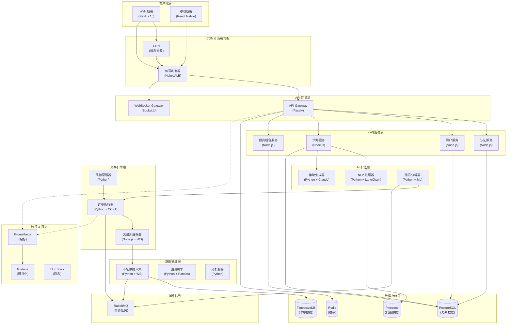
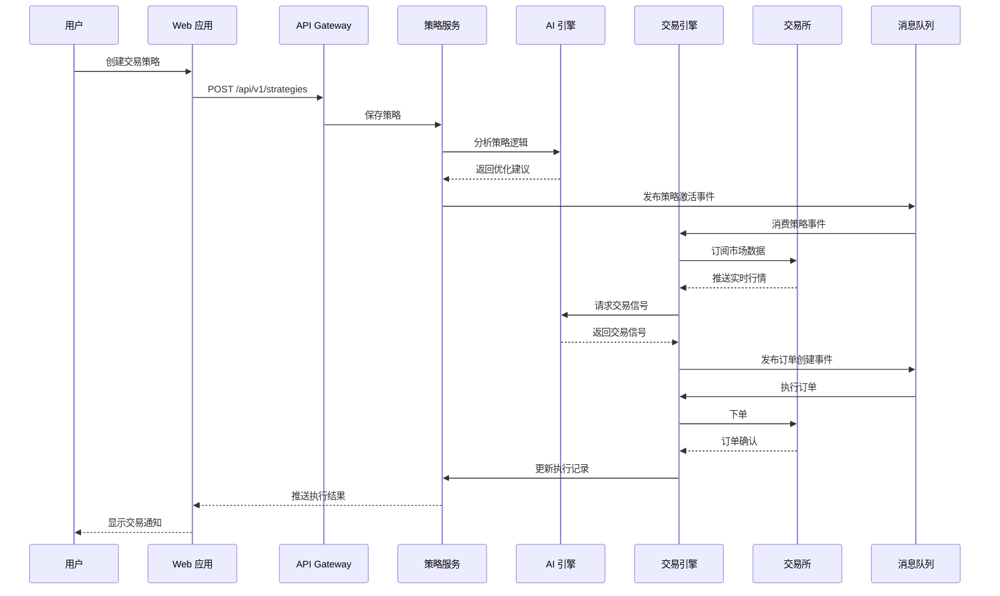
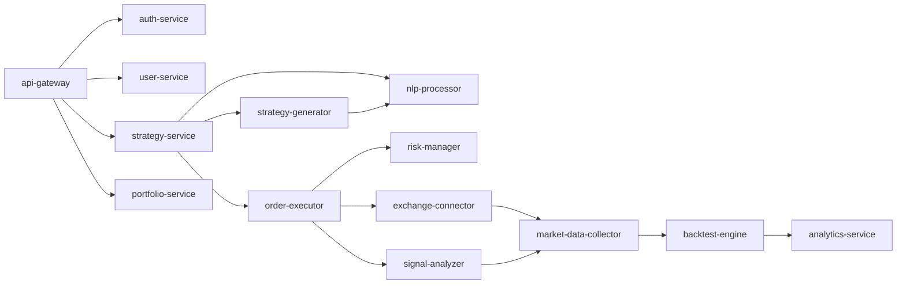
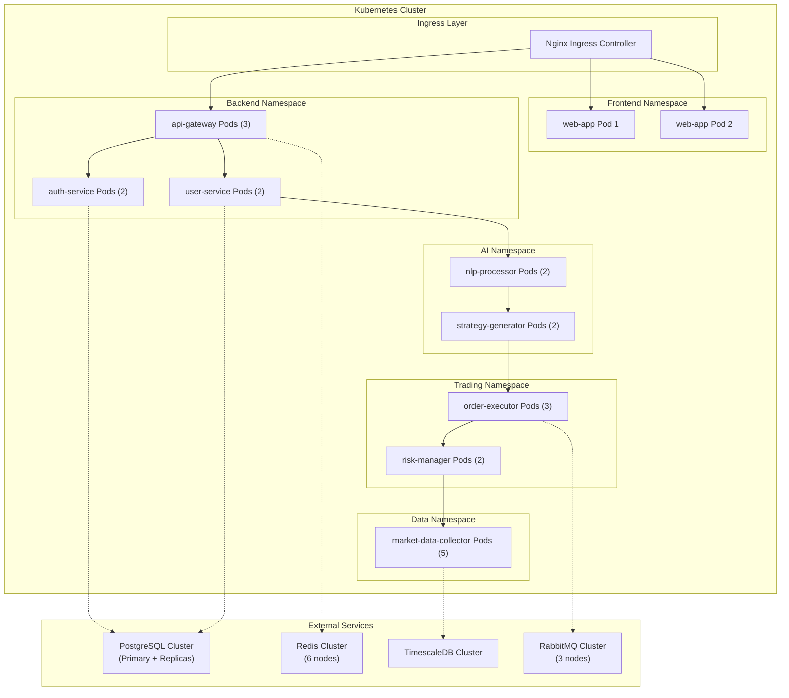

# Delta Terminal 系统架构概述

> **版本**: 1.0.0
> **更新日期**: 2025-12-24
> **状态**: 设计阶段

---

## 目录

1. [架构愿景](#架构愿景)
2. [核心设计原则](#核心设计原则)
3. [系统架构图](#系统架构图)
4. [微服务划分](#微服务划分)
5. [通信模式](#通信模式)
6. [部署架构](#部署架构)
7. [扩展性设计](#扩展性设计)

---

## 架构愿景

Delta Terminal 采用**云原生微服务架构**，旨在构建一个：

- **高可用** (99.9%+ uptime)
- **低延迟** (<100ms API 响应)
- **可扩展** (支持 10万+ 并发用户)
- **智能化** (AI 驱动的交易决策)
- **安全可靠** (多层安全防护)

的现代化 AI 交易平台。

---

## 核心设计原则

### 1. 微服务架构

- **单一职责**: 每个服务专注一个业务领域
- **独立部署**: 服务可独立发布和扩展
- **松耦合**: 通过 API 和消息队列通信
- **容错性**: 服务故障不影响整体系统

### 2. 事件驱动

- **异步处理**: 交易信号、订单执行通过消息队列异步处理
- **事件溯源**: 关键业务操作记录完整事件日志
- **最终一致性**: 分布式事务采用 Saga 模式

### 3. API 优先

- **RESTful API**: 资源操作遵循 REST 规范
- **GraphQL**: 复杂查询使用 GraphQL
- **WebSocket**: 实时数据推送使用 WebSocket
- **API 版本控制**: 使用 URL 版本 (v1, v2)

### 4. 云原生

- **容器化**: 所有服务容器化部署
- **编排**: 使用 Kubernetes 进行容器编排
- **服务发现**: 自动服务注册与发现
- **配置管理**: 集中配置管理

### 5. 可观测性

- **日志**: 结构化日志 (JSON 格式)
- **监控**: Prometheus + Grafana
- **追踪**: 分布式链路追踪
- **告警**: 多级告警机制

---

## 系统架构图

### 总体架构



### 数据流架构



---

## 微服务划分

### 服务分类

#### 1. 核心业务服务 (Node.js)

| 服务名称 | 职责 | 端口 | 数据库 |
|---------|------|------|--------|
| **api-gateway** | API 路由、认证、限流 | 3000 | Redis |
| **auth-service** | 用户认证、JWT 管理 | 3001 | PostgreSQL |
| **user-service** | 用户信息管理 | 3002 | PostgreSQL |
| **strategy-service** | 策略 CRUD 操作 | 3003 | PostgreSQL |
| **portfolio-service** | 投资组合管理 | 3004 | PostgreSQL |
| **notification-service** | 消息通知推送 | 3005 | Redis |

#### 2. AI 服务 (Python)

| 服务名称 | 职责 | 端口 | 依赖 |
|---------|------|------|------|
| **nlp-processor** | 自然语言理解 | 8001 | Claude API, Pinecone |
| **strategy-generator** | AI 策略生成 | 8002 | LangChain, Claude |
| **signal-analyzer** | 交易信号分析 | 8003 | ML 模型, TimescaleDB |

#### 3. 交易引擎服务 (Python)

| 服务名称 | 职责 | 端口 | 依赖 |
|---------|------|------|------|
| **order-executor** | 订单执行逻辑 | 8101 | CCXT, RabbitMQ |
| **risk-manager** | 风险控制引擎 | 8102 | PostgreSQL, Redis |
| **exchange-connector** | 交易所 API 封装 | 8103 | CCXT, WebSocket |

#### 4. 数据服务 (Python)

| 服务名称 | 职责 | 端口 | 依赖 |
|---------|------|------|------|
| **market-data-collector** | 市场数据采集 | 8201 | TimescaleDB, Redis |
| **backtest-engine** | 历史数据回测 | 8202 | TimescaleDB, Pandas |
| **analytics-service** | 数据分析与报表 | 8203 | TimescaleDB, PostgreSQL |

### 服务依赖关系



---

## 通信模式

### 1. 同步通信 (HTTP/gRPC)

**适用场景**: 实时查询、用户操作响应

#### RESTful API

```
GET    /api/v1/users/{id}         # 获取用户信息
POST   /api/v1/strategies          # 创建策略
PUT    /api/v1/strategies/{id}     # 更新策略
DELETE /api/v1/strategies/{id}     # 删除策略
```

#### GraphQL API

```graphql
query GetUserDashboard($userId: ID!) {
  user(id: $userId) {
    id
    name
    portfolio {
      totalValue
      positions {
        symbol
        quantity
        currentPrice
      }
    }
    activeStrategies {
      id
      name
      performance
    }
  }
}
```

### 2. 异步通信 (消息队列)

**适用场景**: 事件驱动、长时间任务、解耦服务

#### RabbitMQ 交换机设计

```
Exchange: delta.events (topic)
├── Routing Key: strategy.created
├── Routing Key: strategy.activated
├── Routing Key: order.created
├── Routing Key: order.filled
├── Routing Key: signal.generated
└── Routing Key: market.tick
```

#### 消息格式

```json
{
  "eventId": "evt_123456",
  "eventType": "order.created",
  "timestamp": "2025-12-24T10:30:00Z",
  "payload": {
    "orderId": "ord_789",
    "strategyId": "strat_456",
    "symbol": "BTC/USDT",
    "side": "buy",
    "type": "limit",
    "price": 42000.00,
    "quantity": 0.1
  },
  "metadata": {
    "userId": "user_123",
    "source": "trading-engine"
  }
}
```

### 3. 实时通信 (WebSocket)

**适用场景**: 市场数据推送、订单状态更新

#### WebSocket 事件

```javascript
// 客户端订阅
ws.emit('subscribe', {
  channel: 'market.tickers',
  symbols: ['BTC/USDT', 'ETH/USDT']
});

// 服务端推送
ws.broadcast('market.tick', {
  symbol: 'BTC/USDT',
  price: 42150.00,
  volume: 1234.56,
  timestamp: 1703419800000
});
```

---

## 部署架构

### Kubernetes 集群设计



### 资源配置

#### Pod 资源限制

```yaml
# 示例: api-gateway
resources:
  requests:
    cpu: "500m"
    memory: "512Mi"
  limits:
    cpu: "1000m"
    memory: "1Gi"

# 示例: order-executor (高负载)
resources:
  requests:
    cpu: "1000m"
    memory: "2Gi"
  limits:
    cpu: "2000m"
    memory: "4Gi"
```

#### 自动扩缩容 (HPA)

```yaml
# 基于 CPU 和内存的自动扩缩容
apiVersion: autoscaling/v2
kind: HorizontalPodAutoscaler
metadata:
  name: api-gateway-hpa
spec:
  scaleTargetRef:
    apiVersion: apps/v1
    kind: Deployment
    name: api-gateway
  minReplicas: 2
  maxReplicas: 10
  metrics:
  - type: Resource
    resource:
      name: cpu
      target:
        type: Utilization
        averageUtilization: 70
  - type: Resource
    resource:
      name: memory
      target:
        type: Utilization
        averageUtilization: 80
```

---

## 扩展性设计

### 1. 水平扩展

- **无状态服务**: 所有业务服务设计为无状态，可任意扩展实例数
- **状态外置**: 会话、缓存存储于 Redis，支持跨实例共享
- **负载均衡**: Kubernetes Service 自动负载均衡

### 2. 垂直扩展

- **资源调整**: 根据监控指标调整 Pod 资源限制
- **数据库升级**: PostgreSQL/TimescaleDB 支持实例升级

### 3. 数据分片

- **用户分片**: 按 userId 哈希分片存储
- **时序数据**: TimescaleDB 自动按时间分区
- **消息队列**: RabbitMQ 使用多个队列并行处理

### 4. 缓存策略

```
L1 Cache (本地): 热点数据缓存 (5分钟 TTL)
L2 Cache (Redis): 用户会话、API 响应 (1小时 TTL)
L3 Cache (CDN): 静态资源 (7天 TTL)
```

### 5. 降级策略

- **功能降级**: 非核心功能在高负载时自动降级
- **限流降级**: API 限流保护核心服务
- **熔断机制**: 依赖服务故障时自动熔断

---

## 性能指标

### SLA 目标

| 指标 | 目标值 | 监控方式 |
|-----|--------|---------|
| API 响应时间 (P95) | <100ms | Prometheus |
| API 响应时间 (P99) | <200ms | Prometheus |
| 订单执行延迟 | <50ms | 自定义指标 |
| 系统可用性 | 99.9% | Uptime Monitor |
| 数据采集延迟 | <10ms | TimescaleDB |
| WebSocket 延迟 | <20ms | 客户端追踪 |

### 容量规划

- **并发用户**: 10万 在线用户
- **API QPS**: 5万 请求/秒
- **WebSocket 连接**: 10万 并发连接
- **订单处理**: 1万 订单/秒
- **市场数据**: 100个交易对实时推送

---

## 安全架构概要

详见 [security.md](./security.md)

- **认证**: JWT + OAuth2.0
- **授权**: RBAC (基于角色的访问控制)
- **数据加密**: TLS 1.3 传输加密，AES-256 数据库加密
- **API 密钥**: 加密存储于 PostgreSQL，从不明文传输
- **DDoS 防护**: Cloudflare + Rate Limiting
- **审计日志**: 所有关键操作记录审计日志

---

## 灾难恢复

### 备份策略

- **数据库**: 每日全量备份 + 实时 WAL 归档
- **配置**: Git 仓库备份
- **日志**: ELK Stack 7天热数据 + S3 30天归档

### 恢复目标

- **RTO** (Recovery Time Objective): <15分钟
- **RPO** (Recovery Point Objective): <5分钟

---

## 下一步

1. 查看 [技术栈详解](./tech-stack.md)
2. 了解 [数据流设计](./data-flow.md)
3. 阅读 [安全架构](./security.md)
4. 遵循 [编码规范](./coding-standards.md)

---

**文档维护**: 架构团队
**审核周期**: 每季度
