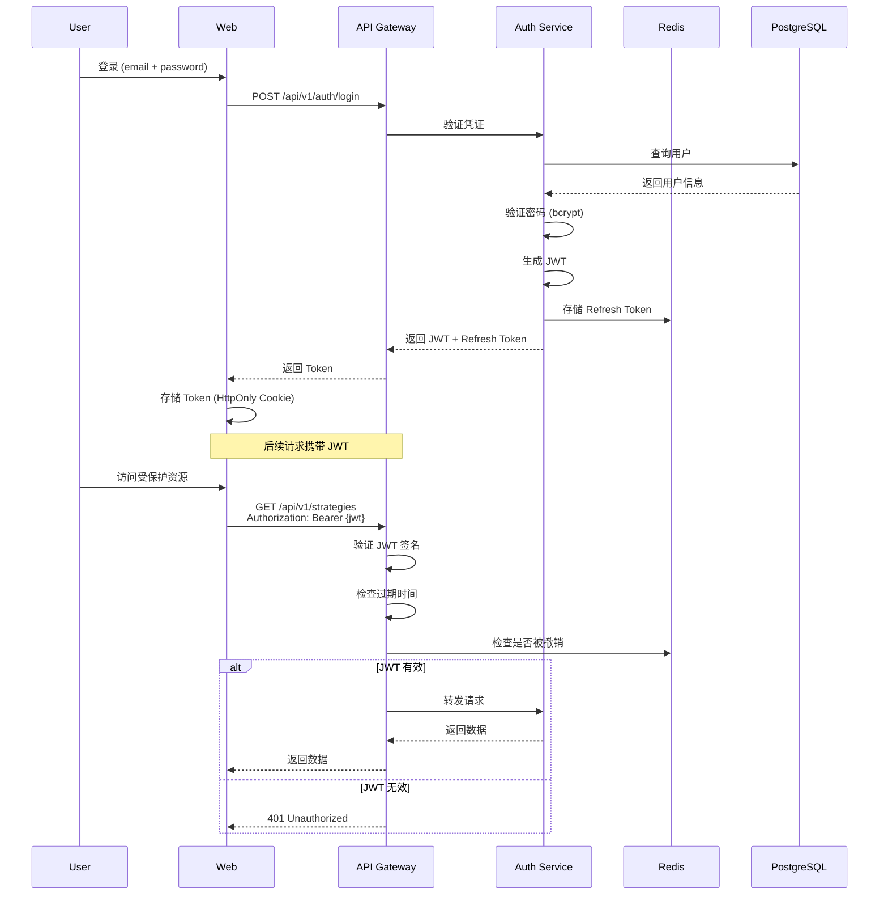

# Delta Terminal 安全架构

> **版本**: 1.0.0
> **更新日期**: 2025-12-24
> **分类**: 机密文档

---

## 目录

1. [安全原则](#安全原则)
2. [认证与授权](#认证与授权)
3. [API 密钥管理](#api-密钥管理)
4. [数据加密](#数据加密)
5. [网络安全](#网络安全)
6. [审计与监控](#审计与监控)
7. [合规性](#合规性)

---

## 安全原则

### 纵深防御 (Defense in Depth)

Delta Terminal 采用多层安全防护：

```
第 1 层: DDoS 防护 (Cloudflare)
第 2 层: WAF 防火墙
第 3 层: API 网关 (认证、限流)
第 4 层: 应用层权限控制 (RBAC)
第 5 层: 数据库访问控制 (行级安全)
第 6 层: 数据加密 (AES-256)
第 7 层: 审计日志
```

### 最小权限原则

- **服务**: 每个微服务仅拥有必要的数据库权限
- **用户**: 默认最小权限，按需授权
- **API**: 所有 API 默认需要认证

### 零信任架构

- **服务间通信**: 使用 mTLS (双向 TLS)
- **API 调用**: 每次请求都验证 JWT
- **数据访问**: 行级权限控制 (RLS)

---

## 认证与授权

### 1. 用户认证

#### JWT (JSON Web Token)

**流程图**:



**JWT Payload**:

```typescript
interface JWTPayload {
  sub: string;           // 用户 ID
  email: string;
  name: string;
  role: 'user' | 'admin';
  iat: number;           // 签发时间
  exp: number;           // 过期时间 (1小时)
}
```

**实现**:

```typescript
// backend/auth-service/jwt.ts
import jwt from 'jsonwebtoken';

const JWT_SECRET = process.env.JWT_SECRET!;
const JWT_EXPIRES_IN = '1h';
const REFRESH_TOKEN_EXPIRES_IN = '7d';

export function generateAccessToken(user: User): string {
  return jwt.sign(
    {
      sub: user.id,
      email: user.email,
      name: user.name,
      role: user.role,
    },
    JWT_SECRET,
    { expiresIn: JWT_EXPIRES_IN }
  );
}

export function generateRefreshToken(userId: string): string {
  return jwt.sign({ sub: userId }, JWT_SECRET, {
    expiresIn: REFRESH_TOKEN_EXPIRES_IN,
  });
}

export function verifyToken(token: string): JWTPayload {
  try {
    return jwt.verify(token, JWT_SECRET) as JWTPayload;
  } catch (error) {
    throw new UnauthorizedException('Invalid token');
  }
}
```

**中间件**:

```typescript
// backend/api-gateway/middleware/auth.ts
import { FastifyRequest, FastifyReply } from 'fastify';

export async function authMiddleware(
  request: FastifyRequest,
  reply: FastifyReply
) {
  const authHeader = request.headers.authorization;

  if (!authHeader || !authHeader.startsWith('Bearer ')) {
    return reply.code(401).send({ error: 'Unauthorized' });
  }

  const token = authHeader.substring(7);

  try {
    const payload = verifyToken(token);

    // 检查 Token 是否被撤销
    const isRevoked = await redis.get(`revoked:${token}`);
    if (isRevoked) {
      return reply.code(401).send({ error: 'Token revoked' });
    }

    // 附加用户信息到请求对象
    request.user = payload;
  } catch (error) {
    return reply.code(401).send({ error: 'Invalid token' });
  }
}
```

#### OAuth2.0 (第三方登录)

支持的提供商: Google, GitHub, Apple

```typescript
// backend/auth-service/oauth.ts
import { OAuth2Client } from 'google-auth-library';

const googleClient = new OAuth2Client(
  process.env.GOOGLE_CLIENT_ID,
  process.env.GOOGLE_CLIENT_SECRET,
  'https://delta-terminal.com/auth/google/callback'
);

export async function handleGoogleCallback(code: string) {
  // 1. 交换授权码获取 Token
  const { tokens } = await googleClient.getToken(code);
  googleClient.setCredentials(tokens);

  // 2. 获取用户信息
  const ticket = await googleClient.verifyIdToken({
    idToken: tokens.id_token!,
    audience: process.env.GOOGLE_CLIENT_ID,
  });

  const payload = ticket.getPayload();

  // 3. 查找或创建用户
  let user = await prisma.user.findUnique({
    where: { email: payload.email },
  });

  if (!user) {
    user = await prisma.user.create({
      data: {
        email: payload.email!,
        name: payload.name!,
        avatar: payload.picture,
      },
    });
  }

  // 4. 生成 JWT
  const accessToken = generateAccessToken(user);
  const refreshToken = generateRefreshToken(user.id);

  return { accessToken, refreshToken };
}
```

### 2. 授权 (RBAC)

#### 角色定义

```typescript
enum Role {
  USER = 'user',           // 普通用户
  PREMIUM = 'premium',     // 付费用户
  ADMIN = 'admin',         // 管理员
  SUPER_ADMIN = 'super_admin'  // 超级管理员
}

enum Permission {
  // 策略权限
  STRATEGY_CREATE = 'strategy:create',
  STRATEGY_READ = 'strategy:read',
  STRATEGY_UPDATE = 'strategy:update',
  STRATEGY_DELETE = 'strategy:delete',
  STRATEGY_ACTIVATE = 'strategy:activate',

  // 订单权限
  ORDER_CREATE = 'order:create',
  ORDER_READ = 'order:read',
  ORDER_CANCEL = 'order:cancel',

  // 管理员权限
  USER_MANAGE = 'user:manage',
  SYSTEM_CONFIG = 'system:config',
}
```

#### 权限矩阵

| 权限 | USER | PREMIUM | ADMIN |
|-----|------|---------|-------|
| strategy:create | ✅ (限额 3) | ✅ (无限) | ✅ |
| strategy:activate | ✅ (限 1 个) | ✅ (限 5 个) | ✅ |
| order:create | ✅ | ✅ | ✅ |
| user:manage | ❌ | ❌ | ✅ |
| system:config | ❌ | ❌ | ✅ |

#### 权限检查装饰器

```typescript
// backend/shared/decorators/permission.ts
export function RequirePermission(...permissions: Permission[]) {
  return function (
    target: any,
    propertyKey: string,
    descriptor: PropertyDescriptor
  ) {
    const originalMethod = descriptor.value;

    descriptor.value = async function (...args: any[]) {
      const request = args[0] as FastifyRequest;
      const user = request.user;

      const hasPermission = await checkUserPermissions(user.id, permissions);

      if (!hasPermission) {
        throw new ForbiddenException('Insufficient permissions');
      }

      return originalMethod.apply(this, args);
    };

    return descriptor;
  };
}

// 使用
class StrategyController {
  @RequirePermission(Permission.STRATEGY_CREATE)
  async createStrategy(request: FastifyRequest, reply: FastifyReply) {
    // 只有拥有 strategy:create 权限的用户可以访问
    const strategy = await strategyService.create(request.body);
    return reply.send(strategy);
  }
}
```

---

## API 密钥管理

交易所 API 密钥是最敏感的数据，必须严格保护。

### 1. 存储加密

#### AES-256-GCM 加密

```typescript
// backend/shared/crypto/encryption.ts
import crypto from 'crypto';

const ALGORITHM = 'aes-256-gcm';
const KEY_LENGTH = 32; // 256 bits
const IV_LENGTH = 16;  // 128 bits
const AUTH_TAG_LENGTH = 16;

// 从环境变量加载主密钥
const MASTER_KEY = Buffer.from(process.env.MASTER_ENCRYPTION_KEY!, 'hex');

export function encryptApiKey(plaintext: string): string {
  // 1. 生成随机 IV
  const iv = crypto.randomBytes(IV_LENGTH);

  // 2. 创建加密器
  const cipher = crypto.createCipheriv(ALGORITHM, MASTER_KEY, iv);

  // 3. 加密数据
  let encrypted = cipher.update(plaintext, 'utf8', 'hex');
  encrypted += cipher.final('hex');

  // 4. 获取认证标签
  const authTag = cipher.getAuthTag();

  // 5. 组合: IV:AuthTag:Ciphertext
  return `${iv.toString('hex')}:${authTag.toString('hex')}:${encrypted}`;
}

export function decryptApiKey(ciphertext: string): string {
  // 1. 分离组件
  const [ivHex, authTagHex, encrypted] = ciphertext.split(':');

  const iv = Buffer.from(ivHex, 'hex');
  const authTag = Buffer.from(authTagHex, 'hex');

  // 2. 创建解密器
  const decipher = crypto.createDecipheriv(ALGORITHM, MASTER_KEY, iv);
  decipher.setAuthTag(authTag);

  // 3. 解密数据
  let decrypted = decipher.update(encrypted, 'hex', 'utf8');
  decrypted += decipher.final('utf8');

  return decrypted;
}
```

#### 密钥轮换

```typescript
// 定期轮换加密密钥
export async function rotateEncryptionKey() {
  const newKey = crypto.randomBytes(KEY_LENGTH);

  // 1. 查询所有加密数据
  const apiKeys = await prisma.apiKey.findMany();

  // 2. 使用旧密钥解密
  const decrypted = apiKeys.map((key) => ({
    id: key.id,
    plainKey: decryptApiKey(key.encryptedKey),
    plainSecret: decryptApiKey(key.encryptedSecret),
  }));

  // 3. 使用新密钥加密
  for (const { id, plainKey, plainSecret } of decrypted) {
    await prisma.apiKey.update({
      where: { id },
      data: {
        encryptedKey: encryptApiKey(plainKey),
        encryptedSecret: encryptApiKey(plainSecret),
      },
    });
  }

  // 4. 更新主密钥
  console.log('New Master Key:', newKey.toString('hex'));
  // 手动更新环境变量
}
```

### 2. 使用时解密

API 密钥只在内存中短暂存在，用完立即销毁。

```typescript
// trading-engine/exchange-connector/connector.ts
export class ExchangeConnector {
  private exchange: ccxt.Exchange | null = null;

  async executeOrder(userId: string, order: CreateOrderDto) {
    // 1. 从数据库获取加密的 API Key
    const apiKey = await prisma.apiKey.findUnique({
      where: { userId },
    });

    if (!apiKey) {
      throw new Error('API key not found');
    }

    try {
      // 2. 临时解密
      const key = decryptApiKey(apiKey.encryptedKey);
      const secret = decryptApiKey(apiKey.encryptedSecret);

      // 3. 初始化交易所连接
      this.exchange = new ccxt.binance({
        apiKey: key,
        secret: secret,
      });

      // 4. 执行订单
      const result = await this.exchange.createOrder(
        order.symbol,
        order.type,
        order.side,
        order.amount,
        order.price
      );

      return result;
    } finally {
      // 5. 立即销毁实例
      this.exchange = null;
    }
  }
}
```

### 3. API 密钥权限限制

要求用户为交易所 API 密钥设置最小权限：

- ✅ 允许: 查询账户、创建订单、查询订单
- ❌ 禁止: 提币、转账、修改安全设置

---

## 数据加密

### 1. 传输加密 (TLS 1.3)

所有网络通信使用 TLS 1.3 加密。

#### Nginx 配置

```nginx
server {
    listen 443 ssl http2;
    server_name api.delta-terminal.com;

    # TLS 1.3 only
    ssl_protocols TLSv1.3;

    # 证书
    ssl_certificate /etc/letsencrypt/live/delta-terminal.com/fullchain.pem;
    ssl_certificate_key /etc/letsencrypt/live/delta-terminal.com/privkey.pem;

    # 强加密套件
    ssl_ciphers 'TLS_AES_256_GCM_SHA384:TLS_CHACHA20_POLY1305_SHA256';
    ssl_prefer_server_ciphers off;

    # HSTS
    add_header Strict-Transport-Security "max-age=31536000; includeSubDomains" always;

    # 禁用不安全的协议
    add_header X-Frame-Options "DENY" always;
    add_header X-Content-Type-Options "nosniff" always;
    add_header X-XSS-Protection "1; mode=block" always;

    location / {
        proxy_pass http://localhost:3000;
        proxy_set_header Host $host;
        proxy_set_header X-Real-IP $remote_addr;
        proxy_set_header X-Forwarded-For $proxy_add_x_forwarded_for;
        proxy_set_header X-Forwarded-Proto $scheme;
    }
}
```

### 2. 数据库加密

#### PostgreSQL 透明数据加密 (TDE)

```sql
-- 创建加密表空间
CREATE TABLESPACE encrypted_space
  LOCATION '/var/lib/postgresql/encrypted'
  WITH (encryption = true);

-- 敏感表使用加密表空间
CREATE TABLE api_keys (
  id UUID PRIMARY KEY,
  user_id UUID NOT NULL,
  encrypted_key TEXT NOT NULL,
  encrypted_secret TEXT NOT NULL
) TABLESPACE encrypted_space;
```

#### 行级加密

```typescript
// Prisma 中间件: 自动加密敏感字段
prisma.$use(async (params, next) => {
  // 写入时加密
  if (params.action === 'create' && params.model === 'ApiKey') {
    if (params.args.data.key) {
      params.args.data.encryptedKey = encryptApiKey(params.args.data.key);
      delete params.args.data.key;
    }
    if (params.args.data.secret) {
      params.args.data.encryptedSecret = encryptApiKey(params.args.data.secret);
      delete params.args.data.secret;
    }
  }

  const result = await next(params);

  // 读取时不自动解密（按需解密）
  return result;
});
```

### 3. 密码哈希

使用 bcrypt 哈希用户密码。

```typescript
// backend/auth-service/password.ts
import bcrypt from 'bcrypt';

const SALT_ROUNDS = 12;

export async function hashPassword(password: string): Promise<string> {
  return bcrypt.hash(password, SALT_ROUNDS);
}

export async function verifyPassword(
  password: string,
  hash: string
): Promise<boolean> {
  return bcrypt.compare(password, hash);
}

// 使用
const passwordHash = await hashPassword('user-password');
await prisma.user.create({
  data: {
    email: 'user@example.com',
    passwordHash,
  },
});

// 验证
const isValid = await verifyPassword('user-password', user.passwordHash);
```

---

## 网络安全

### 1. DDoS 防护

使用 Cloudflare 提供 L3/L4/L7 DDoS 防护。

```
用户请求 → Cloudflare DDoS 防护 → WAF 规则 → API 网关
```

### 2. API 限流

#### 固定窗口限流

```typescript
// backend/api-gateway/middleware/rate-limit.ts
import { RateLimiterRedis } from 'rate-limiter-flexible';
import { redis } from '../redis';

const rateLimiter = new RateLimiterRedis({
  storeClient: redis,
  points: 100,        // 100 次请求
  duration: 60,       // 每分钟
  blockDuration: 60,  // 超限后阻止 60 秒
});

export async function rateLimitMiddleware(
  request: FastifyRequest,
  reply: FastifyReply
) {
  const userId = request.user?.sub || request.ip;

  try {
    await rateLimiter.consume(userId);
  } catch (error) {
    return reply.code(429).send({
      error: 'Too Many Requests',
      retryAfter: error.msBeforeNext / 1000,
    });
  }
}
```

#### 滑动窗口限流

```typescript
// 更精确的限流
const slidingWindowLimiter = new RateLimiterRedis({
  storeClient: redis,
  points: 1000,
  duration: 60,
  blockDuration: 0,
  insuranceLimiter: new RateLimiterMemory({
    points: 1000,
    duration: 60,
  }),
});
```

### 3. CORS 配置

```typescript
// backend/api-gateway/cors.ts
import cors from '@fastify/cors';

fastify.register(cors, {
  origin: (origin, callback) => {
    const whitelist = [
      'https://delta-terminal.com',
      'https://www.delta-terminal.com',
      'https://app.delta-terminal.com',
    ];

    if (!origin || whitelist.includes(origin)) {
      callback(null, true);
    } else {
      callback(new Error('Not allowed by CORS'));
    }
  },
  credentials: true,
  methods: ['GET', 'POST', 'PUT', 'DELETE'],
  allowedHeaders: ['Content-Type', 'Authorization'],
});
```

### 4. CSRF 防护

```typescript
// backend/api-gateway/middleware/csrf.ts
import { randomBytes } from 'crypto';

export async function csrfMiddleware(
  request: FastifyRequest,
  reply: FastifyReply
) {
  if (request.method === 'GET') {
    // 生成 CSRF Token
    const token = randomBytes(32).toString('hex');
    await redis.set(`csrf:${request.user.sub}`, token, { EX: 3600 });

    reply.header('X-CSRF-Token', token);
    return;
  }

  // 验证 CSRF Token
  const token = request.headers['x-csrf-token'];
  const expected = await redis.get(`csrf:${request.user.sub}`);

  if (token !== expected) {
    return reply.code(403).send({ error: 'Invalid CSRF token' });
  }
}
```

---

## 审计与监控

### 1. 审计日志

记录所有关键操作。

```typescript
// backend/shared/audit/logger.ts
interface AuditLog {
  userId: string;
  action: string;
  resource: string;
  resourceId: string;
  ip: string;
  userAgent: string;
  timestamp: Date;
  metadata?: object;
}

export async function logAudit(log: AuditLog) {
  await prisma.auditLog.create({ data: log });

  // 同时发送到 ELK
  logger.info('AUDIT', log);
}

// 使用
await logAudit({
  userId: user.id,
  action: 'strategy.activate',
  resource: 'strategy',
  resourceId: strategyId,
  ip: request.ip,
  userAgent: request.headers['user-agent'],
  timestamp: new Date(),
  metadata: { strategyName: 'BTC Trend' },
});
```

### 2. 安全监控

#### 异常登录检测

```typescript
// backend/auth-service/security-monitor.ts
export async function detectAnomalousLogin(userId: string, ip: string) {
  // 获取用户最近登录 IP
  const recentLogins = await prisma.loginHistory.findMany({
    where: { userId },
    orderBy: { timestamp: 'desc' },
    take: 10,
  });

  const knownIps = new Set(recentLogins.map((l) => l.ip));

  // 新 IP 登录
  if (!knownIps.has(ip)) {
    // 发送邮件通知
    await sendEmail({
      to: user.email,
      subject: '新设备登录提醒',
      body: `检测到来自新 IP (${ip}) 的登录`,
    });

    // 记录安全事件
    await prisma.securityEvent.create({
      data: {
        userId,
        type: 'new_ip_login',
        severity: 'medium',
        metadata: { ip },
      },
    });
  }
}
```

#### 大额订单告警

```typescript
// trading-engine/risk-manager/alerts.ts
export async function checkLargeOrder(order: Order) {
  const threshold = 10000; // $10,000

  if (order.price * order.quantity > threshold) {
    // 发送告警
    await sendAlert({
      channel: 'slack',
      message: `大额订单告警: ${order.symbol} ${order.side} ${order.quantity} @ ${order.price}`,
      severity: 'high',
    });

    // 需要二次确认
    return { requireConfirmation: true };
  }
}
```

### 3. 实时监控指标

```typescript
// Prometheus 指标
export const securityMetrics = {
  loginAttempts: new Counter({
    name: 'auth_login_attempts_total',
    help: 'Total login attempts',
    labelNames: ['result'], // success, failed
  }),

  apiKeyUsage: new Counter({
    name: 'api_key_usage_total',
    help: 'Total API key decryption count',
    labelNames: ['user_id'],
  }),

  suspiciousActivity: new Counter({
    name: 'security_suspicious_activity_total',
    help: 'Suspicious activity detected',
    labelNames: ['type'],
  }),
};

// 使用
securityMetrics.loginAttempts.inc({ result: 'failed' });
```

---

## 合规性

### 1. GDPR (欧盟数据保护)

- **数据最小化**: 只收集必要信息
- **用户同意**: 明确的隐私政策
- **数据导出**: 用户可导出所有数据
- **数据删除**: 用户可请求删除账户

```typescript
// 数据导出
export async function exportUserData(userId: string) {
  const user = await prisma.user.findUnique({ where: { id: userId } });
  const strategies = await prisma.strategy.findMany({ where: { userId } });
  const orders = await prisma.order.findMany({ where: { userId } });

  return {
    user,
    strategies,
    orders,
    // API Key 不导出
  };
}

// 数据删除
export async function deleteUserAccount(userId: string) {
  // 1. 取消所有订单
  await cancelAllOrders(userId);

  // 2. 删除 API Key
  await prisma.apiKey.deleteMany({ where: { userId } });

  // 3. 匿名化历史数据
  await prisma.order.updateMany({
    where: { userId },
    data: { userId: 'deleted-user' },
  });

  // 4. 删除用户
  await prisma.user.delete({ where: { id: userId } });
}
```

### 2. 金融合规

- **KYC**: 实名认证
- **AML**: 反洗钱监控
- **交易记录**: 保留 7 年

---

## 安全检查清单

### 开发阶段

- [ ] 所有用户输入都经过验证和转义
- [ ] 使用参数化查询防止 SQL 注入
- [ ] 敏感数据加密存储
- [ ] 密码使用 bcrypt 哈希
- [ ] API 密钥从不明文记录
- [ ] 错误信息不泄露敏感信息

### 部署阶段

- [ ] HTTPS/TLS 1.3 启用
- [ ] 安全头部配置 (HSTS, CSP)
- [ ] CORS 白名单配置
- [ ] 环境变量加密存储 (Vault)
- [ ] 容器镜像安全扫描
- [ ] 定期安全审计

### 运行阶段

- [ ] 日志监控与告警
- [ ] 定期渗透测试
- [ ] 依赖包安全更新
- [ ] 访问控制定期审查
- [ ] 备份加密存储
- [ ] 灾难恢复演练

---

**文档维护**: 安全团队
**审核周期**: 每月
