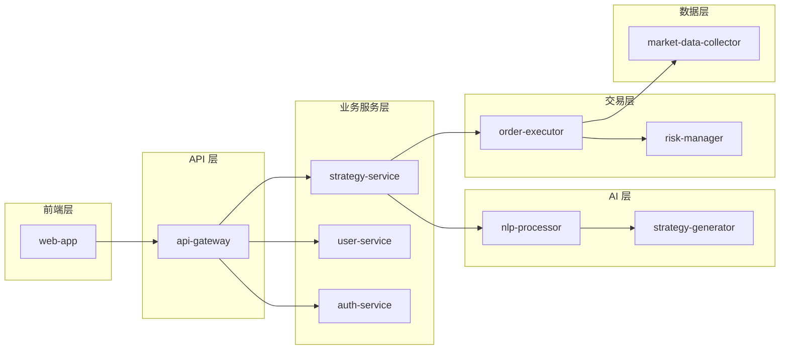

# Delta Terminal 源码结构

> **版本**: 1.0.0
> **更新日期**: 2025-12-24

---

## 目录

1. [项目总览](#项目总览)
2. [目录结构](#目录结构)
3. [模块职责](#模块职责)
4. [依赖关系](#依赖关系)
5. [开发指南](#开发指南)

---

## 项目总览

Delta Terminal 采用 **Monorepo** 架构，使用 **pnpm workspaces** 管理多个包。

```
delta-terminal/
├── frontend/          # 前端应用
├── backend/           # 后端服务 (Node.js)
├── ai-engine/         # AI 引擎 (Python)
├── trading-engine/    # 交易引擎 (Python)
├── data-pipeline/     # 数据管道 (Python)
├── shared/            # 共享代码
├── docs/              # 文档
├── scripts/           # 脚本工具
└── infra/             # 基础设施配置
```

---

## 目录结构

### 完整结构

```
delta-terminal/
│
├── .github/                        # GitHub 配置
│   └── workflows/                  # CI/CD 工作流
│       ├── frontend.yml            # 前端 CI
│       ├── backend.yml             # 后端 CI
│       └── deploy.yml              # 部署流程
│
├── frontend/                       # 前端 Monorepo
│   ├── web-app/                    # Web 应用
│   │   ├── src/
│   │   │   ├── app/                # Next.js App Router
│   │   │   │   ├── (auth)/         # 认证相关页面
│   │   │   │   │   ├── login/
│   │   │   │   │   └── register/
│   │   │   │   ├── (dashboard)/    # 仪表盘
│   │   │   │   │   ├── layout.tsx
│   │   │   │   │   ├── page.tsx
│   │   │   │   │   ├── strategies/
│   │   │   │   │   ├── portfolio/
│   │   │   │   │   └── settings/
│   │   │   │   ├── api/            # API Routes
│   │   │   │   │   └── v1/
│   │   │   │   ├── layout.tsx      # 根布局
│   │   │   │   └── page.tsx        # 首页
│   │   │   ├── components/         # React 组件
│   │   │   │   ├── ui/             # Shadcn/ui 组件
│   │   │   │   ├── features/       # 功能组件
│   │   │   │   │   ├── strategy/
│   │   │   │   │   ├── trading/
│   │   │   │   │   └── chart/
│   │   │   │   └── layout/         # 布局组件
│   │   │   ├── lib/                # 工具库
│   │   │   │   ├── api.ts          # API 客户端
│   │   │   │   ├── utils.ts
│   │   │   │   └── cn.ts           # 样式合并
│   │   │   ├── hooks/              # 自定义 Hooks
│   │   │   │   ├── useAuth.ts
│   │   │   │   ├── useMarketData.ts
│   │   │   │   └── useStrategies.ts
│   │   │   ├── stores/             # Zustand 状态管理
│   │   │   │   ├── useAuthStore.ts
│   │   │   │   └── useStrategyStore.ts
│   │   │   ├── types/              # TypeScript 类型
│   │   │   │   ├── api.ts
│   │   │   │   ├── strategy.ts
│   │   │   │   └── user.ts
│   │   │   └── styles/             # 全局样式
│   │   │       └── globals.css
│   │   ├── public/                 # 静态资源
│   │   ├── tests/                  # 测试
│   │   │   ├── unit/
│   │   │   ├── integration/
│   │   │   └── e2e/
│   │   ├── next.config.js
│   │   ├── tailwind.config.js
│   │   ├── tsconfig.json
│   │   └── package.json
│   │
│   └── mobile-app/                 # 移动应用 (React Native)
│       ├── src/
│       ├── ios/
│       ├── android/
│       └── package.json
│
├── backend/                        # 后端服务 (Node.js)
│   ├── api-gateway/                # API 网关
│   │   ├── src/
│   │   │   ├── server.ts           # Fastify 服务器
│   │   │   ├── routes/             # 路由定义
│   │   │   │   ├── auth.ts
│   │   │   │   ├── strategies.ts
│   │   │   │   └── users.ts
│   │   │   ├── middleware/         # 中间件
│   │   │   │   ├── auth.ts
│   │   │   │   ├── rate-limit.ts
│   │   │   │   └── error-handler.ts
│   │   │   ├── plugins/            # Fastify 插件
│   │   │   │   ├── cors.ts
│   │   │   │   └── swagger.ts
│   │   │   └── config/             # 配置
│   │   │       └── env.ts
│   │   ├── tests/
│   │   ├── Dockerfile
│   │   ├── tsconfig.json
│   │   └── package.json
│   │
│   ├── auth-service/               # 认证服务
│   │   ├── src/
│   │   │   ├── server.ts
│   │   │   ├── controllers/        # 控制器
│   │   │   │   └── auth.controller.ts
│   │   │   ├── services/           # 业务逻辑
│   │   │   │   ├── auth.service.ts
│   │   │   │   ├── jwt.service.ts
│   │   │   │   └── oauth.service.ts
│   │   │   ├── models/             # 数据模型
│   │   │   │   └── user.model.ts
│   │   │   └── utils/
│   │   │       └── password.ts
│   │   ├── prisma/                 # Prisma ORM
│   │   │   ├── schema.prisma
│   │   │   └── migrations/
│   │   ├── tests/
│   │   └── package.json
│   │
│   ├── user-service/               # 用户服务
│   ├── strategy-service/           # 策略服务
│   ├── portfolio-service/          # 投资组合服务
│   └── notification-service/       # 通知服务
│
├── ai-engine/                      # AI 引擎 (Python)
│   ├── nlp-processor/              # NLP 处理器
│   │   ├── src/
│   │   │   ├── main.py             # FastAPI 应用
│   │   │   ├── routers/            # API 路由
│   │   │   │   └── strategy.py
│   │   │   ├── services/           # 业务逻辑
│   │   │   │   ├── nlp_service.py
│   │   │   │   └── vector_store.py
│   │   │   ├── models/             # 数据模型
│   │   │   │   └── strategy.py
│   │   │   └── config/
│   │   │       └── settings.py
│   │   ├── tests/
│   │   ├── Dockerfile
│   │   ├── pyproject.toml          # Poetry 配置
│   │   └── poetry.lock
│   │
│   ├── strategy-generator/         # 策略生成器
│   │   ├── src/
│   │   │   ├── main.py
│   │   │   ├── services/
│   │   │   │   ├── claude_service.py
│   │   │   │   ├── langchain_service.py
│   │   │   │   └── code_validator.py
│   │   │   └── prompts/            # Prompt 模板
│   │   │       ├── strategy_generation.txt
│   │   │       └── optimization.txt
│   │   └── tests/
│   │
│   └── signal-analyzer/            # 信号分析器
│       ├── src/
│       │   ├── main.py
│       │   ├── services/
│       │   │   ├── indicator_service.py
│       │   │   └── ml_model_service.py
│       │   └── models/             # ML 模型
│       │       ├── trend_model.pkl
│       │       └── sentiment_model.pkl
│       └── tests/
│
├── trading-engine/                 # 交易引擎 (Python)
│   ├── order-executor/             # 订单执行器
│   │   ├── src/
│   │   │   ├── main.py
│   │   │   ├── services/
│   │   │   │   ├── executor_service.py
│   │   │   │   └── idempotency.py
│   │   │   └── queue/              # 消息队列
│   │   │       ├── consumer.py
│   │   │       └── publisher.py
│   │   └── tests/
│   │
│   ├── risk-manager/               # 风险管理器
│   │   ├── src/
│   │   │   ├── main.py
│   │   │   ├── services/
│   │   │   │   ├── risk_service.py
│   │   │   │   ├── position_service.py
│   │   │   │   └── alert_service.py
│   │   │   └── rules/              # 风险规则
│   │   │       ├── max_position.py
│   │   │       └── stop_loss.py
│   │   └── tests/
│   │
│   └── exchange-connector/         # 交易所连接器
│       ├── src/
│       │   ├── main.py
│       │   ├── connectors/         # 交易所实现
│       │   │   ├── base.py
│       │   │   ├── binance.py
│       │   │   ├── okx.py
│       │   │   └── bybit.py
│       │   └── websocket/          # WebSocket 客户端
│       │       └── market_data.py
│       └── tests/
│
├── data-pipeline/                  # 数据管道 (Python)
│   ├── market-data-collector/      # 市场数据采集
│   │   ├── src/
│   │   │   ├── main.py
│   │   │   ├── collectors/         # 数据采集器
│   │   │   │   ├── ticker_collector.py
│   │   │   │   └── orderbook_collector.py
│   │   │   └── storage/            # 数据存储
│   │   │       ├── redis_storage.py
│   │   │       └── timescale_storage.py
│   │   └── tests/
│   │
│   ├── backtest-engine/            # 回测引擎
│   │   ├── src/
│   │   │   ├── main.py
│   │   │   ├── engine/
│   │   │   │   ├── backtest.py
│   │   │   │   └── metrics.py
│   │   │   └── data/
│   │   │       └── historical_data.py
│   │   └── tests/
│   │
│   └── analytics-service/          # 分析服务
│       ├── src/
│       │   ├── main.py
│       │   ├── services/
│       │   │   ├── performance_service.py
│       │   │   └── report_service.py
│       │   └── queries/            # SQL 查询
│       │       └── performance.sql
│       └── tests/
│
├── shared/                         # 共享代码
│   ├── common-types/               # 通用类型
│   │   ├── src/
│   │   │   ├── index.ts
│   │   │   ├── user.ts
│   │   │   ├── strategy.ts
│   │   │   └── order.ts
│   │   ├── tsconfig.json
│   │   └── package.json
│   │
│   ├── utils/                      # 工具函数
│   │   ├── ts/                     # TypeScript 工具
│   │   │   ├── src/
│   │   │   │   ├── crypto.ts
│   │   │   │   ├── validation.ts
│   │   │   │   └── logger.ts
│   │   │   └── package.json
│   │   └── py/                     # Python 工具
│   │       ├── src/
│   │       │   ├── crypto.py
│   │       │   └── logger.py
│   │       └── pyproject.toml
│   │
│   └── config/                     # 配置文件
│       ├── env/                    # 环境变量
│       │   ├── .env.example
│       │   ├── .env.development
│       │   └── .env.production
│       └── constants.ts            # 全局常量
│
├── docs/                           # 文档
│   ├── architecture/               # 架构文档
│   │   ├── overview.md
│   │   ├── tech-stack.md
│   │   ├── data-flow.md
│   │   ├── security.md
│   │   ├── coding-standards.md
│   │   └── source-tree.md
│   ├── api/                        # API 文档
│   │   ├── rest-api.md
│   │   └── websocket-api.md
│   ├── guides/                     # 开发指南
│   │   ├── getting-started.md
│   │   ├── local-development.md
│   │   └── deployment.md
│   └── diagrams/                   # 架构图
│       └── system-architecture.png
│
├── scripts/                        # 脚本工具
│   ├── dev/                        # 开发脚本
│   │   ├── start-all.sh            # 启动所有服务
│   │   └── seed-data.ts            # 数据填充
│   ├── deploy/                     # 部署脚本
│   │   ├── build-images.sh
│   │   └── deploy-k8s.sh
│   └── db/                         # 数据库脚本
│       ├── migrate.sh
│       └── backup.sh
│
├── infra/                          # 基础设施配置
│   ├── docker/                     # Docker 配置
│   │   ├── docker-compose.yml      # 本地开发
│   │   ├── docker-compose.prod.yml # 生产环境
│   │   └── Dockerfile.base         # 基础镜像
│   ├── k8s/                        # Kubernetes 配置
│   │   ├── namespaces/
│   │   ├── deployments/
│   │   │   ├── api-gateway.yaml
│   │   │   ├── auth-service.yaml
│   │   │   └── ...
│   │   ├── services/
│   │   ├── ingress/
│   │   └── secrets/
│   ├── terraform/                  # Terraform (IaC)
│   │   ├── main.tf
│   │   ├── variables.tf
│   │   └── outputs.tf
│   └── monitoring/                 # 监控配置
│       ├── prometheus/
│       │   └── prometheus.yml
│       └── grafana/
│           └── dashboards/
│
├── .vscode/                        # VS Code 配置
│   ├── settings.json
│   ├── extensions.json
│   └── launch.json
│
├── .husky/                         # Git Hooks
│   ├── pre-commit
│   └── commit-msg
│
├── .gitignore
├── .eslintrc.js                    # ESLint 配置
├── .prettierrc                     # Prettier 配置
├── pnpm-workspace.yaml             # pnpm workspaces
├── package.json                    # 根 package.json
├── tsconfig.json                   # 根 TypeScript 配置
├── turbo.json                      # Turborepo 配置 (可选)
├── README.md
├── LICENSE
└── CLAUDE.md                       # 项目 AI 上下文
```

---

## 模块职责

### 前端模块

#### web-app (Next.js 15)

**职责**: 提供 Web 用户界面

**核心功能**:
- 用户认证与注册
- 策略管理界面
- 实时图表展示
- 投资组合监控
- 设置与配置

**技术栈**:
- Next.js 15 (App Router)
- React 19 RC
- TailwindCSS + Shadcn/ui
- Zustand (状态管理)
- TanStack Query (数据请求)

**目录说明**:
```
src/
├── app/                 # 页面路由 (App Router)
│   ├── (auth)/         # 认证相关路由组
│   └── (dashboard)/    # 仪表盘路由组
├── components/          # React 组件
│   ├── ui/             # 基础 UI 组件
│   └── features/       # 功能组件
├── hooks/              # 自定义 Hooks
├── stores/             # Zustand 状态
└── lib/                # 工具库
```

---

### 后端模块 (Node.js)

#### api-gateway

**职责**: API 网关与路由

**核心功能**:
- 请求路由与转发
- 认证与授权
- API 限流
- 请求/响应日志

**依赖**:
- Fastify (Web 框架)
- Redis (限流)

#### auth-service

**职责**: 用户认证与授权

**核心功能**:
- 用户注册/登录
- JWT 生成与验证
- OAuth2 集成 (Google, GitHub)
- 密码重置

**依赖**:
- Prisma (ORM)
- PostgreSQL (数据库)
- Redis (会话)

#### strategy-service

**职责**: 策略管理

**核心功能**:
- 策略 CRUD 操作
- 策略激活/停用
- 策略参数管理
- 执行历史记录

**依赖**:
- Prisma (ORM)
- PostgreSQL (数据库)
- RabbitMQ (事件发布)

---

### AI 引擎模块 (Python)

#### nlp-processor

**职责**: 自然语言处理

**核心功能**:
- 自然语言理解
- 意图识别
- 实体提取
- 相似策略搜索

**依赖**:
- FastAPI (Web 框架)
- LangChain (LLM 框架)
- Claude API
- Pinecone (向量数据库)

#### strategy-generator

**职责**: AI 策略生成

**核心功能**:
- 策略代码生成
- 策略优化建议
- 风险评估
- 回测模拟

**依赖**:
- LangChain
- Claude API
- Pandas (数据处理)

---

### 交易引擎模块 (Python)

#### order-executor

**职责**: 订单执行

**核心功能**:
- 订单下单逻辑
- 幂等性控制
- 订单状态管理
- 执行报告

**依赖**:
- CCXT (交易所接口)
- RabbitMQ (消息队列)
- Redis (幂等性)

#### risk-manager

**职责**: 风险管理

**核心功能**:
- 仓位检查
- 风险规则引擎
- 止损/止盈
- 告警通知

**依赖**:
- PostgreSQL (数据库)
- Redis (缓存)

---

### 数据管道模块 (Python)

#### market-data-collector

**职责**: 市场数据采集

**核心功能**:
- 实时行情采集
- 数据清洗
- 数据存储
- 数据推送

**依赖**:
- WebSocket (实时连接)
- TimescaleDB (时序数据库)
- Redis (缓存)
- RabbitMQ (事件发布)

#### backtest-engine

**职责**: 回测引擎

**核心功能**:
- 历史数据回测
- 性能指标计算
- 回测报告生成

**依赖**:
- Pandas (数据处理)
- NumPy (数值计算)
- TimescaleDB (历史数据)

---

## 依赖关系

### 服务依赖图



### 数据库依赖

| 服务 | 数据库 | 用途 |
|-----|--------|------|
| auth-service | PostgreSQL | 用户数据 |
| user-service | PostgreSQL | 用户信息 |
| strategy-service | PostgreSQL | 策略数据 |
| api-gateway | Redis | 限流、缓存 |
| nlp-processor | Pinecone | 向量搜索 |
| market-data-collector | TimescaleDB | 时序数据 |
| order-executor | PostgreSQL + Redis | 订单数据 + 幂等性 |

---

## 开发指南

### 添加新服务

#### 1. 创建服务目录

```bash
# Node.js 服务
mkdir -p backend/new-service/src/{controllers,services,models}

# Python 服务
mkdir -p ai-engine/new-service/src/{routers,services,models}
```

#### 2. 初始化项目

```bash
# Node.js
cd backend/new-service
npm init -y
npm install fastify @fastify/cors

# Python
cd ai-engine/new-service
poetry init
poetry add fastapi uvicorn
```

#### 3. 创建基础代码

```typescript
// backend/new-service/src/server.ts
import Fastify from 'fastify';

const fastify = Fastify({ logger: true });

fastify.get('/health', async () => {
  return { status: 'ok' };
});

const start = async () => {
  try {
    await fastify.listen({ port: 3010 });
    console.log('Server running on http://localhost:3010');
  } catch (err) {
    fastify.log.error(err);
    process.exit(1);
  }
};

start();
```

#### 4. 添加到 pnpm workspace

```yaml
# pnpm-workspace.yaml
packages:
  - 'frontend/*'
  - 'backend/*'
  - 'backend/new-service'  # 新增
```

#### 5. 添加 Dockerfile

```dockerfile
# backend/new-service/Dockerfile
FROM node:20-alpine

WORKDIR /app
COPY package*.json ./
RUN npm ci --only=production

COPY . .
RUN npm run build

EXPOSE 3010
CMD ["node", "dist/server.js"]
```

#### 6. 添加 K8s 配置

```yaml
# infra/k8s/deployments/new-service.yaml
apiVersion: apps/v1
kind: Deployment
metadata:
  name: new-service
spec:
  replicas: 2
  selector:
    matchLabels:
      app: new-service
  template:
    metadata:
      labels:
        app: new-service
    spec:
      containers:
      - name: new-service
        image: delta-terminal/new-service:latest
        ports:
        - containerPort: 3010
```

### 添加新功能

#### 1. 创建分支

```bash
git checkout -b feat/add-new-feature
```

#### 2. 开发功能

```bash
# 启动开发服务
pnpm dev --filter=new-service

# 运行测试
pnpm test --filter=new-service
```

#### 3. 提交代码

```bash
git add .
git commit -m "feat(new-service): add new feature"
git push origin feat/add-new-feature
```

#### 4. 创建 PR

在 GitHub 上创建 Pull Request，等待审查。

---

## 文件命名规范

### TypeScript/JavaScript

```
controllers/      # 控制器
  user.controller.ts

services/         # 业务逻辑
  user.service.ts

models/           # 数据模型
  user.model.ts

types/            # 类型定义
  user.types.ts

utils/            # 工具函数
  validation.util.ts

middleware/       # 中间件
  auth.middleware.ts

dto/              # 数据传输对象
  create-user.dto.ts
```

### Python

```
routers/          # 路由
  user.py

services/         # 业务逻辑
  user_service.py

models/           # 数据模型
  user.py

schemas/          # Pydantic Schema
  user_schema.py

utils/            # 工具函数
  validation.py
```

---

## 下一步

- 查看 [架构概述](./overview.md)
- 了解 [开发指南](../guides/getting-started.md)
- 阅读 [API 文档](../api/rest-api.md)

---

**文档维护**: 架构团队
**审核周期**: 季度
