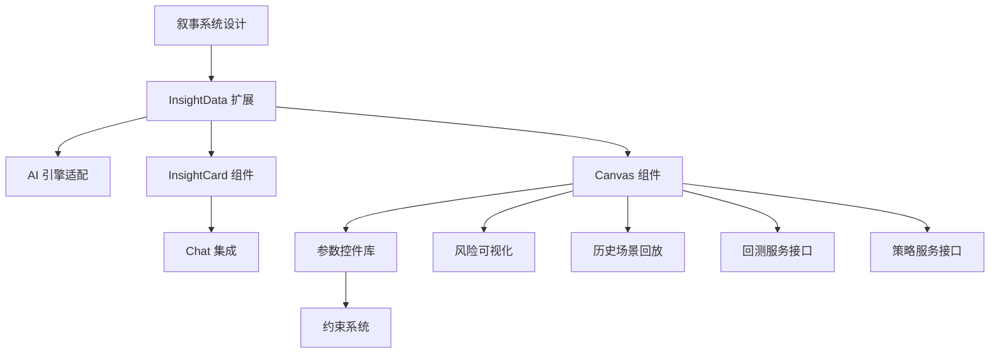

# A2UI 功能需求规格书

> **版本**: 2.0.1 | **更新日期**: 2025-12-29 | **负责人**: 产品团队

---

## 1. 概述

### 1.1 文档目的

本文档定义 Delta Terminal 2.0 的 A2UI (Agent-to-UI) 系统功能需求，作为开发团队的实施指南。

### 1.2 范围

覆盖 A2UI 系统的核心功能模块：

- 叙事驱动的策略体验
- InsightData 数据结构
- InsightCard 展示组件
- Canvas 面板系统
- 参数控件库
- 约束与验证系统
- 风控预警集成

### 1.3 核心设计原则

#### 1.3.1 叙事驱动设计 (Narrative-Driven Design)

**核心理念**: 用户不需要理解技术参数，只需理解"故事"。

```
传统方式: "RSI(14) < 30 时买入 10%，止损 -3%，止盈 +8%"
     ↓
叙事方式: "当市场恐慌抛售时，悄悄买入一点点，错了认亏，对了就跑"
```

**设计原则**:

| 原则           | 描述                                |
| -------------- | ----------------------------------- |
| **故事优先**   | 用人话讲策略，技术参数作为补充      |
| **意图确认**   | AI 先确认理解了用户想法，再生成策略 |
| **风险直觉化** | 用"最多亏多少钱"代替"止损百分比"    |
| **历史叙事**   | 用真实事件（如312暴跌）讲述策略表现 |

#### 1.3.2 AI 提议，人类批准 (AI Proposer, Human Approver)

```
用户表达模糊意图 → AI 翻译成策略 → 用户确认/调整 → 批准执行
```

用户只需能回答三个问题：

1. **什么时候买？** → AI 用故事解释触发条件
2. **什么时候卖？** → AI 用故事解释退出逻辑
3. **最多亏多少？** → AI 用具体金额展示风险

---

## 2. 功能需求

### 2.1 叙事体验层 (Narrative Experience)

#### FR-A2UI-080: 策略叙事生成

**优先级**: P0 **描述**: AI 必须用自然语言故事形式解释策略逻辑，而非仅输出技术参数。

**验收标准**:

- [ ] 每个 InsightData 包含 `narrative` 字段，含一句话策略摘要
- [ ] 叙事使用用户能理解的比喻（如"恐慌抛售"代替"RSI超卖"）
- [ ] 支持中文口语化表达
- [ ] 技术参数作为"详情"折叠展示

**数据结构扩展**:

```typescript
interface InsightData {
  // ... 现有字段

  // 新增：叙事层
  narrative: {
    summary: string // 一句话：当市场恐慌时抄底
    story: string // 完整故事：这个策略会在大家都在恐慌...
    buyTrigger: string // 什么时候买：当 RSI 跌到很低（像2020年312那样）
    sellTrigger: string // 什么时候卖：赚到 8% 就跑，或者亏 3% 认赔
    riskInWords: string // 风险描述：最坏情况亏 30 块，最好能赚 80 块
  }

  // 新增：意图映射（AI 理解 → 技术参数）
  intentMapping?: {
    userSaid: string // 用户原话："跌得差不多了，想抄底"
    aiUnderstood: string // AI 理解：逆势交易 + 超卖信号
    technicalMapping: {
      // 技术映射
      signal: string // RSI < 30
      action: string // 买入做多
      risk: string // 中等仓位
    }
  }
}
```

**示例**:

```json
{
  "narrative": {
    "summary": "当市场恐慌时，悄悄抄底",
    "story": "这个策略会在大家都在恐慌抛售的时候（RSI跌到30以下），用10%的资金悄悄买入。如果判断错了，最多亏3%就认赔出局；如果对了，赚到8%就落袋为安。",
    "buyTrigger": "当市场非常恐慌（像2020年312暴跌那样），指标显示超卖",
    "sellTrigger": "赚到8%就跑，或者亏3%止损",
    "riskInWords": "投入1000块，最多亏30块，可能赚80块"
  }
}
```

---

#### FR-A2UI-081: 意图确认界面

**优先级**: P0 **描述**: AI 在生成策略前，先用可视化方式确认理解了用户意图。

**验收标准**:

- [ ] 显示"你说的 → AI理解的"对照表
- [ ] 用户可以点击"理解正确"或"不是这个意思"
- [ ] 错误理解时提供修正引导
- [ ] 确认后才生成完整策略

**交互流程**:

```
用户: "我觉得 BTC 跌得差不多了，想抄个底"

AI 返回意图确认卡:
┌─────────────────────────────────────────────┐
│  🤔 我理解你想要：                           │
│                                              │
│  你说的           →    我理解的              │
│  ─────────────────────────────────────────  │
│  "跌得差不多"     →    等待超卖信号 (RSI低)   │
│  "抄个底"         →    逆势买入做多           │
│  (没提风险偏好)   →    默认中等仓位           │
│                                              │
│  ┌──────────────┐  ┌──────────────┐         │
│  │  ✅ 理解正确  │  │  ❌ 不是这样  │         │
│  └──────────────┘  └──────────────┘         │
└─────────────────────────────────────────────┘

用户点击"理解正确" → AI 生成完整策略叙事卡
```

---

#### FR-A2UI-082: 风险可视化 (人话版)

**优先级**: P0 **描述**: 用具体金额和直观图形展示风险，而非抽象百分比。

**验收标准**:

- [ ] 显示"投入 X 块，最多亏 Y 块，可能赚 Z 块"
- [ ] 用进度条对比盈亏幅度
- [ ] 显示盈亏比（赚的是亏的几倍）
- [ ] 不显示复杂的夏普比率等专业指标（折叠到详情）

**设计规范**:

```
┌─────────────────────────────────────────────┐
│  💰 风险一目了然                             │
│                                              │
│  投入: 1000 USDT (10% 仓位)                  │
│                                              │
│  最好情况 🎉                                 │
│  ├────────────────────────┤ +80 USDT (+8%)  │
│                                              │
│  最坏情况 😢                                 │
│  ├─────┤ -30 USDT (-3%)                     │
│                                              │
│  盈亏比: 赚的是亏的 2.7 倍                   │
│  ─────────────────────────────────────────  │
│  💡 通俗说：赌对了赚80块，赌错了亏30块        │
│                                              │
└─────────────────────────────────────────────┘
```

---

#### FR-A2UI-083: 历史场景回放

**优先级**: P1 **描述**: 用真实历史事件讲述策略表现，增强用户理解和信任。

**验收标准**:

- [ ] 支持选择经典历史场景（312暴跌、519崩盘、牛市顶部等）
- [ ] 用时间线叙事展示策略在该场景的表现
- [ ] 显示"如果你当时用这个策略，会..."的结论
- [ ] 配合价格走势图标注关键时刻

**场景库**:

| 场景ID            | 名称     | 日期       | 特征                  |
| ----------------- | -------- | ---------- | --------------------- |
| scene_312         | 312暴跌  | 2020-03-12 | 极端恐慌，BTC 日跌50% |
| scene_519         | 519崩盘  | 2021-05-19 | 政策利空，全面暴跌    |
| scene_bull_top    | 牛市顶部 | 2021-11-10 | BTC 69000 历史高点    |
| scene_bear_bottom | 熊市底部 | 2022-11-21 | FTX 暴雷后底部        |

**交互设计**:

```
┌─────────────────────────────────────────────────────────┐
│  📅 历史回放：如果312暴跌时你用这个策略...               │
│                                                          │
│  时间线：                                                │
│  ────────────────────────────────────────────────────   │
│                                                          │
│  3月12日 上午                                            │
│  └─ BTC 开始下跌，从 $7900 跌到 $7000                    │
│     └─ 策略还在观望（RSI 还没到超卖）                     │
│                                                          │
│  3月12日 晚间                                            │
│  └─ BTC 暴跌到 $4000，RSI 跌到 15（极度恐慌）            │
│     └─ 🔔 策略触发买入！在 $4200 入场                    │
│                                                          │
│  3月13日                                                 │
│  └─ BTC 反弹到 $5500                                     │
│     └─ 触发止盈 +8%，在 $4536 卖出                       │
│                                                          │
│  结果：2天赚了 8% 💰                                     │
│                                                          │
└─────────────────────────────────────────────────────────┘
```

---

### 2.2 InsightData 生成

#### FR-A2UI-001: AI 返回结构化数据

**优先级**: P0 **描述**: AI 引擎在响应用户策略相关请求时，必须返回结构化的 InsightData 而非纯文本。

**验收标准**:

- [ ] 用户输入"创建 RSI 策略"时，返回 `type: "strategy_create"` 的 InsightData
- [ ] 用户输入"调整止损"时，返回 `type: "strategy_modify"` 的 InsightData
- [ ] InsightData 包含完整的 `narrative`, `params`, `evidence`, `impact` 字段
- [ ] 纯问答类请求仍返回文本响应

**完整数据结构**:

```typescript
interface InsightData {
  id: string
  type: 'strategy_create' | 'strategy_modify' | 'batch_adjust' | 'risk_alert'
  target?: { strategyId: string; name: string; symbol: string }

  // 叙事层 (新增 - P0)
  narrative: {
    summary: string
    story: string
    buyTrigger: string
    sellTrigger: string
    riskInWords: string
  }

  // 意图映射 (新增 - P0)
  intentMapping?: {
    userSaid: string
    aiUnderstood: string
    technicalMapping: {
      signal: string
      action: string
      risk: string
    }
  }

  // 参数层
  params: InsightParam[]

  // 证据层
  evidence?: {
    chart?: ChartData
    comparison?: Comparison
    historicalScenario?: HistoricalScenario // 新增
  }

  // 影响预估层
  impact?: {
    metrics: ImpactMetric[]
    confidence: number
    sampleSize: number
    riskVisualization: RiskVisualization // 新增：人话版风险展示
  }

  // AI 解释 (保留兼容，但叙事层优先)
  explanation: string
}

// 新增：人话版风险可视化
interface RiskVisualization {
  investAmount: number // 投入金额
  investPercentage: number // 仓位百分比
  maxLoss: number // 最大亏损金额
  maxLossPercentage: number // 最大亏损百分比
  potentialGain: number // 潜在盈利金额
  potentialGainPercentage: number
  riskRewardRatio: number // 盈亏比
  summaryText: string // "赌对了赚80块，赌错了亏30块"
}

// 新增：历史场景
interface HistoricalScenario {
  sceneId: string
  sceneName: string
  date: string
  timeline: TimelineEvent[]
  outcome: {
    result: 'profit' | 'loss' | 'neutral'
    returnPercentage: number
    returnAmount: number
    durationDays: number
  }
}
```

---

#### FR-A2UI-002: InsightParam 多态控件

**优先级**: P0 **描述**: 每个参数必须指定控件类型，前端根据类型渲染对应 UI。

**验收标准**:

- [ ] 支持 7 种控件类型: slider, number, select, toggle, button_group, logic_builder, heatmap_slider
- [ ] 每个参数有 `level` 属性区分 L1/L2
- [ ] 包含 `constraints` 约束规则数组
- [ ] **新增**: 每个参数包含 `humanLabel` 人话描述

**控件类型映射**:

| 参数类型 | 控件类型        | 技术标签       | 人话标签             |
| -------- | --------------- | -------------- | -------------------- |
| 数值范围 | slider          | RSI 周期 7-21  | 灵敏度（越小越敏感） |
| 百分比   | slider + number | 止损 0.5%-5%   | 最多亏多少           |
| 枚举     | button_group    | 做多/做空/双向 | 看涨/看跌/都行       |
| 开关     | toggle          | 启用追踪止损   | 自动跟着涨           |
| 复杂逻辑 | logic_builder   | 多条件组合     | 同时满足/任一满足    |
| 风险级别 | heatmap_slider  | 保守/中性/激进 | 稳一点/正常/冲一把   |

---

#### FR-A2UI-003: 影响预估 (Impact)

**优先级**: P1 **描述**: 每个策略提案必须包含基于历史数据的影响预估，同时提供专业版和人话版。

**验收标准**:

- [ ] 专业指标：预估收益率、胜率、最大回撤、夏普比率（折叠展示）
- [ ] **人话指标**：投多少、最多亏多少、可能赚多少、盈亏比（默认展示）
- [ ] 显示置信度和样本量
- [ ] 修改策略时显示新旧指标对比

**数据结构**:

```typescript
interface ImpactMetric {
  key: string
  label: string
  humanLabel: string // 新增：人话标签
  value: number
  oldValue?: number
  unit: string
  trend: 'up' | 'down' | 'neutral'
  level: 'basic' | 'advanced' // 新增：basic 默认展示，advanced 折叠
}
```

---

### 2.3 InsightCard 组件

#### FR-A2UI-010: Chat 内卡片展示

**优先级**: P0 **描述**: InsightData 在 Chat 面板中以叙事卡片形式展示。

**验收标准**:

- [ ] **首行显示叙事摘要**（如"当市场恐慌时抄底"）
- [ ] 显示策略名称、类型 Badge
- [ ] 显示人话版风险预览（"最多亏30块，可能赚80块"）
- [ ] 点击卡片触发 Canvas 展开
- [ ] 不同类型卡片有不同配色主题

**设计规范**:

```
┌─────────────────────────────────────────────┐
│  [新策略]                                    │
│                                              │
│  📖 当市场恐慌时，悄悄抄底                    │  ← 叙事摘要优先
│                                              │
│  💰 最多亏 30 USDT | 🎯 可能赚 80 USDT       │  ← 人话风险
│  📊 过去90天: 胜率68%, 收益+24%              │  ← 简化指标
│                                              │
│  点击查看详情 →                              │
└─────────────────────────────────────────────┘
```

---

#### FR-A2UI-011: 卡片预览信息

**优先级**: P0 **描述**: 卡片体区域显示叙事摘要和人话风险预览。

**验收标准**:

- [ ] 创建策略: 显示叙事摘要 + 人话风险（最多亏/可能赚）
- [ ] 修改策略: 显示变更对比用人话描述（"止损从30块改成20块"）
- [ ] 批量调整: 显示影响策略数量、总风险变化
- [ ] 风险预警: 显示风险等级、触发原因用人话描述

---

### 2.4 Canvas 面板

#### FR-A2UI-020: Proposal Canvas (叙事增强版)

**优先级**: P0 **描述**: 策略提案的完整展示和交互面板，叙事优先。

**验收标准**:

- [ ] **叙事区** (新增，置顶): 策略故事完整展示
- [ ] **意图确认区** (新增): 显示"你说的→AI理解的"映射
- [ ] **风险可视化区** (新增): 人话版盈亏展示
- [ ] 头部: 策略名称 + 类型 Badge + 关闭按钮
- [ ] L1 参数区: 核心参数（带人话标签），可编辑
- [ ] L2 参数区: 高级参数，折叠展示
- [ ] 证据区: K 线图 + 信号标注 + 历史场景回放
- [ ] 操作区: [不是我想要的] [调整一下] [就是这个!]

**Canvas 布局**:

```
┌─────────────────────────────────────────────────────────┐
│  [新策略] BTC 超卖抄底                          [×]     │
├─────────────────────────────────────────────────────────┤
│                                                          │
│  📖 策略故事                                             │
│  ─────────────────────────────────────────────────────  │
│  "当市场恐慌抛售时，悄悄买入一点点。                      │
│   错了认亏，对了就跑。"                                  │
│                                                          │
├─────────────────────────────────────────────────────────┤
│                                                          │
│  🤔 AI 理解确认                                          │
│  ─────────────────────────────────────────────────────  │
│  你说的             →    我理解的                        │
│  "跌得差不多"       →    RSI < 30 超卖                   │
│  "抄个底"           →    买入做多                        │
│                                     [✓ 正确] [✗ 不对]    │
│                                                          │
├─────────────────────────────────────────────────────────┤
│                                                          │
│  💰 风险一目了然                                         │
│  ─────────────────────────────────────────────────────  │
│  投入: 1000 USDT (10%)                                   │
│  🎉 最好: +80 ─────────────────────────                  │
│  😢 最坏: -30 ─────                                      │
│  盈亏比: 2.7 倍                                          │
│                                                          │
├─────────────────────────────────────────────────────────┤
│                                                          │
│  ⚙️ 核心参数                                             │
│  ─────────────────────────────────────────────────────  │
│  灵敏度 (RSI周期)   [━━━━●━━━━━━] 14                      │
│  恐慌阈值           [━━●━━━━━━━━] 30                      │
│  最多亏多少         [━━━━━●━━━━━] 3%                      │
│  目标收益           [━━━━━━━━●━━] 8%                      │
│                                                          │
│  [▶ 显示高级参数]                                        │
│                                                          │
├─────────────────────────────────────────────────────────┤
│                                                          │
│  📅 历史回放: 312暴跌                                    │
│  ─────────────────────────────────────────────────────  │
│  [时间线图...]                                           │
│  结果: 2天赚了 8% 💰                                     │
│                                                          │
├─────────────────────────────────────────────────────────┤
│                                                          │
│  ┌────────────┐  ┌────────────┐  ┌────────────┐         │
│  │ 不是我想要的 │  │  调整一下   │  │ 就是这个! ✓│         │
│  └────────────┘  └────────────┘  └────────────┘         │
│                                                          │
└─────────────────────────────────────────────────────────┘
```

---

#### FR-A2UI-021: Backtest Canvas

**优先级**: P1 **描述**: 回测结果详细展示面板，增加叙事化结论。

**验收标准**:

- [ ] **叙事结论** (新增): "过去90天，这个策略赚了24%，10次交易对了7次"
- [ ] 权益曲线图 (支持对比基准)
- [ ] 简化指标: 总收益、胜率、最大亏过多少
- [ ] 高级指标(折叠): 年化、夏普、索提诺
- [ ] 交易明细列表 (可筛选、分页)
- [ ] 按钮: [下载报告] [部署策略]

---

#### FR-A2UI-022: Monitor Canvas

**优先级**: P1 **描述**: 运行中策略的实时监控面板。

**验收标准**:

- [ ] **状态叙事** (新增): "策略正在观望中，等待下一个恐慌信号"
- [ ] 实时 K 线 + 当前信号标注
- [ ] 当前持仓信息用人话描述（"现在持有 0.1 BTC，赚了 50 块"）
- [ ] 今日统计 (交易次数、盈亏)
- [ ] 最近订单列表
- [ ] 操作按钮: [暂停] [修改] [关闭持仓]

---

#### FR-A2UI-023: Config Canvas

**优先级**: P2 **描述**: 完整策略配置编辑面板。

**验收标准**:

- [ ] 显示所有参数 (L1 + L2)，带人话标签
- [ ] 分组展示: 基础配置 / 入场规则 / 出场规则 / 风控规则
- [ ] 实时参数校验
- [ ] 历史版本对比
- [ ] 保存按钮

---

#### FR-A2UI-024: Explorer Canvas

**优先级**: P2 **描述**: 参数敏感度分析面板。

**验收标准**:

- [ ] 选择参数进行敏感度分析
- [ ] 热力图展示不同参数组合的收益
- [ ] 最优区域高亮 + 人话解释（"RSI 设成 12-16 效果最好"）
- [ ] 一键应用最优参数

---

#### FR-A2UI-025: Detail Canvas

**优先级**: P2 **描述**: 交易/订单明细查看面板。

**验收标准**:

- [ ] 订单详情: 时间、价格、数量、状态
- [ ] 交易详情: 入场/出场、持仓时长、盈亏
- [ ] 相关 K 线上下文
- [ ] **叙事解释** (新增): "因为 RSI 跌到了 28，触发了买入信号"

---

### 2.5 参数控件

#### FR-A2UI-030: Slider 控件

**优先级**: P0 **描述**: 滑块控件，用于数值范围选择。

**验收标准**:

- [ ] 显示人话 label + 技术 label（可切换）
- [ ] 拖动滑块实时更新值
- [ ] 支持 min/max/step 配置
- [ ] 超出约束范围显示人话警告

---

#### FR-A2UI-031: Button Group 控件

**优先级**: P0 **描述**: 按钮组控件，用于枚举选择。

**验收标准**:

- [ ] 水平排列选项按钮，使用人话标签
- [ ] 当前选中高亮 (品牌色背景)
- [ ] 支持单选和多选模式

---

#### FR-A2UI-032: Toggle 控件

**优先级**: P0 **描述**: 开关控件，用于布尔值。

**验收标准**:

- [ ] 显示人话 label + 开关
- [ ] 开启状态显示绿色
- [ ] 点击切换，有动画过渡

---

#### FR-A2UI-033: Logic Builder 控件

**优先级**: P1 **描述**: 逻辑构建器，用于多条件组合。

**验收标准**:

- [ ] 条件组展示用人话（"同时满足" / "任一满足"）
- [ ] 每个条件用人话描述 + 技术值
- [ ] 支持添加/删除条件
- [ ] 支持嵌套条件组

---

#### FR-A2UI-034: Heatmap Slider 控件

**优先级**: P1 **描述**: 热力图滑块，用于风险等级选择。

**验收标准**:

- [ ] 显示分区用人话: 稳一点(绿) / 正常(灰) / 冲一把(红)
- [ ] 滑块在轨道上拖动
- [ ] 当前区域高亮
- [ ] 显示对应风险的人话描述

---

### 2.6 约束系统

#### FR-A2UI-040: 参数校验

**优先级**: P0 **描述**: 参数修改时实时校验约束规则。

**验收标准**:

- [ ] 超出范围实时显示人话错误提示（"亏损上限不能比盈利目标还大"）
- [ ] 违反约束时禁用批准按钮
- [ ] 支持依赖约束 (如止损 < 止盈)

---

#### FR-A2UI-041: 约束反馈

**优先级**: P1 **描述**: 约束违反时给出清晰的人话反馈。

**验收标准**:

- [ ] 错误参数边框标红
- [ ] 显示人话错误信息（"止损设太大了，比止盈还大"）
- [ ] 提供修复建议（"建议设成 2% 或更低"）

---

### 2.7 风控集成

#### FR-A2UI-050: 风险预警卡片

**优先级**: P0 **描述**: AI 主动推送风险预警，使用人话描述。

**验收标准**:

- [ ] 卡片边框红色高亮
- [ ] 显示风险等级和人话描述（"BTC 波动太大了，建议减仓"）
- [ ] 显示触发原因和建议操作
- [ ] 支持超时自动执行

---

#### FR-A2UI-051: 熔断机制

**优先级**: P1 **描述**: 三级熔断机制，用人话通知。

**验收标准**:

- [ ] 一级熔断: "今天亏了 3%，策略暂停休息一下"
- [ ] 二级熔断: "今天亏了 5%，自动减仓一半保护本金"
- [ ] 三级熔断: "今天亏了 8%，所有仓位已平掉，先歇一天"
- [ ] 熔断时发送通知

---

#### FR-A2UI-052: Kill Switch

**优先级**: P0 **描述**: 紧急全局停止按钮。

**验收标准**:

- [ ] 顶部状态栏可见
- [ ] 点击后二次确认（"确定要紧急停止所有交易吗？"）
- [ ] 执行: 取消所有订单 + 平所有仓 + 暂停所有策略
- [ ] 记录操作日志

---

### 2.8 状态管理

#### FR-A2UI-060: 策略状态机

**优先级**: P0 **描述**: 策略全生命周期状态管理。

**状态流转**:

```
草稿 → 回测中 → 验证通过 → 模拟盘 → 实盘 → 暂停/停止
```

**验收标准**:

- [ ] 状态变更实时同步 UI
- [ ] 不同状态显示不同 Badge，使用人话标签
- [ ] 状态变更记录日志

---

#### FR-A2UI-061: 订单状态机

**优先级**: P0 **描述**: 订单状态跟踪。

**状态流转**:

```
等待中 → 已提交 → 部分成交 → 全部成交/已取消/被拒绝
```

**验收标准**:

- [ ] WebSocket 实时推送状态更新
- [ ] 异常状态触发人话通知（"订单被拒绝了，可能是价格变化太快"）

---

### 2.9 实时交互

#### FR-A2UI-070: 参数调整实时回测

**优先级**: P1 **描述**: 用户调整参数时实时更新回测结果。

**验收标准**:

- [ ] 参数变更后 debounce 500ms 触发回测
- [ ] 显示 loading 状态
- [ ] 更新人话版风险展示和影响区数据
- [ ] 失败时显示人话错误提示

---

#### FR-A2UI-071: K 线拖拽止损

**优先级**: P2 **描述**: 在 K 线图上直接拖拽设置止损止盈价位。

**验收标准**:

- [ ] K 线图上显示可拖拽的止损/止盈线
- [ ] 拖拽后同步更新参数面板和人话风险展示
- [ ] 显示对应价格、百分比和金额

---

#### FR-A2UI-072: 无状态上下文恢复 (chatHistory Fallback)

**优先级**: P0 **状态**: ✅ 已完成

**描述**: 在无 Redis 或后端重启场景下，通过前端传递对话历史恢复对话上下文。

**验收标准**:

- [x] 前端维护完整的对话历史 (chatHistory)
- [x] API 请求中携带 chatHistory 作为 context 参数
- [x] 后端从 chatHistory 重建对话上下文
- [x] 多步骤引导流程中正确恢复 collectedParams
- [x] 支持 Railway 无状态部署环境

**实现文件**:

- `frontend/web-app/src/hooks/useA2UIInsight.ts` - 前端 Hook
- `frontend/web-app/src/app/api/ai/insight/route.ts` - Next.js API Route
- `ai-engine/nlp-processor/src/api/endpoints/chat.py` - 后端端点

---

#### FR-A2UI-073: Trading Spirit 人格系统

**优先级**: P1 **状态**: ✅ 已完成

**描述**: 为 AI 助手提供个性化的 Trading Spirit 人格，通过反应式 Orb 可视化展示状态。

**验收标准**:

- [x] SpiritOrb 组件显示 AI 状态 (idle/thinking/speaking/error)
- [x] Spirit 人格定义支持自定义名称和描述
- [x] Spirit 状态通过 WebSocket 实时更新
- [x] Supabase 集成存储 Spirit 配置
- [x] Spirit 创建向导引导用户设置

**实现文件**:

- `frontend/web-app/src/components/spirit/SpiritOrb.tsx` - Orb 可视化
- `frontend/web-app/src/components/spirit/SpiritCreationWizard.tsx` - 创建向导
- `frontend/web-app/src/components/spirit/OrbShader.ts` - WebGL 着色器
- `frontend/web-app/src/hooks/useSpiritController.ts` - Spirit 控制 Hook

---

## 3. 非功能需求

### 3.1 性能

> **注意**：AI 响应时间定义以 `requirements.md` 为准，此处为 A2UI 层面补充

| 指标            | 目标                        | 说明                           |
| --------------- | --------------------------- | ------------------------------ |
| Canvas 打开延迟 | < 300ms                     | 用户点击到 Canvas 渲染完成     |
| 实时回测响应    | < 2s                        | 参数修改后触发回测返回结果     |
| 参数更新响应    | < 100ms                     | 滑块/输入框值变更响应          |
| K 线渲染帧率    | ≥ 30fps                     | 图表动画流畅度                 |
| **AI 响应时间** | 首 token < 500ms, 完整 < 3s | 🔄 与 requirements.md 保持一致 |
| 叙事生成 (流式) | 首 token < 500ms            | 叙事内容流式输出开始时间       |

### 3.2 可用性

- 所有控件支持键盘操作
- **错误信息使用人话描述**
- 响应式布局 (桌面/平板)
- **新手引导流程**

### 3.3 安全性

- 参数服务端二次校验
- 敏感操作需用户确认
- 审计日志记录所有策略操作

---

## 4. 优先级规划

### P0 (必须有) - 核心 MVP

1. **叙事体验层** (FR-A2UI-080, 081, 082) - 🆕
2. InsightData 生成 (FR-A2UI-001, 002)
3. InsightCard 展示 (FR-A2UI-010, 011)
4. Proposal Canvas 叙事增强版 (FR-A2UI-020)
5. 基础控件 (FR-A2UI-030, 031, 032)
6. 参数校验 (FR-A2UI-040)
7. Kill Switch (FR-A2UI-052)
8. 状态机 (FR-A2UI-060, 061)
9. 无状态上下文恢复 (FR-A2UI-072) ✅ 已完成

### P1 (应该有) - 完整体验

1. **历史场景回放** (FR-A2UI-083) - 🆕
2. Impact 影响预估人话版 (FR-A2UI-003)
3. Backtest Canvas (FR-A2UI-021)
4. Monitor Canvas (FR-A2UI-022)
5. Logic Builder (FR-A2UI-033)
6. Heatmap Slider (FR-A2UI-034)
7. 约束反馈 (FR-A2UI-041)
8. 熔断机制 (FR-A2UI-051)
9. 实时回测 (FR-A2UI-070)
10. Trading Spirit 人格系统 (FR-A2UI-073) ✅ 已完成

### P2 (锦上添花) - 增强功能

1. Config Canvas (FR-A2UI-023)
2. Explorer Canvas (FR-A2UI-024)
3. Detail Canvas (FR-A2UI-025)
4. K 线拖拽止损 (FR-A2UI-071)

---

## 5. 依赖关系



---

## 6. 验收测试场景

### 场景 1: 新手创建策略（叙事驱动）

1. 用户输入: "我觉得 BTC 跌得差不多了，想抄个底"
2. AI 返回意图确认卡，显示"你说的 → AI理解的"
3. 用户确认"理解正确"
4. AI 返回叙事策略卡：
   - 故事摘要："当市场恐慌时抄底"
   - 人话风险："最多亏30块，可能赚80块"
5. 用户点击查看详情，Canvas 展开
6. Canvas 显示完整叙事 + 风险可视化 + 历史回放
7. 用户点击"就是这个!"
8. 策略创建成功

### 场景 2: 风险预警处理

1. 系统检测到 BTC 波动率超标
2. AI 主动发送风险预警卡：
   - 人话描述："BTC 波动太大了，建议减仓"
   - 建议操作："把仓位减一半"
3. 用户点击查看详情
4. Canvas 显示风险解释和建议
5. 用户点击"按建议执行"
6. 系统执行减仓

### 场景 3: 历史场景学习

1. 用户在策略详情页点击"历史回放"
2. 选择"312暴跌"场景
3. 系统展示时间线叙事
4. 用户理解策略在极端行情的表现
5. 增强对策略的信心

---

## 7. 文档版本

| 版本  | 日期       | 变更说明                                                                           | 作者         |
| ----- | ---------- | ---------------------------------------------------------------------------------- | ------------ |
| 1.0.0 | 2025-12-25 | 初始版本                                                                           | Product Team |
| 1.1.0 | 2025-12-28 | 新增 FR-A2UI-072/073                                                               | Claude       |
| 2.0.0 | 2025-12-29 | **重大更新**: 新增叙事驱动设计原则，新增 FR-A2UI-080/081/082/083，全面增强人话描述 | Claude       |
| 2.0.1 | 2025-12-29 | 统一 AI 响应时间定义，与 requirements.md 保持一致                                  | PM John      |

---

## 附录 A: 术语对照表（技术术语 → 人话）

| 技术术语  | 人话表达                      |
| --------- | ----------------------------- |
| RSI 超卖  | 市场恐慌 / 跌得很惨           |
| MACD 金叉 | 趋势开始反转                  |
| 止损 -3%  | 最多亏 3% / 亏30块就认赔      |
| 止盈 +8%  | 赚到 8% 就跑 / 赚80块落袋为安 |
| 仓位 10%  | 用十分之一的钱                |
| 杠杆 3x   | 借钱放大3倍（风险也3倍）      |
| 回撤      | 从最高点跌下来多少            |
| 夏普比率  | 收益和风险的性价比            |
| 做多      | 看涨 / 买入等涨               |
| 做空      | 看跌 / 借来卖等跌             |

---

**批准签名**

- 产品负责人：\_\_\_\_\_\_\_\_\_\_ 日期：\_\_\_\_\_\_
- 技术负责人：\_\_\_\_\_\_\_\_\_\_ 日期：\_\_\_\_\_\_
