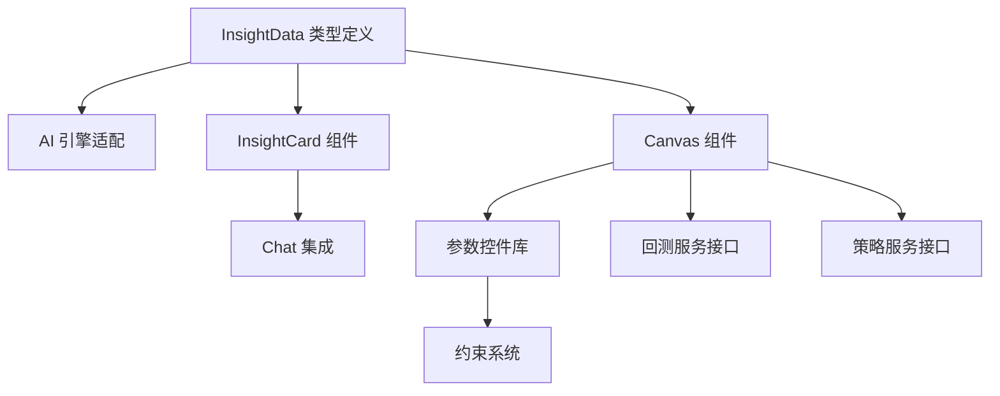

# A2UI 功能需求规格书

> **版本**: 1.1.0 **更新日期**: 2025-12-28 **负责人**: 产品团队

---

## 1. 概述

### 1.1 文档目的

本文档定义 Delta Terminal 2.0 的 A2UI (Agent-to-UI) 系统功能需求，作为开发团队的实施指南。

### 1.2 范围

覆盖 A2UI 系统的核心功能模块：

- InsightData 数据结构
- InsightCard 展示组件
- Canvas 面板系统
- 参数控件库
- 约束与验证系统
- 风控预警集成

---

## 2. 功能需求

### 2.1 InsightData 生成

#### FR-A2UI-001: AI 返回结构化数据

**优先级**: P0 **描述**: AI 引擎在响应用户策略相关请求时，必须返回结构化的 InsightData 而非纯文本。

**验收标准**:

- [ ] 用户输入"创建 RSI 策略"时，返回 `type: "strategy_create"` 的 InsightData
- [ ] 用户输入"调整止损"时，返回 `type: "strategy_modify"` 的 InsightData
- [ ] InsightData 包含完整的 `params`, `evidence`, `impact` 字段
- [ ] 纯问答类请求仍返回文本响应

**数据结构**:

```typescript
interface InsightData {
  id: string
  type: 'strategy_create' | 'strategy_modify' | 'batch_adjust' | 'risk_alert'
  target?: { strategyId: string; name: string; symbol: string }
  params: InsightParam[]
  evidence?: { chart?: ChartData; comparison?: Comparison }
  impact?: { metrics: ImpactMetric[]; confidence: number; sampleSize: number }
  explanation: string
}
```

---

#### FR-A2UI-002: InsightParam 多态控件

**优先级**: P0 **描述**: 每个参数必须指定控件类型，前端根据类型渲染对应 UI。

**验收标准**:

- [ ] 支持 7 种控件类型: slider, number, select, toggle, button_group, logic_builder, heatmap_slider
- [ ] 每个参数有 `level` 属性区分 L1/L2
- [ ] 包含 `constraints` 约束规则数组

**控件类型映射**:

| 参数类型 | 控件类型        | 示例           |
| -------- | --------------- | -------------- |
| 数值范围 | slider          | RSI 周期 7-21  |
| 百分比   | slider + number | 止损 0.5%-5%   |
| 枚举     | button_group    | 做多/做空/双向 |
| 开关     | toggle          | 启用追踪止损   |
| 复杂逻辑 | logic_builder   | 多条件组合     |
| 风险级别 | heatmap_slider  | 保守/中性/激进 |

---

#### FR-A2UI-003: 影响预估 (Impact)

**优先级**: P1 **描述**: 每个策略提案必须包含基于历史数据的影响预估。

**验收标准**:

- [ ] 包含预估收益率、胜率、最大回撤、夏普比率
- [ ] 显示置信度 (0-100%)
- [ ] 显示样本量 (基于多少天数据)
- [ ] 修改策略时显示新旧指标对比

**数据结构**:

```typescript
interface ImpactMetric {
  key: string // "expectedReturn", "winRate", "maxDrawdown"
  label: string // "预估收益", "胜率", "最大回撤"
  value: number
  oldValue?: number // 修改时的旧值
  unit: string // "%", "倍"
  trend: 'up' | 'down' | 'neutral'
}
```

---

### 2.2 InsightCard 组件

#### FR-A2UI-010: Chat 内卡片展示

**优先级**: P0 **描述**: InsightData 在 Chat 面板中以紧凑卡片形式展示。

**验收标准**:

- [ ] 卡片显示策略名称、类型 Badge、关键指标预览
- [ ] 点击卡片触发 Canvas 展开
- [ ] 不同类型卡片有不同配色主题
- [ ] 卡片 hover 状态有视觉反馈

**设计规范**:

| 类型            | Badge 颜色 | 图标背景   |
| --------------- | ---------- | ---------- |
| strategy_create | 蓝色       | cyan-dim   |
| strategy_modify | 黄色       | yellow-dim |
| batch_adjust    | 紫色       | purple-dim |
| risk_alert      | 红色       | red-dim    |

---

#### FR-A2UI-011: 卡片预览信息

**优先级**: P0 **描述**: 卡片体区域显示关键指标预览。

**验收标准**:

- [ ] 创建策略: 显示预估收益、胜率、回撤
- [ ] 修改策略: 显示变更对比 (旧值 → 新值)
- [ ] 批量调整: 显示影响策略数量、总风险变化
- [ ] 风险预警: 显示风险等级、触发原因

---

### 2.3 Canvas 面板

#### FR-A2UI-020: Proposal Canvas

**优先级**: P0 **描述**: 策略提案的完整展示和交互面板。

**验收标准**:

- [ ] 头部: 策略名称 + 类型 Badge + 关闭按钮
- [ ] L1 参数区: 直接展示核心参数，可编辑
- [ ] L2 参数区: 折叠展示高级参数，点击展开
- [ ] 证据区: K 线图 + 信号标注 + 回测曲线
- [ ] 影响区: 4 宫格指标展示
- [ ] AI 解释区: 策略逻辑解释
- [ ] 操作区: [拒绝] [修改后提交] [批准]

**交互流程**:

1. 用户调整参数 → 触发实时回测 → 更新 Impact
2. 点击批准 → 调用策略创建 API → 反馈结果
3. 点击拒绝 → 关闭 Canvas → 返回 Chat

---

#### FR-A2UI-021: Backtest Canvas

**优先级**: P1 **描述**: 回测结果详细展示面板。

**验收标准**:

- [ ] 权益曲线图 (支持对比基准)
- [ ] 统计指标: 总收益、年化、夏普、最大回撤、胜率、盈亏比
- [ ] 交易明细列表 (可筛选、分页)
- [ ] 月度收益热力图
- [ ] 按钮: [下载报告] [部署策略]

---

#### FR-A2UI-022: Monitor Canvas

**优先级**: P1 **描述**: 运行中策略的实时监控面板。

**验收标准**:

- [ ] 实时 K 线 + 当前信号标注
- [ ] 当前持仓信息 (方向、数量、盈亏)
- [ ] 今日统计 (交易次数、盈亏)
- [ ] 最近订单列表
- [ ] 操作按钮: [暂停] [修改] [关闭持仓]

---

#### FR-A2UI-023: Config Canvas

**优先级**: P2 **描述**: 完整策略配置编辑面板。

**验收标准**:

- [ ] 显示所有参数 (L1 + L2)
- [ ] 分组展示: 基础配置 / 入场规则 / 出场规则 / 风控规则
- [ ] 实时参数校验
- [ ] 历史版本对比
- [ ] 保存按钮

---

#### FR-A2UI-024: Explorer Canvas

**优先级**: P2 **描述**: 参数敏感度分析面板。

**验收标准**:

- [ ] 选择参数进行敏感度分析
- [ ] 热力图展示不同参数组合的收益
- [ ] 最优区域高亮
- [ ] 一键应用最优参数

---

#### FR-A2UI-025: Detail Canvas

**优先级**: P2 **描述**: 交易/订单明细查看面板。

**验收标准**:

- [ ] 订单详情: 时间、价格、数量、状态
- [ ] 交易详情: 入场/出场、持仓时长、盈亏
- [ ] 相关 K 线上下文
- [ ] 信号触发原因

---

### 2.4 参数控件

#### FR-A2UI-030: Slider 控件

**优先级**: P0 **描述**: 滑块控件，用于数值范围选择。

**验收标准**:

- [ ] 显示 label + 当前值 + 单位
- [ ] 拖动滑块实时更新值
- [ ] 支持 min/max/step 配置
- [ ] 超出约束范围显示警告

---

#### FR-A2UI-031: Button Group 控件

**优先级**: P0 **描述**: 按钮组控件，用于枚举选择。

**验收标准**:

- [ ] 水平排列选项按钮
- [ ] 当前选中高亮 (品牌色背景)
- [ ] 支持单选和多选模式

---

#### FR-A2UI-032: Toggle 控件

**优先级**: P0 **描述**: 开关控件，用于布尔值。

**验收标准**:

- [ ] 显示 label + 开关
- [ ] 开启状态显示绿色
- [ ] 点击切换，有动画过渡

---

#### FR-A2UI-033: Logic Builder 控件

**优先级**: P1 **描述**: 逻辑构建器，用于多条件组合。

**验收标准**:

- [ ] 条件组展示 (AND/OR 连接)
- [ ] 每个条件: 指标 + 运算符 + 值
- [ ] 支持添加/删除条件
- [ ] 支持嵌套条件组

---

#### FR-A2UI-034: Heatmap Slider 控件

**优先级**: P1 **描述**: 热力图滑块，用于风险等级选择。

**验收标准**:

- [ ] 显示分区: 保守(绿) / 中性(灰) / 激进(红)
- [ ] 滑块在轨道上拖动
- [ ] 当前区域高亮
- [ ] 显示对应风险描述

---

### 2.5 约束系统

#### FR-A2UI-040: 参数校验

**优先级**: P0 **描述**: 参数修改时实时校验约束规则。

**验收标准**:

- [ ] 超出范围实时显示错误提示
- [ ] 违反约束时禁用批准按钮
- [ ] 支持依赖约束 (如止损 < 止盈)

**约束类型**:

```typescript
type ConstraintType =
  | 'min_max' // 最小最大值
  | 'dependency' // 依赖另一参数
  | 'mutual_exclusive' // 互斥
  | 'conditional' // 条件约束
```

---

#### FR-A2UI-041: 约束反馈

**优先级**: P1 **描述**: 约束违反时给出清晰反馈。

**验收标准**:

- [ ] 错误参数边框标红
- [ ] 显示具体错误信息
- [ ] 提供修复建议

---

### 2.6 风控集成

#### FR-A2UI-050: 风险预警卡片

**优先级**: P0 **描述**: AI 主动推送风险预警。

**验收标准**:

- [ ] 卡片边框红色高亮
- [ ] 显示风险等级 (info/warning/critical)
- [ ] 显示触发原因和建议操作
- [ ] 支持超时自动执行

---

#### FR-A2UI-051: 熔断机制

**优先级**: P1 **描述**: 三级熔断机制。

**验收标准**:

- [ ] 一级熔断: 日亏损 > 3% → 暂停策略
- [ ] 二级熔断: 日亏损 > 5% → 减少仓位
- [ ] 三级熔断: 日亏损 > 8% → 关闭所有持仓
- [ ] 熔断时发送通知

---

#### FR-A2UI-052: Kill Switch

**优先级**: P0 **描述**: 紧急全局停止按钮。

**验收标准**:

- [ ] 顶部状态栏可见
- [ ] 点击后二次确认
- [ ] 执行: 取消所有订单 + 平所有仓 + 暂停所有策略
- [ ] 记录操作日志

---

### 2.7 状态管理

#### FR-A2UI-060: 策略状态机

**优先级**: P0 **描述**: 策略全生命周期状态管理。

**状态流转**:

```
Draft → Backtesting → Validated → Paper → Live → Paused/Stopped
```

**验收标准**:

- [ ] 状态变更实时同步 UI
- [ ] 不同状态显示不同 Badge
- [ ] 状态变更记录日志

---

#### FR-A2UI-061: 订单状态机

**优先级**: P0 **描述**: 订单状态跟踪。

**状态流转**:

```
Pending → Submitted → Partial → Filled/Cancelled/Rejected
```

**验收标准**:

- [ ] WebSocket 实时推送状态更新
- [ ] 异常状态 (Rejected) 触发通知

---

### 2.8 实时交互

#### FR-A2UI-070: 参数调整实时回测

**优先级**: P1 **描述**: 用户调整参数时实时更新回测结果。

**验收标准**:

- [ ] 参数变更后 debounce 500ms 触发回测
- [ ] 显示 loading 状态
- [ ] 更新 Impact 区域数据
- [ ] 失败时显示错误提示

---

#### FR-A2UI-071: K 线拖拽止损

**优先级**: P2 **描述**: 在 K 线图上直接拖拽设置止损止盈价位。

**验收标准**:

- [ ] K 线图上显示可拖拽的止损/止盈线
- [ ] 拖拽后同步更新参数面板
- [ ] 显示对应价格和百分比

---

#### FR-A2UI-072: 无状态上下文恢复 (chatHistory Fallback)

**优先级**: P0 **描述**: 在无 Redis 或后端重启场景下，通过前端传递对话历史恢复对话上下文。

**验收标准**:

- [x] 前端维护完整的对话历史 (chatHistory)
- [x] API 请求中携带 chatHistory 作为 context 参数
- [x] 后端从 chatHistory 重建对话上下文
- [x] 多步骤引导流程中正确恢复 collectedParams
- [x] 支持 Railway 无状态部署环境

**数据结构**:

```typescript
interface ChatHistoryMessage {
  role: 'user' | 'assistant'
  content: string
}

interface InsightRequest {
  message: string
  conversationId?: string
  context?: {
    chatHistory?: ChatHistoryMessage[]
    collectedParams?: Record<string, unknown>
    isFollowUp?: boolean
    // ... 其他上下文
  }
}
```

**实现文件**:

- `frontend/web-app/src/hooks/useA2UIInsight.ts` - 前端 Hook
- `frontend/web-app/src/app/api/ai/insight/route.ts` - Next.js API Route
- `ai-engine/nlp-processor/src/api/endpoints/chat.py` - 后端端点

---

#### FR-A2UI-073: Trading Spirit 人格系统

**优先级**: P1 **描述**: 为 AI 助手提供个性化的 Trading Spirit 人格，通过反应式 Orb 可视化展示状态。

**验收标准**:

- [x] SpiritOrb 组件显示 AI 状态 (idle/thinking/speaking/error)
- [x] Spirit 人格定义支持自定义名称和描述
- [x] Spirit 状态通过 WebSocket 实时更新
- [x] Supabase 集成存储 Spirit 配置
- [x] Spirit 创建向导引导用户设置

**组件结构**:

```typescript
interface TradingSpirit {
  id: string
  name: string
  description?: string
  personality?: string
  created_at: string
  user_id: string
}

type SpiritState = 'idle' | 'thinking' | 'speaking' | 'error'
```

**实现文件**:

- `frontend/web-app/src/components/spirit/SpiritOrb.tsx` - Orb 可视化
- `frontend/web-app/src/components/spirit/SpiritCreationWizard.tsx` - 创建向导
- `frontend/web-app/src/components/spirit/OrbShader.ts` - WebGL 着色器
- `frontend/web-app/src/hooks/useSpiritController.ts` - Spirit 控制 Hook

---

## 3. 非功能需求

### 3.1 性能

| 指标            | 目标    |
| --------------- | ------- |
| Canvas 打开延迟 | < 300ms |
| 实时回测响应    | < 2s    |
| 参数更新响应    | < 100ms |
| K 线渲染帧率    | ≥ 30fps |

### 3.2 可用性

- 所有控件支持键盘操作
- 错误信息清晰易懂
- 响应式布局 (桌面/平板)

### 3.3 安全性

- 参数服务端二次校验
- 敏感操作需用户确认
- 审计日志记录所有策略操作

---

## 4. 优先级规划

### P0 (必须有) - 核心 MVP

1. InsightData 生成 (FR-A2UI-001, 002)
2. InsightCard 展示 (FR-A2UI-010, 011)
3. Proposal Canvas (FR-A2UI-020)
4. 基础控件 (FR-A2UI-030, 031, 032)
5. 参数校验 (FR-A2UI-040)
6. Kill Switch (FR-A2UI-052)
7. 状态机 (FR-A2UI-060, 061)
8. **无状态上下文恢复 (FR-A2UI-072)** ✅ 已完成

### P1 (应该有) - 完整体验

1. Impact 影响预估 (FR-A2UI-003)
2. Backtest Canvas (FR-A2UI-021)
3. Monitor Canvas (FR-A2UI-022)
4. Logic Builder (FR-A2UI-033)
5. Heatmap Slider (FR-A2UI-034)
6. 约束反馈 (FR-A2UI-041)
7. 熔断机制 (FR-A2UI-051)
8. 实时回测 (FR-A2UI-070)
9. **Trading Spirit 人格系统 (FR-A2UI-073)** ✅ 已完成

### P2 (锦上添花) - 增强功能

1. Config Canvas (FR-A2UI-023)
2. Explorer Canvas (FR-A2UI-024)
3. Detail Canvas (FR-A2UI-025)
4. K 线拖拽止损 (FR-A2UI-071)

---

## 5. 依赖关系



---

## 6. 验收测试场景

### 场景 1: 创建 RSI 策略

1. 用户输入: "帮我创建一个 BTC 的 RSI 超卖策略，保守一点"
2. AI 返回 InsightCard，显示策略预览
3. 用户点击卡片，Proposal Canvas 展开
4. 用户调整 RSI 周期从 14 改为 21
5. 系统触发实时回测，更新 Impact
6. 用户点击"批准"
7. 策略创建成功，跳转到监控页

### 场景 2: 风险预警处理

1. 系统检测到 BTC 波动率超标
2. AI 主动发送 risk_alert InsightCard
3. 卡片显示"高波动预警"，红色边框
4. 用户点击查看详情
5. Canvas 显示建议操作: 降低仓位 50%
6. 用户点击"批准建议"
7. 系统执行减仓

---

## 7. 文档版本

| 版本  | 日期       | 变更说明                                                               | 作者         |
| ----- | ---------- | ---------------------------------------------------------------------- | ------------ |
| 1.0.0 | 2025-12-25 | 初始版本                                                               | Product Team |
| 1.1.0 | 2025-12-28 | 新增 FR-A2UI-072 无状态上下文恢复, FR-A2UI-073 Trading Spirit 人格系统 | Claude       |

---

**批准签名**

- 产品负责人：****\_\_\_**** 日期：**\_\_\_**
- 技术负责人：****\_\_\_**** 日期：**\_\_\_**
