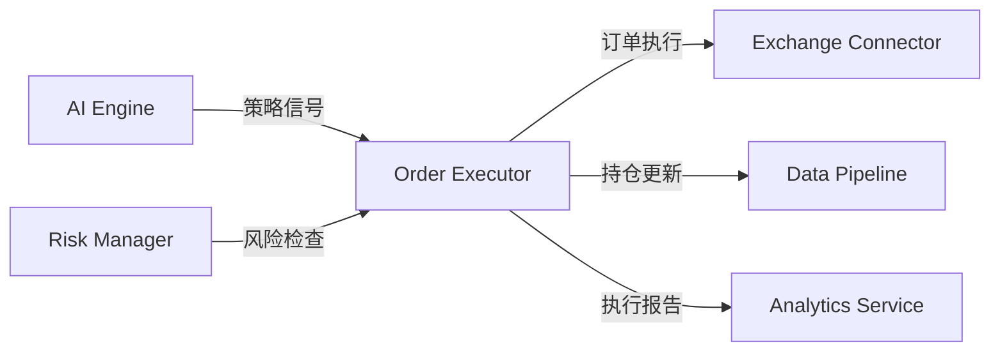

# Order Executor - 订单执行引擎模块

> **模块路径**: `trading-engine/order-executor`
> **职责**: 智能交易订单执行与管理
> **状态**: ✅ 已完成
> **最后更新**: 2025-12-24

---

## 模块概述

Order Executor 是 Delta Terminal 的核心订单执行引擎,提供多种智能订单类型和执行算法,支持高效、安全的自动化交易。

### 核心功能

1. **多种订单类型**
   - 市价单: 快速成交
   - 限价单: 精确价格控制
   - TWAP: 时间加权平均价格,降低市场冲击
   - 冰山单: 隐藏订单规模,防止被跟踪

2. **智能执行引擎**
   - 异步订单队列
   - 优先级管理
   - 自动重试机制
   - 滑点监控

3. **持仓管理**
   - 实时持仓同步
   - 盈亏计算
   - 风险监控

---

## 技术栈

- **框架**: FastAPI, Pydantic
- **交易所连接**: CCXT
- **队列系统**: Redis
- **日志**: Structlog
- **监控**: Prometheus
- **语言**: Python 3.11+

---

## 项目结构

```
order-executor/
├── src/
│   ├── api/                    # API 层
│   │   ├── endpoints/
│   │   │   ├── orders.py       # 订单管理端点
│   │   │   └── positions.py    # 持仓管理端点
│   │   └── router.py           # 路由聚合
│   │
│   ├── executor/               # 执行器层
│   │   ├── base.py             # 基础执行器抽象类
│   │   ├── market_executor.py  # 市价单执行器
│   │   ├── limit_executor.py   # 限价单执行器
│   │   ├── twap_executor.py    # TWAP 执行器
│   │   └── iceberg_executor.py # 冰山单执行器
│   │
│   ├── services/               # 业务逻辑层
│   │   ├── order_service.py    # 订单服务
│   │   └── position_service.py # 持仓服务
│   │
│   ├── queue/                  # 队列管理
│   │   └── order_queue.py      # 订单队列实现
│   │
│   ├── models/                 # 数据模型
│   │   └── schemas.py          # Pydantic 模型定义
│   │
│   ├── config.py               # 配置管理
│   ├── main.py                 # FastAPI 应用入口
│   └── __init__.py
│
├── tests/                      # 测试目录
├── Dockerfile                  # Docker 配置
├── pyproject.toml              # Poetry 依赖管理
├── .env.example                # 环境变量示例
├── README.md                   # 模块文档
└── CLAUDE.md                   # AI 上下文文档
```

---

## 核心组件说明

### 1. 执行器层 (`executor/`)

**职责**: 实现各种订单类型的执行逻辑

#### 基础执行器 (`base.py`)
- 提供通用的交易所连接管理
- 订单提交、查询、取消的基础方法
- 错误处理与重试机制
- 订单验证逻辑

#### 市价单执行器 (`market_executor.py`)
- 立即按市场价格成交
- 滑点计算与监控
- 适合快速建仓/平仓

#### 限价单执行器 (`limit_executor.py`)
- 指定价格挂单
- 价格合理性验证
- 订单状态监控
- 支持 IOC/FOK/GTC 等时间策略

#### TWAP 执行器 (`twap_executor.py`)
- 将大额订单拆分为多个小订单
- 在指定时间内均匀执行
- 降低市场冲击
- 实时进度跟踪

**TWAP 示例**:
```python
# 买入 10 BTC, 分 10 片, 每片 1 BTC, 每 60 秒执行一片
{
    "quantity": 10.0,
    "twap_slices": 10,
    "twap_interval": 60
}
# 总执行时间: 10 分钟
```

#### 冰山单执行器 (`iceberg_executor.py`)
- 隐藏真实订单规模
- 只显示部分数量
- 成交后自动补充
- 防止被"盯梢"

**冰山单示例**:
```python
# 买入 100 BTC, 每次只显示 10 BTC (10%)
{
    "quantity": 100.0,
    "iceberg_visible_ratio": 0.1
}
```

---

### 2. 订单队列 (`queue/order_queue.py`)

**职责**: 异步订单队列管理

**核心功能**:
- ✅ 优先级队列 (高优先级订单优先执行)
- ✅ 失败自动重试 (最多 3 次)
- ✅ 并发控制 (防止过载)
- ✅ 队列监控 (健康检查)

**队列设计**:
```python
PENDING_QUEUE      # 待处理队列
PRIORITY_QUEUE     # 高优先级队列 (有序集合)
PROCESSING_QUEUE   # 处理中队列
FAILED_QUEUE       # 失败队列
COMPLETED_QUEUE    # 完成队列
```

---

### 3. 服务层 (`services/`)

#### 订单服务 (`order_service.py`)
- 订单创建、取消、查询
- 订单参数验证
- 订单统计分析
- TWAP/冰山单进度查询

#### 持仓服务 (`position_service.py`)
- 持仓查询与同步
- 盈亏计算
- 持仓更新 (根据订单成交)

---

### 4. API 层 (`api/`)

**RESTful API 设计**:

| 端点 | 方法 | 功能 |
|------|------|------|
| `/api/v1/orders` | POST | 创建订单 |
| `/api/v1/orders/{id}` | GET | 查询订单 |
| `/api/v1/orders/{id}/cancel` | POST | 取消订单 |
| `/api/v1/orders` | GET | 查询订单列表 |
| `/api/v1/orders/statistics` | GET | 订单统计 |
| `/api/v1/orders/{id}/twap-progress` | GET | TWAP 进度 |
| `/api/v1/orders/{id}/iceberg-progress` | GET | 冰山单进度 |
| `/api/v1/positions` | GET | 查询持仓 |
| `/api/v1/positions/sync/{exchange}` | POST | 同步持仓 |

---

## 配置管理

### 环境变量 (`.env`)

```bash
# 交易所配置
EXCHANGE_API_KEY=your_api_key
EXCHANGE_SECRET=your_secret
DEFAULT_EXCHANGE=binance

# TWAP 配置
TWAP_DEFAULT_SLICES=10        # 默认分片数
TWAP_DEFAULT_INTERVAL=60      # 默认间隔(秒)

# 冰山单配置
ICEBERG_DEFAULT_VISIBLE_RATIO=0.1  # 默认可见比例

# 风险控制
MAX_ORDER_VALUE=100000        # 单笔订单最大金额
MAX_POSITION_SIZE=500000      # 最大持仓金额
```

---

## 运行与部署

### 本地开发

```bash
# 1. 安装依赖
poetry install

# 2. 配置环境变量
cp .env.example .env
# 编辑 .env

# 3. 启动服务
poetry run python -m src.main

# 4. 访问 API 文档
open http://localhost:8003/docs
```

### Docker 部署

```bash
# 构建镜像
docker build -t delta-order-executor .

# 运行容器
docker run -d \
  --name order-executor \
  -p 8003:8003 \
  --env-file .env \
  delta-order-executor
```

---

## API 使用示例

### 1. 创建市价单

```bash
curl -X POST http://localhost:8003/api/v1/orders \
  -H "Content-Type: application/json" \
  -d '{
    "strategy_id": "strategy_001",
    "exchange": "binance",
    "symbol": "BTC/USDT",
    "side": "buy",
    "order_type": "market",
    "quantity": 0.1
  }'
```

### 2. 创建 TWAP 订单

```bash
curl -X POST http://localhost:8003/api/v1/orders \
  -H "Content-Type: application/json" \
  -d '{
    "strategy_id": "strategy_001",
    "exchange": "binance",
    "symbol": "BTC/USDT",
    "side": "buy",
    "order_type": "twap",
    "quantity": 1.0,
    "twap_slices": 10,
    "twap_interval": 60
  }'
```

### 3. 查询 TWAP 进度

```bash
curl http://localhost:8003/api/v1/orders/{order_id}/twap-progress
```

### 4. 查询持仓

```bash
curl http://localhost:8003/api/v1/positions?strategy_id=strategy_001
```

---

## 与其他模块的交互



### 上游依赖

- **AI Engine**: 提供交易信号
- **Risk Manager**: 订单前置风险检查

### 下游服务

- **Exchange Connector**: 交易所连接层
- **Data Pipeline**: 数据采集与存储
- **Analytics Service**: 执行分析与报告

---

## 监控与日志

### 健康检查

```bash
curl http://localhost:8003/health

# 响应示例
{
  "status": "healthy",
  "queue_health": "healthy",
  "queue_stats": {
    "pending": 5,
    "processing": 2,
    "failed": 0
  }
}
```

### Prometheus 指标

```bash
curl http://localhost:8003/metrics
```

### 日志示例

```json
{
  "event": "order_created",
  "level": "info",
  "timestamp": "2025-12-24T10:30:00Z",
  "order_id": "ord_123456",
  "symbol": "BTC/USDT",
  "order_type": "twap",
  "quantity": 1.0
}
```

---

## 测试

### 运行测试

```bash
# 所有测试
poetry run pytest

# 单元测试
poetry run pytest tests/unit

# 集成测试
poetry run pytest tests/integration

# 覆盖率报告
poetry run pytest --cov=src --cov-report=html
```

---

## 性能优化

### 当前性能指标

- **订单处理延迟**: < 100ms (市价单)
- **队列吞吐量**: > 100 订单/秒
- **TWAP 执行精度**: 时间偏差 < 1 秒

### 优化方向

1. **数据库优化**: 使用 PostgreSQL 替代内存存储
2. **缓存优化**: Redis 缓存热点数据
3. **并发优化**: 增加工作线程数量
4. **WebSocket**: 实时订单更新推送

---

## 故障排查

### 常见问题

1. **订单执行失败**
   - 检查 API 密钥配置
   - 检查账户余额
   - 查看详细日志

2. **队列堵塞**
   - 检查 Redis 连接
   - 查看队列状态
   - 清理失败订单

3. **TWAP 执行中断**
   - 检查网络稳定性
   - 查看 TWAP 进度
   - 手动重启 TWAP 执行

---

## 后续开发计划

- [ ] 数据库持久化 (PostgreSQL + SQLAlchemy)
- [ ] WebSocket 实时订单推送
- [ ] 更多高级订单类型 (Grid Trading, DCA)
- [ ] 订单执行性能分析
- [ ] 智能滑点优化
- [ ] 多交易所套利支持

---

## AI 开发建议

### 推荐提问

1. **功能开发**
   - "帮我实现止损止盈订单执行器"
   - "优化 TWAP 算法,支持自适应时间间隔"
   - "添加订单执行性能分析功能"

2. **问题排查**
   - "分析订单执行失败的日志"
   - "为什么 TWAP 执行时间不准确?"
   - "如何优化订单队列性能?"

3. **测试与优化**
   - "生成市价单执行器的单元测试"
   - "如何测试 TWAP 执行的时间精度?"
   - "优化订单队列的并发性能"

### 上下文提供建议

与 AI 对话时,提供:
- 当前工作的文件路径
- 相关错误日志或堆栈追踪
- 预期行为 vs 实际行为
- 已尝试的解决方案

---

## 相关文档

- [项目总览](../../CLAUDE.md)
- [API 网关](../../backend/api-gateway/CLAUDE.md)
- [风险管理器](../risk-manager/CLAUDE.md)
- [交易所连接器](../exchange-connector/CLAUDE.md)

---

**最后更新**: 2025-12-24
**维护者**: Delta Terminal 开发团队
