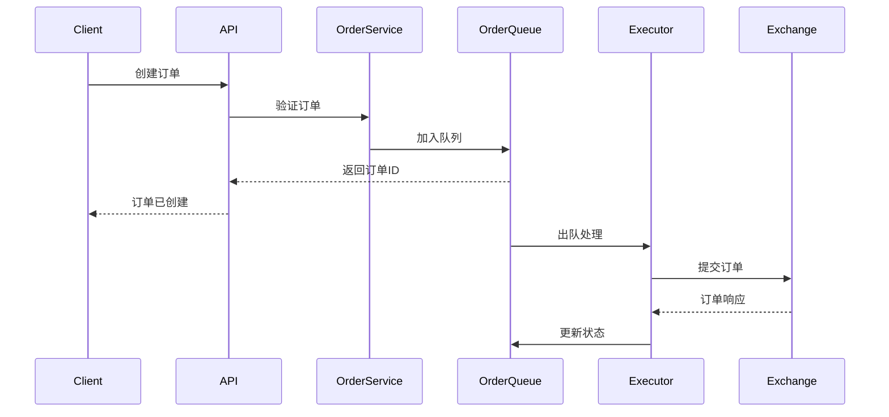

# Order Executor - 订单执行引擎

> Delta Terminal 智能交易订单执行系统

## 概述

Order Executor 是 Delta Terminal 的核心订单执行引擎,负责智能化的交易订单管理和执行。

### 核心功能

- ✅ **多种订单类型**
  - 市价单 (Market Order)
  - 限价单 (Limit Order)
  - TWAP 订单 (时间加权平均价格)
  - 冰山单 (Iceberg Order)
  - 止损/止盈订单 (Stop Loss/Take Profit)

- ✅ **智能执行引擎**
  - 异步订单队列处理
  - 优先级管理
  - 失败自动重试机制
  - 并发控制

- ✅ **高级算法交易**
  - TWAP: 降低市场冲击,获得更优平均价格
  - 冰山单: 隐藏真实订单规模,防止"盯梢"

- ✅ **持仓管理**
  - 实时持仓同步
  - 盈亏计算
  - 风险监控

- ✅ **监控与统计**
  - 订单统计分析
  - 队列健康监控
  - Prometheus 指标导出

---

## 快速开始

### 前置要求

```bash
# Python 环境
python >= 3.11
poetry >= 1.7

# 外部依赖
PostgreSQL >= 15
Redis >= 7.0
```

### 安装

```bash
# 1. 克隆仓库
cd trading-engine/order-executor

# 2. 安装依赖
poetry install

# 3. 配置环境变量
cp .env.example .env
# 编辑 .env 填入交易所 API 密钥等配置

# 4. 启动服务
poetry run python -m src.main
```

### Docker 部署

```bash
# 构建镜像
docker build -t delta-order-executor:latest .

# 运行容器
docker run -d \
  --name order-executor \
  -p 8003:8003 \
  --env-file .env \
  delta-order-executor:latest
```

---

## API 文档

### 订单管理

#### 创建订单

```bash
POST /api/v1/orders

# 市价单示例
{
  "strategy_id": "strategy_001",
  "exchange": "binance",
  "symbol": "BTC/USDT",
  "side": "buy",
  "order_type": "market",
  "quantity": 0.1,
  "time_in_force": "GTC"
}

# TWAP 订单示例
{
  "strategy_id": "strategy_001",
  "exchange": "binance",
  "symbol": "BTC/USDT",
  "side": "buy",
  "order_type": "twap",
  "quantity": 1.0,
  "twap_slices": 10,
  "twap_interval": 60,
  "time_in_force": "GTC"
}

# 冰山单示例
{
  "strategy_id": "strategy_001",
  "exchange": "binance",
  "symbol": "BTC/USDT",
  "side": "buy",
  "order_type": "iceberg",
  "quantity": 5.0,
  "price": 50000,
  "iceberg_visible_ratio": 0.1,
  "time_in_force": "GTC"
}
```

#### 查询订单

```bash
# 查询单个订单
GET /api/v1/orders/{order_id}

# 查询订单列表
GET /api/v1/orders?strategy_id=strategy_001&symbol=BTC/USDT&limit=100

# 获取订单统计
GET /api/v1/orders/statistics?strategy_id=strategy_001
```

#### 取消订单

```bash
POST /api/v1/orders/{order_id}/cancel?reason=user_request
```

#### 查询 TWAP 进度

```bash
GET /api/v1/orders/{order_id}/twap-progress
```

#### 查询冰山单进度

```bash
GET /api/v1/orders/{order_id}/iceberg-progress
```

### 持仓管理

```bash
# 查询持仓列表
GET /api/v1/positions?strategy_id=strategy_001

# 查询单个持仓
GET /api/v1/positions/{strategy_id}/{exchange}/{symbol}

# 同步持仓数据
POST /api/v1/positions/sync/{exchange}
```

### 系统监控

```bash
# 健康检查
GET /health

# 队列状态
GET /api/v1/orders/queue/status

# Prometheus 指标
GET /metrics
```

---

## 架构设计

### 核心组件

```
order-executor/
├── src/
│   ├── api/                    # API 层
│   │   ├── endpoints/
│   │   │   ├── orders.py       # 订单端点
│   │   │   └── positions.py    # 持仓端点
│   │   └── router.py           # 路由聚合
│   │
│   ├── executor/               # 执行器层
│   │   ├── base.py             # 基础执行器
│   │   ├── market_executor.py  # 市价单执行器
│   │   ├── limit_executor.py   # 限价单执行器
│   │   ├── twap_executor.py    # TWAP 执行器
│   │   └── iceberg_executor.py # 冰山单执行器
│   │
│   ├── services/               # 服务层
│   │   ├── order_service.py    # 订单服务
│   │   └── position_service.py # 持仓服务
│   │
│   ├── queue/                  # 队列管理
│   │   └── order_queue.py      # 订单队列
│   │
│   ├── models/                 # 数据模型
│   │   └── schemas.py          # Pydantic 模型
│   │
│   ├── config.py               # 配置管理
│   └── main.py                 # 应用入口
│
├── tests/                      # 测试
├── Dockerfile                  # Docker 配置
└── pyproject.toml              # 项目依赖
```

### 订单执行流程



---

## 配置说明

### 环境变量

详见 `.env.example`

关键配置:

```bash
# 交易所 API 密钥 (必填)
EXCHANGE_API_KEY=your_api_key
EXCHANGE_SECRET=your_secret

# TWAP 配置
TWAP_DEFAULT_SLICES=10        # 默认分片数
TWAP_DEFAULT_INTERVAL=60      # 默认间隔(秒)

# 冰山单配置
ICEBERG_DEFAULT_VISIBLE_RATIO=0.1  # 默认可见比例 10%

# 风险控制
MAX_ORDER_VALUE=100000        # 单笔订单最大金额(USDT)
MAX_POSITION_SIZE=500000      # 最大持仓金额(USDT)
```

---

## 监控与日志

### Prometheus 指标

```bash
# 访问指标端点
curl http://localhost:8003/metrics
```

### 日志格式

支持 JSON 和控制台输出:

```bash
# JSON 格式 (生产环境推荐)
LOG_FORMAT=json

# 控制台格式 (开发环境)
LOG_FORMAT=console
```

---

## 测试

```bash
# 运行所有测试
poetry run pytest

# 运行单元测试
poetry run pytest tests/unit

# 生成覆盖率报告
poetry run pytest --cov=src --cov-report=html
```

---

## 性能优化

### 并发处理

- 默认 3 个工作线程并发处理订单
- 可通过修改 `main.py` 中的 `worker_count` 调整

### 队列优化

- 使用 Redis 实现高性能队列
- 支持优先级队列
- 自动重试失败订单

### 网络优化

- 使用 CCXT 的内置重试机制
- 支持 WebSocket 实时数据流 (计划中)

---

## 安全建议

1. **API 密钥管理**
   - 使用环境变量存储
   - 不要提交到代码仓库
   - 定期轮换密钥

2. **风险控制**
   - 设置合理的 `MAX_ORDER_VALUE`
   - 启用订单前置验证
   - 监控异常订单

3. **网络安全**
   - 使用 HTTPS/WSS 连接
   - 验证交易所证书
   - 限制 API 访问 IP

---

## 故障排查

### 常见问题

1. **订单执行失败**
   - 检查 API 密钥是否正确
   - 检查账户余额是否充足
   - 查看日志获取详细错误信息

2. **队列堵塞**
   - 检查 Redis 连接状态
   - 查看队列状态: `GET /api/v1/orders/queue/status`
   - 清理失败订单队列

3. **连接超时**
   - 检查网络连接
   - 增加 `ORDER_TIMEOUT` 配置
   - 检查交易所 API 状态

---

## 后续开发计划

- [ ] 数据库持久化 (PostgreSQL)
- [ ] WebSocket 实时订单更新
- [ ] 更多高级订单类型 (Grid Trading, DCA 等)
- [ ] 订单执行性能分析
- [ ] 滑点优化算法
- [ ] 多交易所套利支持

---

## 贡献指南

欢迎贡献代码和建议!

1. Fork 本项目
2. 创建功能分支 (`git checkout -b feature/amazing-feature`)
3. 提交更改 (`git commit -m 'feat: add amazing feature'`)
4. 推送到分支 (`git push origin feature/amazing-feature`)
5. 创建 Pull Request

---

## 许可证

MIT License

---

## 联系方式

- 项目主页: [Delta Terminal](https://github.com/your-org/delta-terminal)
- 问题反馈: [Issues](https://github.com/your-org/delta-terminal/issues)
